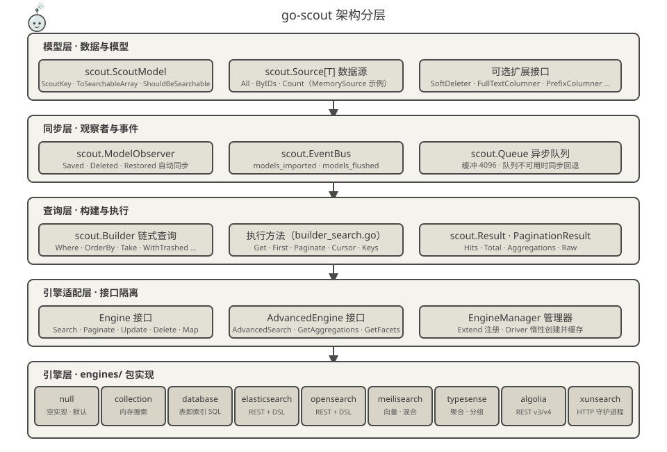
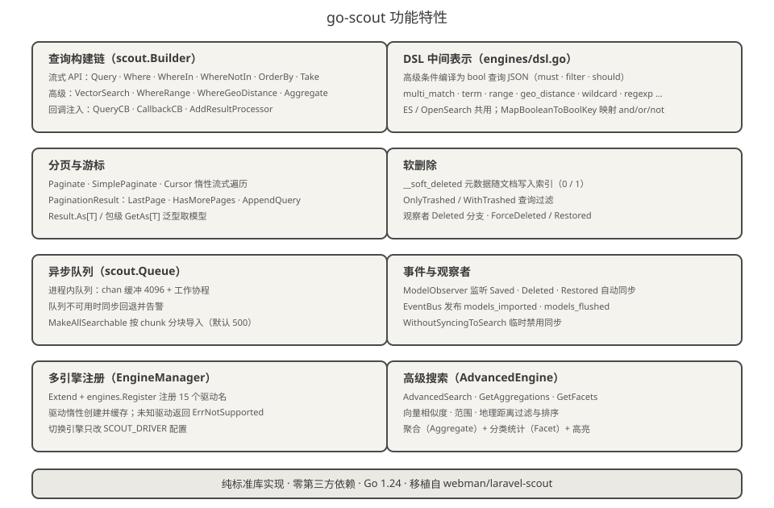
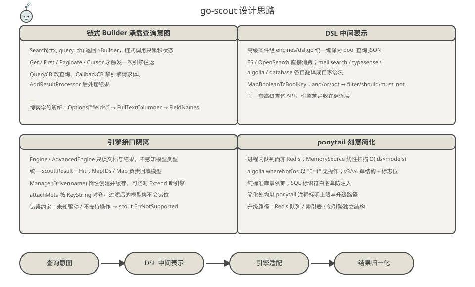
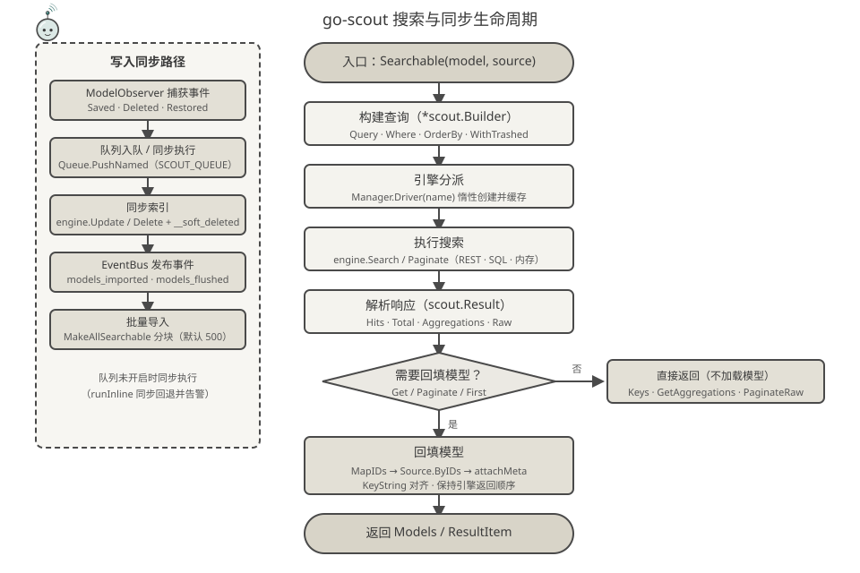

<p align="center">
  
</p>

<p align="center">
  <a href="https://pkg.go.dev/github.com/erikwang2013/go-scout"></a>
</p>

# go-scout

> 用 Go 编写的搜索同步库 —— Laravel Scout 的 Go 移植（基于 PHP 插件 [webman-scout](https://github.com/shopwwi/webman-scout)）。
> Go 1.24 · 纯标准库实现，零第三方依赖 · 版本 v1.4.0

**Languages / 语言**: [中文](README.md) · [English](docs/i18n/en/README.md) · [한국어](docs/i18n/ko/README.md) · [Русский](docs/i18n/ru/README.md) · [Deutsch](docs/i18n/de/README.md) · [Français](docs/i18n/fr/README.md) · [Español](docs/i18n/es/README.md) · [Português](docs/i18n/pt/README.md) · [हिन्दी](docs/i18n/hi/README.md) · [العربية](docs/i18n/ar/README.md) · [বাংলা](docs/i18n/bn/README.md) · [Bahasa Indonesia](docs/i18n/id/README.md) · [日本語](docs/i18n/ja/README.md)

## 项目简介

go-scout 解决的是"模型与搜索引擎之间的同步"问题：让实现 `scout.ScoutModel` 接口的模型在保存、删除、恢复时自动写入或移出搜索引擎，并用一套统一的链式查询 API 去搜索它们，屏蔽各搜索引擎（Elasticsearch、OpenSearch、Meilisearch、Typesense、Algolia、XunSearch…）之间的 API 差异。

它镜像了原 PHP 库的类结构与行为：

| PHP（webman/laravel-scout） | Go（go-scout） |
|---|---|
| `Scout` | `scout.Scout`（scout.go） |
| `Builder` | `scout.Builder`（builder.go / builder_search.go） |
| `EngineManager` | `scout.Manager` / `scout.EngineManager`（manager.go） |
| `ModelObserver` | `scout.ModelObserver`（observer.go） |
| `Searchable` trait | `scout.Searchable`（searchable.go） |
| `Engine` / `AdvancedEngine` 及各引擎类 | `scout.Engine` / `scout.AdvancedEngine` 及 `engines` 包 9 个引擎 |

内置引擎（`engines` 包）：

- **null** —— 空实现，默认兜底驱动（索引被禁用时使用）
- **collection** —— 内存搜索，无需任何外部服务
- **database** —— 表即索引，直接对数据库表做 LIKE/ILIKE 与全文检索（mysql / pgsql / sqlite）
- **elasticsearch** / **opensearch** —— REST 查询，共用 `engines/dsl.go` 的 DSL 中间表示
- **meilisearch** —— REST 查询，支持向量与混合搜索、过滤、排序、分面
- **typesense** —— REST 查询，支持聚合、分组、向量近邻
- **algolia** —— REST 查询，v3 / v4 两个版本
- **xunsearch** —— HTTP 守护进程协议（索引端 + 搜索端）

连同 `advanced_*` 别名，`engines.Register` 一共注册 16 个驱动名（见 [engines/register.go](engines/register.go)）。

## 项目宠物 · 小侦 Scouty

<p align="center">
  
</p>

**小侦（Scouty）** 是 go-scout 的搜索小侦——一只戴着放大镜风镜、系着侦察兵领巾的探针。它是照着这个库的职责画出来的，每个零件都对应代码里的一层：

| 小侦的零件 | 对应实现 | 说明 |
|---|---|---|
| 放大镜风镜 | `scout.Builder`（查询层） | 只负责看清"要找什么"：`Where` / `OrderBy` / 向量 / 地理条件最终都编译进这只镜头 |
| 天线与检索信号 | `EngineManager`（多引擎广播） | 一次查询、16 个驱动名任选；`Driver(name)` 惰性创建并缓存 |
| 侦察兵领巾 | `ModelObserver`（同步层） | 保存即同步：`Saved` / `Deleted` / `Restored` 自动写入或移出索引 |
| 领巾的结 | `EventBus` | 同步完成后的 `models_imported` / `models_flushed` 事件 |
| 手里的文档卡片 | `ScoutModel`（文档） | `ToSearchableArray()` 之后的文档；卡片角上的色块就是主键字段（`KeyString`） |
| 脚下的影子 | `Source[T]`（数据源） | 模型站在数据源上：`All` / `ByIDs` / `Count` |

配色沿用文档插图的纸感底色（`#f4f3ee` / `#4a4a4a`），只加了一支 `#2f6f6a` 强调色，与架构 / 功能 / 设计 / 生命周期四张图同族。

小侦也住进了代码里：

- [mascot.go](mascot.go) —— `scout.MascotName` / `scout.MascotSVG` / `scout.MascotASCII`，宠物本体随库分发，可直接写进网页、报告或生成的资源文件
- `go run ./cmd/scout mascot` —— 终端里的小侦（加 `-svg` 打印矢量版）；不带参数运行 CLI 时也会先打招呼
- [docs/logo.svg](docs/logo.svg) —— 主视觉（完整小侦 + 字标），README 最前面用的就是它
- `mascot_test.go` —— 守住两件事：内嵌 SVG 与 `docs/mascot.svg` 永远一致，以及 `docs/` 下全部 SVG（含 12 种语言）都是合法 XML

## 架构设计



自底向上共五层，职责逐层收窄：

1. **模型层** —— 业务模型实现 `scout.ScoutModel`（`ScoutKey`、`ToSearchableArray`、`ShouldBeSearchable`、`TableName` 等，见 [model.go](model.go)），数据经 `scout.Source[T]` 接口（`All` / `ByIDs` / `Count`）供给，内置 `scout.NewMemorySource`。可选接口如 `SoftDeleter`、`FullTextColumner`、`PrefixColumner` 按需实现。
2. **同步层** —— `scout.ModelObserver` 捕获模型的保存/删除/恢复事件；`scout.EventBus` 发布 `scout.models_imported`、`scout.models_flushed` 事件；`scout.Queue` 提供进程内异步队列（缓冲 4096），队列不可用时同步回退。
3. **查询层** —— `scout.Builder` 以链式调用累积查询状态（`Where`、`OrderBy`、`Take`、`WithTrashed`…），由 `builder_search.go` 中的执行方法（`Get` / `First` / `Paginate` / `Cursor` / `Keys`）触发一次引擎往返，结果归一化为 `scout.Result` / `PaginationResult`。
4. **引擎适配层** —— `Engine` 接口（`Search`、`Paginate`、`Update`、`Delete`、`Map`、`Flush`、`CreateIndex`、`DeleteIndex`…）与 `AdvancedEngine` 扩展接口（`AdvancedSearch`、`GetAggregations`、`GetFacets`）把引擎差异隔离在接口之后；`scout.Manager` 通过 `Extend` 注册、`Driver(name)` 惰性创建并缓存驱动。
5. **引擎层** —— `engines` 包 9 个引擎实现，各自只依赖配置（`*scout.Config`）与 HTTP 客户端，互不感知。

## 功能特性



- **查询构建链** —— `scout.Builder` 流式 API：`Query` / `Where` / `WhereIn` / `WhereNotIn` / `OrderBy` / `OrderByDesc` / `Latest` / `Oldest` / `Take` / `Skip`；高级条件 `VectorSearch` / `WhereRange` / `WhereGeoDistance` / `FulltextSearch` / `OrderByVectorSimilarity` / `OrderByGeoDistance`；回调注入 `QueryCB` / `CallbackCB` / `AddResultProcessor`。搜索字段解析顺序：`Options["fields"]` → `FullTextColumner` → `FieldNames`。
- **DSL 中间表示** —— [engines/dsl.go](engines/dsl.go) 把高级条件统一编译为 bool 查询 JSON（`multi_match`、`term`、`range`、`geo_distance`、`wildcard`、`regexp` 等），Elasticsearch / OpenSearch 直接消费；`MapBooleanToBoolKey` 把 and/or/not 映射为 `filter` / `should` / `must_not`。
- **分页与游标** —— `Paginate` / `PaginateRaw` / `SimplePaginate` / `Cursor`（缓冲通道惰性遍历）；`PaginationResult` 提供 `LastPage` / `HasMorePages` / `AppendQuery`；`Result.As[T]` 与包级泛型函数 `scout.GetAs[T]` 免断言取模型。
- **软删除** —— 索引文档写入 `__soft_deleted` 元数据（0/1）；`OnlyTrashed` / `WithTrashed` 查询过滤；database 引擎走 `deleted_at` 列。
- **异步队列** —— 进程内队列（`chan` 缓冲 4096 + 工作协程），`SCOUT_QUEUE=1` 开启；队列不可用时同步回退并告警；`MakeAllSearchable` 按 chunk 分块导入（默认 500 条/块）。
- **事件与观察者** —— `ModelObserver` 监听 `Saved` / `Deleted` / `Restored` 自动同步；`EventBus` 发布 `scout.models_imported`、`scout.models_flushed`；`WithoutSyncingToSearch` 临时禁用同步。
- **多引擎注册** —— `Manager.Extend` + `engines.Register` 注册 16 个驱动名，驱动惰性创建并缓存；未知驱动返回 `scout.ErrNotSupported`；切换引擎只改 `SCOUT_DRIVER` 配置。

## 设计思路



- **链式 Builder 承载查询意图** —— `Search(ctx, query, cb)` 返回 `*scout.Builder`，链式调用只累积状态，`Get` / `First` / `Paginate` / `Cursor` 才触发引擎往返；查询修改、请求体截获、结果后处理全部通过回调注入，引擎无需关心。
- **DSL 中间表示** —— 高级条件统一编译为 bool 查询 JSON，ES / OpenSearch 直接消费，Meilisearch / Typesense / Algolia / database 各自翻译，引擎差异收在翻译层。
- **引擎接口隔离** —— `Engine` / `AdvancedEngine` 只谈文档与结果，不感知模型类型；`MapIDs` / `Map` 负责把结果 ID 回填为模型，`attachMeta` 按 `KeyString` 对齐，过滤后的模型集不会错位。
- **ponytail 刻意简化** —— 代码中处处以 `ponytail:` 注释标明取舍：进程内队列而非 Redis、`MemorySource` 线性扫描 O(ids×models)、Algolia 的 `whereNotIns` 以 `"0=1"` 无操作、v3/v4 单结构加版本标志、随机排序以 `_score asc` 占位等。纯标准库，零第三方 SDK。

## 生命周期



**搜索路径**：`Searchable(model, source).Search(ctx, query, cb)` 构建 `*scout.Builder` → `Manager.Driver(name)` 分派引擎（惰性创建并缓存）→ `engine.Search` / `Paginate`（REST / SQL / 内存）→ 解析为 `scout.Result`（Hits · Total · Aggregations · Raw）→ 若需要回填模型（`Get` / `Paginate` / `First`）：`MapIDs` → `Source.ByIDs` → `attachMeta`（按 `KeyString` 对齐、保持引擎返回顺序）→ 返回 `ResultItem` / `PaginationResult`；`Keys` / `GetAggregations` / `PaginateRaw` 则直接返回，不加载模型。

**写入路径**：`ModelObserver` 捕获模型事件 → `Queue.PushNamed("scout_make" / "scout_remove" / "scout_make_range")` 异步执行（未开启则同步回退）→ `engine.Update` / `Delete`（软删除时附 `__soft_deleted` 元数据）→ `EventBus` 发布 `scout.models_imported` / `scout.models_flushed`。

## 项目结构

```
go-scout/
├── go.mod                      # 模块定义：github.com/erikwang2013/go-scout · go 1.24.1 · 零依赖
├── .gitignore                  # IDE / 缓存 / 密钥类文件忽略
├── LICENSE                     # BSD 3-Clause 许可证
├── scout.go                    # Scout 门面：Config / Manager / Events / Queue / Observer 组装与工厂
├── config.go                   # 配置树：DefaultConfig + 环境变量覆盖 + dot-path 取值
├── engine.go                   # Engine / AdvancedEngine 接口 + Result / Hit / PaginationResult 类型
├── manager.go                  # EngineManager：Extend 注册、Driver 惰性创建缓存、默认 null 引擎
├── builder.go                  # Builder 结构 + 链式条件构建（Where / OrderBy / Take / 高级条件）
├── builder_search.go           # 查询执行：Raw / Get / First / Paginate / Cursor / GetAs[T]
├── searchable.go               # Searchable：模型与数据源绑定、全量导入导出、软删除元数据
├── observer.go                 # ModelObserver：Saved / Deleted / Restored 自动同步
├── events.go                   # EventBus：同步线程安全发布订阅 + 导入/清空事件
├── queue.go                    # Queue：进程内异步队列（chan 4096）+ 同步回退
├── model.go                    # ScoutModel 接口 + 可选扩展接口 + KeyName/KeyString 等辅助
├── source.go                   # Source[T] 接口 + MemorySource（线性扫描）
├── exceptions.go               # ErrNotSupported / ErrScout 错误体系
├── identity.go                 # 身份传递：`scout.WithUser` / `scout.WithClientIP`（Algolia identify 用）
├── mascot.go                   # 项目宠物小侦：MascotName / MascotSVG / MascotASCII
├── mascot_test.go              # 内嵌 SVG 与 docs/mascot.svg 一致性 + docs/ 全部 SVG 合法性
├── cmd/scout/main.go           # CLI 演示程序：import / flush / index / queue-import 等 8 个子命令
├── engines/
│   ├── engine.go               # HTTP 客户端（认证、TLS 跳过）+ DoJSON/DoBytes 共用辅助
│   ├── register.go             # SetDatabase + Register 注册 16 个驱动名 + Drivers()
│   ├── dsl.go                  # DSL 中间表示：bool 查询 / 排序 / 聚合 / 分面 / 高亮
│   ├── null.go                 # NullEngine：空实现
│   ├── collection.go           # CollectionEngine：内存搜索（大小写不敏感子串匹配）
│   ├── database.go             # DatabaseEngine：表即索引 SQL（LIKE/ILIKE + pgsql tsvector）
│   ├── elasticsearch.go        # ElasticsearchEngine + 与 OpenSearch 共享的 es* 辅助
│   ├── opensearch.go           # OpenSearchEngine（基础驱动即高级引擎）
│   ├── meilisearch.go          # MeilisearchEngine：过滤 / 排序 / 向量混合 / 分面
│   ├── meilisearch_advanced.go # Meilisearch 高级引擎：向量 / 混合搜索扩展
│   ├── typesense.go            # TypesenseEngine：filter_by / 聚合 / 分组 / 近邻搜索
│   ├── typesense_advanced.go   # Typesense 高级引擎：检索参数 / 聚合 / 向量扩展
│   ├── algolia.go              # AlgoliaEngine：v3/v4 单结构 + 版本标志
│   ├── xunsearch.go            # XunSearchEngine：索引守护进程 + 搜索守护进程
│   ├── xunsearch_advanced.go   # XunSearch 高级引擎：高级条件 / 分面扩展
│   ├── algolia_test.go         # Algolia 过滤字面量测试（algoliaLit / algoliaFilters）
│   ├── elasticsearch_test.go   # Elasticsearch 请求/解析测试（httptest 桩）
│   ├── opensearch_test.go      # OpenSearch 请求/解析测试（httptest 桩）
│   ├── xunsearch_test.go       # XunSearch 守护进程协议测试（httptest 桩）
│   ├── collection_test.go      # 内存引擎行为测试（过滤 / 排序 / 分页 / 回填）
│   ├── database_test.go        # SQL 生成与断言（assertSQL 精确匹配）
│   ├── meilisearch_test.go     # Meilisearch 请求/解析测试（httptest 桩）
│   ├── typesense_test.go       # Typesense 请求/解析测试（含 404 自动建集合）
│   └── null_test.go            # NullEngine 空行为测试
└── docs/
    ├── logo.svg                # 主视觉：完整小侦 + go-scout 字标
    ├── mascot.svg              # 项目宠物小侦 Scouty（同一份图内嵌于 mascot.go）
    ├── alipay.png              # 支付宝收款码（打赏部分引用）
    ├── weixinpay.png           # 微信支付收款码（打赏部分引用）
    ├── coin/                   # 各链收款二维码（10 张 jpg）
    ├── arch.svg                # 架构分层图
    ├── features.svg            # 功能特性图
    ├── design.svg              # 设计思路图
    ├── lifecycle.svg           # 搜索生命周期流程图
    └── i18n/<lang>/            # 12 种语言的 README 与对应翻译版四张插图
```

## 快速开始 / 使用说明

### 1. 引入

```bash
go get github.com/erikwang2013/go-scout
```

无第三方依赖，引入即用。

### 2. 配置驱动

`scout.DefaultConfig()` 读取环境变量，通用项：

| 环境变量 | 默认值 | 说明 |
|---|---|---|
| `SCOUT_DRIVER` | `database` | 引擎驱动名；空字符串或 `"false"` 回退为 `null` |
| `SCOUT_PREFIX` | 空 | 索引前缀 |
| `SCOUT_QUEUE` | 关 | 置 1 开启异步队列 |
| `SCOUT_SOFT_DELETE` | 关 | 软删除元数据随文档写入索引 |
| `SCOUT_IDENTIFY` | 关 | 开启后把「谁在检索」透传给 Algolia：`X-Algolia-UserToken`（来自 `scout.WithUser` 的用户主键）与 `X-Forwarded-For`（来自 `scout.WithClientIP`，仅公网 IP） |
| `SCOUT_CHUNK_SEARCHABLE` / `SCOUT_CHUNK_UNSEARCHABLE` | `500` | 批量导入/移除的块大小 |
| `SCOUT_BULK_SIZE` | `100` | 批量写入大小（opensearch） |

各引擎专用（配置树路径 `engine.key` 与 env 同名，如 `opensearch.host` ← `OPENSEARCH_HTTP_HOST`）：

| 引擎 | 环境变量（默认值） |
|---|---|
| meilisearch | `MEILISEARCH_HOST`（`http://127.0.0.1:7700`）、`MEILISEARCH_KEY` |
| typesense | `TYPESENSE_HOST`（`127.0.0.1`）、`TYPESENSE_PORT`（`8108`）、`TYPESENSE_PROTOCOL`（`http`）、`TYPESENSE_API_KEY`（`xyz`）、`TYPESENSE_IMPORT_ACTION`（`upsert`）、`TYPESENSE_MAX_TOTAL_RESULTS`（`1000`）、`TYPESENSE_CONNECTION_TIMEOUT`（`2`） |
| elasticsearch | `ELASTICSEARCH_HOST`（`http://127.0.0.1:9200`，取 hosts 列表首项）+ `elasticsearch.auth`（user/password） |
| opensearch | `OPENSEARCH_HTTP_HOST`（`https://127.0.0.1:6205`）、`OPENSEARCH_USERNAME` / `OPENSEARCH_PASSWORD`（`admin`/`admin`）、`OPENSEARCH_SSL_VERIFICATION`（默认跳过 TLS 校验）、`OPENSEARCH_TIMEOUT`（`30` 秒）、`OPENSEARCH_CONNECTION_TIMEOUT`（`10`） |
| xunsearch | `XUNSEARCH_INDEX_HOST`（`http://127.0.0.1`）+ `XUNSEARCH_INDEX_PORT`（`8383`）、`XUNSEARCH_SEARCH_HOST`（`http://127.0.0.1`）+ `XUNSEARCH_SEARCH_PORT`（`8384`）、`XUNSEARCH_DEFAULT_INDEX`（`default`）、`XUNSEARCH_CHARSET`（`utf-8`）、`XUNSEARCH_CONFIG_PATH`（空 = 用上面的主机与端口；设置后按 `<路径>/<索引名>.ini` 取项目名、守护进程与字符集）、`XUNSEARCH_BATCH_SIZE`（`100`） |
| algolia | `ALGOLIA_APP_ID`、`ALGOLIA_SECRET`（缺失时构造引擎直接 panic）、`ALGOLIA_HOST`（可选，默认 `https://<appID>.algolia.net`，可指向代理或兼容端点） |

`database` 驱动还需注入数据库连接与方言：

```go
engines.SetDatabase(db, "mysql") // dialect: mysql / pgsql / postgres / sqlite
```

### 3. 最小使用示例

```go
package main

import (
	"context"
	"fmt"

	"github.com/erikwang2013/go-scout"
	"github.com/erikwang2013/go-scout/engines"
)

// Post 实现 scout.ScoutModel 即可参与搜索
type Post struct {
	ID    int
	Title string
	Body  string
}

func (p Post) ScoutKey() any            { return p.ID }
func (p Post) TableName() string        { return "posts" }
func (p Post) ShouldBeSearchable() bool { return p.Title != "" }
func (p Post) ToSearchableArray() map[string]any {
	return map[string]any{"title": p.Title, "body": p.Body}
}

func main() {
	ctx := context.Background()

	// 初始化：默认配置 + 注册全部引擎（SCOUT_DRIVER 决定用哪个）
	s := scout.NewWithConfig(scout.DefaultConfig())
	engines.Register(s.Manager)

	// 绑定模型与数据源，全量导入（chunk 传 0 表示用默认块大小 500）
	sr := s.Searchable(&Post{}, scout.NewMemorySource(
		Post{ID: 1, Title: "Go module layout", Body: "packages and imports"},
		Post{ID: 2, Title: "Indexing strategies", Body: "bulk writes"},
	))
	_ = sr.MakeAllSearchable(ctx, 0)

	// 链式查询：Search → Where → OrderByDesc → Take → Get
	items, err := sr.Search(ctx, "golang", nil). // 第三参为查询回调，可传 nil
		Where("title", "indexing").
		OrderByDesc("created_at").
		Take(10).
		Get(ctx)
	if err != nil {
		panic(err)
	}
	for _, it := range items {
		post := it.Model.(Post) // ResultItem.Model 已回填为原始模型
		fmt.Println(post.ID, it.Score)
	}

	// 泛型取数：GetAs[T] 免类型断言
	posts, _ := scout.GetAs[Post](ctx, sr.Search(ctx, "indexing", nil).Take(5))
	_ = posts
}
```

执行查询的关键方法：`Get(ctx) ([]ResultItem, error)`、`First(ctx)`、`Paginate(ctx, perPage, page, pageName)`（每页默认 15 条，页码参数名默认 `page`）、`Cursor(ctx)`（惰性流式）、`Keys(ctx)`（只取主键）。分页结果 `PaginationResult` 还带 `LastPage()` / `HasMorePages()` / `AppendQuery()` 供翻页链接使用。

### 4. CLI 演示程序

`cmd/scout` 是一个自包含的演示 CLI：启动时把 `SCOUT_DRIVER` 设为 `collection`，用 `NewMemorySource` 预置 7 条 `post` 数据（空标题的草稿因 `ShouldBeSearchable` 为 false 被跳过）。

```bash
go run ./cmd/scout                # 打印全部子命令用法
go run ./cmd/scout index posts --key id        # 创建索引
go run ./cmd/scout import --chunk 3 --fresh    # 全量导入（每块 3 条，先清空）
go run ./cmd/scout flush          # 清空索引
go run ./cmd/scout queue-import --chunk 3 --min 1 --max 100 --workers 4  # 按键范围入队导入
go run ./cmd/scout sync-index-settings --driver meilisearch  # 同步索引设置（需引擎实现 UpdateIndexSettings）
go run ./cmd/scout delete-index posts           # 删除单个索引
go run ./cmd/scout delete-all-indexes           # 删除全部索引
go run ./cmd/scout mascot                       # 打印项目宠物小侦（-svg 输出矢量图）
```

不带参数运行 `go run ./cmd/scout` 时，小侦会先出现在用法说明上方。

## 许可与说明

本项目为对 PHP 插件 webman-scout 的 Go 移植，类结构、驱动命名与行为语义保持一致；简化取舍均在源码中以 `ponytail:` 注释标明（进程内队列、内存数据源线性扫描、Algolia `"0=1"` 无操作等）。

## 打赏（Donate）

感谢支持！你的打赏将帮助项目持续维护与发展。欢迎支持：

<p align="center">
<table>
<tr>
<td align="center">
<b>微信（WeChat Pay）</b><br/>

</td>
<td align="center">
<b>支付宝（Alipay）</b><br/>

</td>
</tr>
</table>
</p>

### 虚拟币打赏（Crypto Donate）

支持以下主网，转账时请核对收款地址与对应主网：

| 主网 | 钱包地址 | 收款码 |
|---|---|---|
| BNB Smart Chain (BEP20) | `0x355d429f97511897ccb4e271ec888205f9ab6629` |  |
| Tron (TRC20) | `TEdDHWLajt1XvqtPDWmQctdrJaC3pzZZzz` |  |
| Ethereum (ERC20) | `0x355d429f97511897ccb4e271ec888205f9ab6629` |  |
| Aptos | `0x836e3780edfc3f7b2372b39e2a1a3a5d7adfaccd96c726f21cfde1b50dd68030` |  |
| Plasma | `0x355d429f97511897ccb4e271ec888205f9ab6629` |  |
| Polygon POS | `0x355d429f97511897ccb4e271ec888205f9ab6629` |  |
| Solana | `2hfhboHdmdrYsY25XfQSsEWxq5ip4EQsR7f4AzSRMUyr` |  |
| The Open Network (TON) | `UQB9kFQohzmXUir9QSSZq01iwl9aQZIDdBpNmDklljRtCoGK` |  |
| Arbitrum One | `0x355d429f97511897ccb4e271ec888205f9ab6629` |  |
| AVAX C-Chain | `0x355d429f97511897ccb4e271ec888205f9ab6629` |  |

### 全球转账（银行汇款）

**收款人信息**

- 收款人姓名：WANG KEXUN
- 收款账户号码：881015918251

**收款银行**

- ZA Bank SWIFT Code：`AABLHKHHXXX`
- 银行名称：ZA Bank Limited
- 银行编号：387
- 银行地址：`Core F, Cyberport 3, 100 Cyberport Road, Hong Kong`

**跨境汇款代理银行（如需）**

> 此为跨境汇款代理银行（中转银行）信息，非收款银行信息。请向汇款银行查询是否需要提供跨境汇款代理银行信息。

- 汇入港元、人民币及美元时，代理银行为 Citibank：
  - 银行名称：Citibank N.A. Hong Kong
  - SWIFT Code：`CITIHKHXXXX`
  - 银行编号：006
  - 分行名称：Hong Kong Branch
  - 分行编号：391
  - 银行地址：`Citibank Tower, Citibank Plaza, 3 Garden Road, Central, Hong Kong`
- 汇入其他币种时，代理银行为 BNY Mellon：
  - 银行名称：THE BANK OF NEW YORK MELLON
  - SWIFT Code：`IRVTUS3NXXX`
  - 银行地址：`THE BANK OF NEW YORK MELLON, 240 GREENWICH STREET, NEW YORK, United States`
