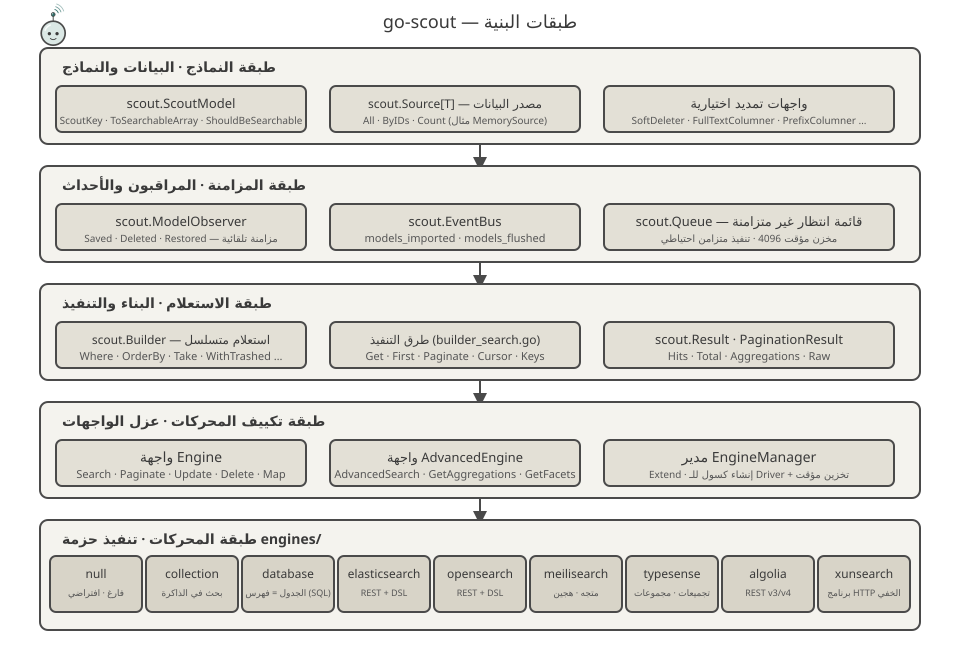
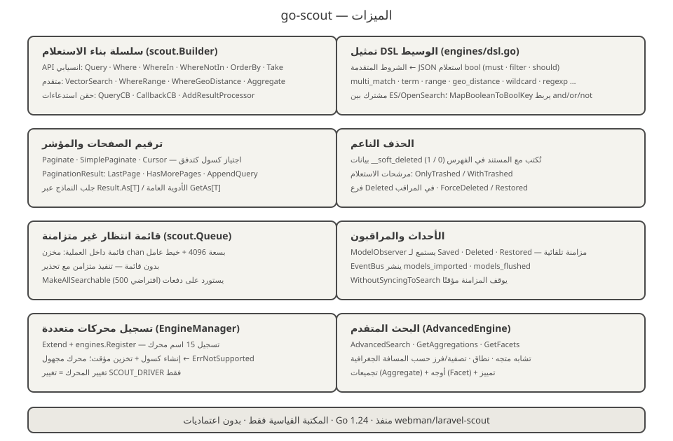
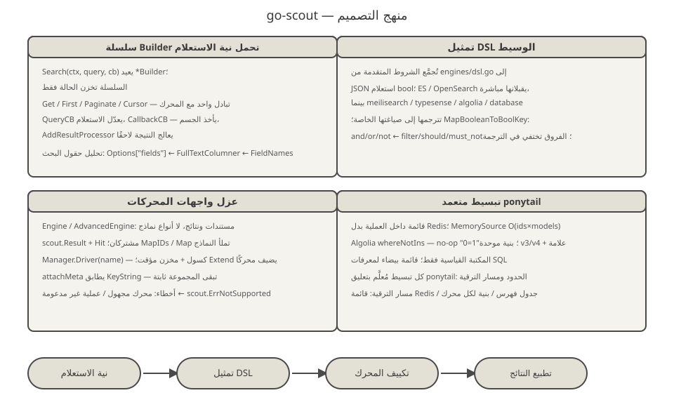
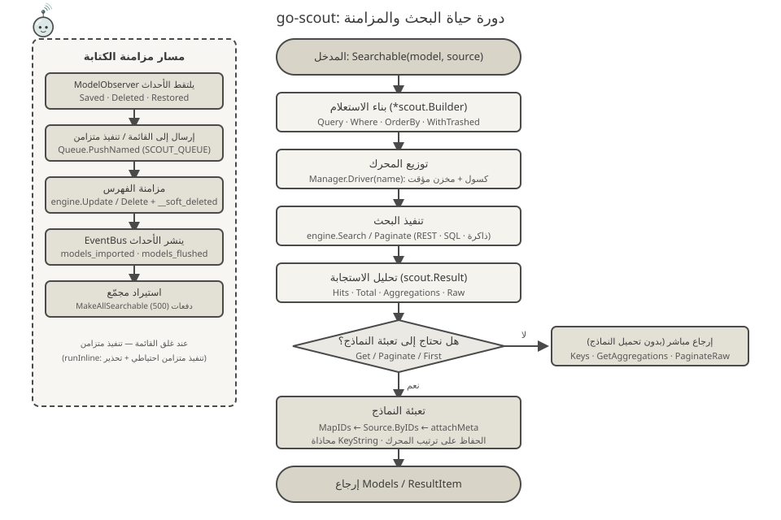

<p align="center">
  
</p>

<p align="center">
  <a href="https://pkg.go.dev/github.com/erikwang2013/go-scout"></a>
</p>

# go-scout

> مكتبة مزامنة بحث مكتوبة بلغة Go — منفذ Go لـ Laravel Scout (استنادًا إلى إضافة PHP [webman-scout](https://github.com/shopwwi/webman-scout)).
> Go 1.24 · المكتبة القياسية فقط، بدون أي اعتماديات خارجية · الإصدار v1.3.1

**Languages / 语言**: [中文](../../../README.md) · [English](../en/README.md) · [한국어](../ko/README.md) · [Русский](../ru/README.md) · [Deutsch](../de/README.md) · [Français](../fr/README.md) · [Español](../es/README.md) · [Português](../pt/README.md) · [हिन्दी](../hi/README.md) · [العربية](./README.md) · [বাংলা](../bn/README.md) · [Bahasa Indonesia](../id/README.md) · [日本語](../ja/README.md)

<div dir="rtl">

## نبذة عن المشروع

go-scout يحل مشكلة «المزامنة بين النماذج ومحركات البحث»: النماذج التي تنفّذ واجهة `scout.ScoutModel` تُكتب أو تُحذف تلقائيًا في محرك البحث عند save/delete/restore، مع واجهة استعلام متسلسلة موحّدة للبحث، تخفي اختلافات واجهات محركات البحث المختلفة (Elasticsearch، OpenSearch، Meilisearch، Typesense، Algolia، XunSearch…).

يعكس بنية فئات مكتبة PHP الأصلية وسلوكها كالمرآة:

| PHP (webman/laravel-scout) | Go (go-scout) |
|---|---|
| `Scout` | `scout.Scout` (scout.go) |
| `Builder` | `scout.Builder` (builder.go / builder_search.go) |
| `EngineManager` | `scout.Manager` / `scout.EngineManager` (manager.go) |
| `ModelObserver` | `scout.ModelObserver` (observer.go) |
| خاصية Searchable | `scout.Searchable` (searchable.go) |
| `Engine` / `AdvancedEngine` وفئات المحركات | `scout.Engine` / `scout.AdvancedEngine` والمحركات التسعة في حزمة `engines` |

المحركات المدمجة (حزمة `engines`):

- **null** — تنفيذ فارغ، المحرك الافتراضي (يُستخدم عند تعطيل الفهرسة)
- **collection** — بحث في الذاكرة، لا يحتاج أي خدمة خارجية
- **database** — الجدول هو الفهرس: بحث LIKE/ILIKE وفهرس نصي كامل مباشرة على جداول قاعدة البيانات (mysql / pgsql / sqlite)
- **elasticsearch** / **opensearch** — استعلام REST، بتمثيل وسيط DSL مشترك في `engines/dsl.go`
- **meilisearch** — استعلام REST، بحث متجه وهجين، تصفية، فرز، أوجه
- **typesense** — استعلام REST، تجميعات، تجميع، بحث أقرب جار متجه
- **algolia** — استعلام REST، إصداران: v3 / v4
- **xunsearch** — بروتوكول خادم HTTP (جزء الفهرس وجزء البحث)

يُسجَّل 16 اسم محرك إجمالًا عبر `engines.Register` مع الأسماء المستعارة `advanced_*` (انظر [engines/register.go](../../../engines/register.go)).

## تميمة المشروع · Scouty

<p align="center">
  
</p>

**Scouty** هو كشاف go-scout: مسبار صغير يرتدي نظارة مكبّرة ووشاح كشافة. رُسم على أساس ما تفعله المكتبة فعلاً — كل جزء يقابل طبقة في الشيفرة:

- **نظارة التكبير** — طبقة الاستعلام `scout.Builder`: تُترجم `Where` و`OrderBy` والمتجهات والشروط الجغرافية كلها إلى هذه العدسة.
- **الهوائي وأقواس الإشارة** — `EngineManager`: استعلام واحد و16 اسم مشغّل؛ ويُنشأ `Driver(name)` عند الطلب ويُخزَّن مؤقتاً.
- **وشاح الكشافة** — `ModelObserver`: تتزامن `Saved` / `Deleted` / `Restored` تلقائياً، والعقدة هي حدث `EventBus`.
- **بطاقات المستندات في يده** — المستند بعد `ToSearchableArray()`؛ والرقاقة الملوّنة هي المفتاح الأساسي (`KeyString`).

يسكن Scouty في الشيفرة أيضاً: `scout.MascotName` / `scout.MascotSVG` / `scout.MascotASCII` في [mascot.go](../../../mascot.go)؛ والأمر `go run ./cmd/scout mascot` في الطرفية (`-svg` للنسخة المتجهية)؛ والشعار في [docs/logo.svg](../../../docs/logo.svg). ويضمن `mascot_test.go` تطابق الـ SVG المضمّن مع `docs/mascot.svg` وصلاحية كل ملفات SVG تحت `docs/` بما فيها المجموعات المترجمة الـ 12.

## التصميم المعماري



خمس طبقات من الأسفل إلى الأعلى، تتركز المسؤوليات في كل طبقة:

1. **طبقة النماذج** — نموذج العمل ينفّذ `scout.ScoutModel` (`ScoutKey`، `ToSearchableArray`، `ShouldBeSearchable`، `TableName`… انظر [model.go](../../../model.go))؛ تأتي البيانات من واجهة `scout.Source[T]` (`All` / `ByIDs` / `Count`) مع `scout.NewMemorySource` المدمج. تُنفَّذ الواجهات الاختيارية مثل `SoftDeleter` و`FullTextColumner` و`PrefixColumner` عند الحاجة.
2. **طبقة المزامنة** — `scout.ModelObserver` يلتقط أحداث save/delete/restore للنماذج؛ `scout.EventBus` ينشر أحداث `scout.models_imported` و`scout.models_flushed`؛ `scout.Queue` يوفر قائمة انتظار غير متزامنة داخل العملية (مخزن مؤقت 4096)، مع تنفيذ متزامن احتياطي عند غلق القائمة.
3. **طبقة الاستعلام** — `scout.Builder` يجمع حالة الاستعلام عبر السلسلة (`Where`، `OrderBy`، `Take`، `WithTrashed`…)؛ طرق التنفيذ في [builder_search.go](../../../builder_search.go) (`Get` / `First` / `Paginate` / `Cursor` / `Keys`) تُجري تبادلًا واحدًا مع المحرك، وتُطبَّع النتائج في `scout.Result` / `PaginationResult`.
4. **طبقة تكييف المحركات** — واجهة `Engine` (`Search`، `Paginate`، `Update`، `Delete`، `Map`، `Flush`، `CreateIndex`، `DeleteIndex`…) والواجهة المتقدمة `AdvancedEngine` (`AdvancedSearch`، `GetAggregations`، `GetFacets`) تخفي اختلافات المحركات خلف الواجهات؛ `scout.Manager` يسجلها عبر `Extend` وينشئ المحرك كسولًا عبر `Driver(name)` مع تخزين مؤقت.
5. **طبقة المحركات** — 9 تطبيقات في حزمة `engines`، يعتمد كل منها على الإعدادات (`*scout.Config`) وعميل HTTP فقط، دون معرفة بعضها البعض.

## الميزات



- **سلسلة بناء الاستعلام** — واجهة انسيابية في `scout.Builder`: `Query` / `Where` / `WhereIn` / `WhereNotIn` / `OrderBy` / `OrderByDesc` / `Latest` / `Oldest` / `Take` / `Skip`؛ شروط متقدمة `VectorSearch` / `WhereRange` / `WhereGeoDistance` / `FulltextSearch` / `OrderByVectorSimilarity` / `OrderByGeoDistance`؛ حقن استدعاءات `QueryCB` / `CallbackCB` / `AddResultProcessor`. ترتيب تحليل حقول البحث: `Options["fields"]` ← `FullTextColumner` ← `FieldNames`.
- **تمثيل DSL الوسيط** — [engines/dsl.go](../../../engines/dsl.go) يجمّع الشروط المتقدمة في JSON استعلام bool موحّد (`multi_match`، `term`، `range`، `geo_distance`، `wildcard`، `regexp`…) يقبله Elasticsearch / OpenSearch مباشرة؛ `MapBooleanToBoolKey` يربط and/or/not بـ `filter` / `should` / `must_not`.
- **ترقيم الصفحات والمؤشر** — `Paginate` / `PaginateRaw` / `SimplePaginate` / `Cursor` (اجتياز كسول عبر قناة مخزنة)؛ في `PaginationResult`: `LastPage` / `HasMorePages` / `AppendQuery`؛ `Result.As[T]` والدالة العامة على مستوى الحزمة `scout.GetAs[T]` تجلب النماذج دون تحويل أنواع.
- **الحذف الناعم** — تُكتب بيانات `__soft_deleted` الوصفية (0/1) مع المستند في الفهرس؛ مرشحات الاستعلام `OnlyTrashed` / `WithTrashed`؛ محرك database يستخدم عمود `deleted_at`.
- **قائمة انتظار غير متزامنة** — قائمة داخل العملية (`chan` بسعة 4096 + goroutine عامل)، تُفعَّل بـ `SCOUT_QUEUE=1`؛ بدون قائمة — تنفيذ متزامن مع تحذير؛ `MakeAllSearchable` يستورد على دفعات (افتراضي 500 لكل دفعة).
- **الأحداث والمراقبون** — `ModelObserver` يستمع إلى `Saved` / `Deleted` / `Restored` للمزامنة التلقائية؛ `EventBus` ينشر `scout.models_imported` و`scout.models_flushed`؛ `WithoutSyncingToSearch` يوقف المزامنة مؤقتًا.
- **تسجيل محركات متعددة** — `Manager.Extend` + `engines.Register` يسجّلان 16 اسم محرك؛ إنشاء كسول للمحرك مع تخزين مؤقت؛ محرك مجهول يعطي `scout.ErrNotSupported`؛ تغيير المحرك = تغيير إعداد `SCOUT_DRIVER` فقط.

## منهج التصميم



- **سلسلة Builder تحمل نية الاستعلام** — `Search(ctx, query, cb)` يعيد `*scout.Builder`؛ السلسلة تخزن الحالة فقط، ويحدث التبادل مع المحرك عند `Get` / `First` / `Paginate` / `Cursor`؛ تعديل الاستعلام، والحصول على جسم طلب المحرك، ومعالجة النتائج لاحقًا — كل ذلك عبر الاستدعاءات، والمحرك لا يعرف شيئًا عن ذلك.
- **تمثيل DSL الوسيط** — تُجمَّع الشروط المتقدمة في JSON استعلام bool موحّد؛ ES / OpenSearch يقبلانها مباشرة، بينما تترجمها Meilisearch / Typesense / Algolia / database إلى صياغتها الخاصة — تختفي اختلافات المحركات في طبقة الترجمة.
- **عزل واجهات المحركات** — `Engine` / `AdvancedEngine` تتعامل مع المستندات والنتائج فقط ولا تعرف أنواع النماذج؛ `MapIDs` / `Map` تعيد النماذج من المعرّفات وتعبّئها، و`attachMeta` يطابق `KeyString` — فلا تختلّ مجموعة النماذج المفلترة.
- **تبسيط متعمد ponytail** — كل تنازل مُعلَّم بتعليق `ponytail:` في الكود: قائمة داخل العملية بدل Redis، `MemorySource` بمسح خطي O(ids×models)، no-op `"0=1"` في Algolia لـ `whereNotIns`، بنية موحدة v3/v4 بعلامة إصدار، فرز عشوائي عبر حقل `_score asc` وهمي إلخ. المكتبة القياسية فقط، بلا أي SDK خارجي.

## دورة الحياة



**مسار البحث**: `Searchable(model, source).Search(ctx, query, cb)` ينشئ `*scout.Builder` ← `Manager.Driver(name)` يحدد المحرك (إنشاء كسول + تخزين مؤقت) ← `engine.Search` / `Paginate` (REST / SQL / ذاكرة) ← تحليل إلى `scout.Result` (Hits · Total · Aggregations · Raw) ← عند الحاجة لتعبئة النماذج (`Get` / `Paginate` / `First`): `MapIDs` ← `Source.ByIDs` ← `attachMeta` (محاذاة `KeyString`، الحفاظ على ترتيب المحرك) ← إرجاع `ResultItem` / `PaginationResult`؛ أما `Keys` / `GetAggregations` / `PaginateRaw` فتُرجع مباشرة دون تحميل النماذج.

**مسار الكتابة**: `ModelObserver` يلتقط أحداث النموذج ← `Queue.PushNamed("scout_make" / "scout_remove" / "scout_make_range")` ينفّذ غير متزامن (بدون قائمة — تنفيذ متزامن) ← `engine.Update` / `Delete` (يُضاف `__soft_deleted` عند الحذف الناعم) ← `EventBus` ينشر `scout.models_imported` / `scout.models_flushed`.

## بنية المشروع

<div dir="ltr">

```
go-scout/
├── go.mod                      # الوحدة: github.com/erikwang2013/go-scout · go 1.24.1 · بدون اعتماديات
├── .gitignore                  # استبعاد IDE / ذاكرة التخزين المؤقت / ملفات المفاتيح
├── LICENSE                     # رخصة BSD 3-Clause
├── scout.go                    # واجهة Scout: تجميع Config / Manager / Events / Queue / Observer والمصنع
├── config.go                   # شجرة الإعدادات: DefaultConfig + تجاوز متغيرات البيئة + قيم بمسار نقطي
├── engine.go                   # واجهتا Engine / AdvancedEngine + أنواع Result / Hit / PaginationResult
├── manager.go                  # EngineManager: تسجيل Extend، إنشاء كسول للـ Driver مع تخزين مؤقت، محرك null افتراضي
├── builder.go                  # بنية Builder + شروط السلسلة (Where / OrderBy / Take / شروط متقدمة)
├── builder_search.go           # تنفيذ الاستعلام: Raw / Get / First / Paginate / Cursor / GetAs[T]
├── searchable.go               # Searchable: ربط النموذج بمصدر البيانات، استيراد/تصدير كامل، بيانات الحذف الناعم
├── observer.go                 # ModelObserver: مزامنة تلقائية عند Saved / Deleted / Restored
├── events.go                   # EventBus: نشر/اشتراك آمن للخيوط + أحداث الاستيراد/التفريغ
├── queue.go                    # Queue: قائمة انتظار غير متزامنة داخل العملية (chan 4096) + تنفيذ متزامن احتياطي
├── model.go                    # واجهة ScoutModel + واجهات التمديد الاختيارية + أدوات KeyName/KeyString
├── source.go                   # واجهة Source[T] + MemorySource (مسح خطي)
├── exceptions.go               # نظام الأخطاء ErrNotSupported / ErrScout
├── identity.go                 # الهوية: `scout.WithUser` / `scout.WithClientIP` (لـ Algolia identify)
├── mascot.go                   # تميمة Scouty: MascotName / MascotSVG / MascotASCII
├── mascot_test.go              # مطابقة SVG المضمّن مع docs/mascot.svg + فحص كل ملفات SVG في docs/
├── cmd/scout/main.go           # CLI تجريبي: import / flush / index / queue-import إلخ، 8 أوامر فرعية إجمالًا
├── engines/
│   ├── engine.go               # عميل HTTP (مصادقة، تخطي TLS) + أدوات مشتركة DoJSON/DoBytes
│   ├── register.go             # SetDatabase + Register — تسجيل 16 اسم محرك + Drivers()
│   ├── dsl.go                  # تمثيل DSL: استعلام bool / فرز / تجميعات / أوجه / تمييز
│   ├── null.go                 # NullEngine: تنفيذ فارغ
│   ├── collection.go           # CollectionEngine: بحث في الذاكرة (تطابق نصي جزئي دون حساسية للحالة)
│   ├── database.go             # DatabaseEngine: الجدول = فهرس SQL (LIKE/ILIKE + tsvector في pgsql)
│   ├── elasticsearch.go        # ElasticsearchEngine + أدوات es* المشتركة مع OpenSearch
│   ├── opensearch.go           # OpenSearchEngine (المحرك الأساسي هو نفسه المحرك المتقدم)
│   ├── meilisearch.go          # MeilisearchEngine: تصفية / فرز / هجين متجه / أوجه
│   ├── meilisearch_advanced.go # محرك Meilisearch المتقدم: امتدادات البحث المتجهي / الهجين
│   ├── typesense.go            # TypesenseEngine: filter_by / تجميعات / تجميع / بحث أقرب جار
│   ├── typesense_advanced.go   # محرك Typesense المتقدم: معاملات البحث / التجميعات / المتجهات
│   ├── algolia.go              # AlgoliaEngine: بنية موحدة v3/v4 + علامة الإصدار
│   ├── xunsearch.go            # XunSearchEngine: خادم الفهرس + خادم البحث
│   └── xunsearch_advanced.go   # محرك XunSearch المتقدم: الشروط المتقدمة / الأوجه
├── docs/
│   ├── arch.svg                # مخطط طبقات البنية
│   ├── features.svg            # مخطط الميزات
│   ├── design.svg              # مخطط منهج التصميم
│   ├── logo.svg                # الواجهة: Scouty كاملاً + كلمة go-scout
│   ├── mascot.svg              # تميمة Scouty (الرسم نفسه مضمّن في mascot.go)
│   ├── alipay.png              # رمز QR لـ Alipay (يشير إليه قسم التبرعات)
│   ├── weixinpay.png           # رمز QR لـ WeChat Pay (يشير إليه قسم التبرعات)
│   ├── coin/                   # رموز QR للتبرع حسب الشبكة (10 ملفات jpg)
│   └── lifecycle.svg           # مخطط دورة حياة البحث
└── engines/
    ├── algolia_test.go         # اختبارات القيم الحرفية للتصفية في Algolia ‏(algoliaLit / algoliaFilters)
    ├── elasticsearch_test.go   # اختبارات طلب وتحليل Elasticsearch (محاكاة httptest)
    ├── opensearch_test.go      # اختبارات طلب وتحليل OpenSearch (محاكاة httptest)
    ├── xunsearch_test.go       # اختبارات بروتوكول خادم XunSearch (محاكاة httptest)
    ├── collection_test.go      # اختبارات سلوك محرك الذاكرة (تصفية / فرز / ترقيم صفحات / تعبئة خلفية)
    ├── database_test.go        # توليد SQL واختباره (مطابقة دقيقة عبر assertSQL)
    ├── meilisearch_test.go     # اختبار طلبات/تحليل Meilisearch (محاكاة عبر httptest)
    ├── typesense_test.go       # اختبار طلبات/تحليل Typesense (مع إنشاء تلقائي للمجموعات عند 404)
    └── null_test.go            # اختبار السلوك الفارغ لـ NullEngine
```

</div>

## بدء سريع/دليل الاستخدام

### الاستيراد

<div dir="ltr">

```bash
go get github.com/erikwang2013/go-scout
```

</div>

لا توجد أي اعتماديات خارجية — بمجرد إضافته يصبح جاهزًا للاستخدام.

### إعداد المحرك

`scout.DefaultConfig()` يقرأ متغيرات البيئة. العناصر العامة:

<div dir="ltr">

| متغير البيئة | القيمة الافتراضية | الوصف |
|---|---|---|
| `SCOUT_DRIVER` | `database` | اسم محرك البحث؛ سلسلة فارغة أو `"false"` ← تراجع إلى `null` |
| `SCOUT_PREFIX` | فارغ | بادئة الفهرس |
| `SCOUT_QUEUE` | معطّل | `1` يفعّل قائمة الانتظار غير المتزامنة |
| `SCOUT_SOFT_DELETE` | معطّل | كتابة بيانات الحذف الناعم الوصفية مع المستند في الفهرس |
| `SCOUT_IDENTIFY` | متوقف | عند التفعيل يمرّر «مَن يبحث» إلى Algolia: `X-Algolia-UserToken` (المفتاح من `scout.WithUser`) و`X-Forwarded-For` (من `scout.WithClientIP`، عناوين عامة فقط) |
| `SCOUT_CHUNK_SEARCHABLE` / `SCOUT_CHUNK_UNSEARCHABLE` | `500` | حجم الدفعة للاستيراد/الحذف المجمّع |
| `SCOUT_BULK_SIZE` | `100` | حجم الكتابة المجمّعة (opensearch) |

</div>

خاص بكل محرك (مسار `engine.key` في شجرة الإعدادات يعادل اسم متغير البيئة، مثل `opensearch.host` ← `OPENSEARCH_HTTP_HOST`):

<div dir="ltr">

| المحرك | متغيرات البيئة (القيم الافتراضية) |
|---|---|
| meilisearch | `MEILISEARCH_HOST` (`http://127.0.0.1:7700`)، `MEILISEARCH_KEY` |
| typesense | `TYPESENSE_HOST` (`127.0.0.1`)، `TYPESENSE_PORT` (`8108`)، `TYPESENSE_PROTOCOL` (`http`)، `TYPESENSE_API_KEY` (`xyz`)، `TYPESENSE_IMPORT_ACTION` (`upsert`)، `TYPESENSE_MAX_TOTAL_RESULTS` (`1000`)، `TYPESENSE_CONNECTION_TIMEOUT` (`2`) |
| elasticsearch | `ELASTICSEARCH_HOST` (`http://127.0.0.1:9200`، العنصر الأول في قائمة hosts) + `elasticsearch.auth` (user/password) |
| opensearch | `OPENSEARCH_HTTP_HOST` (`https://127.0.0.1:6205`)، `OPENSEARCH_USERNAME` / `OPENSEARCH_PASSWORD` (`admin`/`admin`)، `OPENSEARCH_SSL_VERIFICATION` (تعطيل التحقق من TLS افتراضيًا)، `OPENSEARCH_TIMEOUT` (`30` ثانية)، `OPENSEARCH_CONNECTION_TIMEOUT` (`10`) |
| xunsearch | `XUNSEARCH_INDEX_HOST` (`http://127.0.0.1`) + `XUNSEARCH_INDEX_PORT` (`8383`)، `XUNSEARCH_SEARCH_HOST` (`http://127.0.0.1`) + `XUNSEARCH_SEARCH_PORT` (`8384`)، `XUNSEARCH_DEFAULT_INDEX` (`default`)، `XUNSEARCH_CHARSET` (`utf-8`)، `XUNSEARCH_CONFIG_PATH` (فارغ = المضيفان أعلاه؛ وعند تعيينه يوفّر `<المسار>/<الفهرس>.ini` اسم المشروع والخوادم والترميز)، `XUNSEARCH_BATCH_SIZE` (`100`) |
| algolia | `ALGOLIA_APP_ID`، `ALGOLIA_SECRET` (عند غيابهما ينهار مُنشئ المحرك مع panic) |

</div>

محرك `database` يحتاج أيضًا اتصال قاعدة البيانات واللهجة:

<div dir="ltr">

```go
engines.SetDatabase(db, "mysql") // dialect: mysql / pgsql / postgres / sqlite
```

</div>

### مثال الاستخدام الأدنى

<div dir="ltr">

```go
package main

import (
	"context"
	"fmt"

	"github.com/erikwang2013/go-scout"
	"github.com/erikwang2013/go-scout/engines"
)

// Post 实现 scout.ScoutModel 即可参与搜索
type Post struct {
	ID    int
	Title string
	Body  string
}

func (p Post) ScoutKey() any            { return p.ID }
func (p Post) TableName() string        { return "posts" }
func (p Post) ShouldBeSearchable() bool { return p.Title != "" }
func (p Post) ToSearchableArray() map[string]any {
	return map[string]any{"title": p.Title, "body": p.Body}
}

func main() {
	ctx := context.Background()

	// 初始化：默认配置 + 注册全部引擎（SCOUT_DRIVER 决定用哪个）
	s := scout.NewWithConfig(scout.DefaultConfig())
	engines.Register(s.Manager)

	// 绑定模型与数据源，全量导入（chunk 传 0 表示用默认块大小 500）
	sr := s.Searchable(&Post{}, scout.NewMemorySource(
		Post{ID: 1, Title: "Go module layout", Body: "packages and imports"},
		Post{ID: 2, Title: "Indexing strategies", Body: "bulk writes"},
	))
	_ = sr.MakeAllSearchable(ctx, 0)

	// 链式查询：Search → Where → OrderByDesc → Take → Get
	items, err := sr.Search(ctx, "golang", nil). // 第三参为查询回调，可传 nil
		Where("title", "indexing").
		OrderByDesc("created_at").
		Take(10).
		Get(ctx)
	if err != nil {
		panic(err)
	}
	for _, it := range items {
		post := it.Model.(Post) // ResultItem.Model 已回填为原始模型
		fmt.Println(post.ID, it.Score)
	}

	// 泛型取数：GetAs[T] 免类型断言
	posts, _ := scout.GetAs[Post](ctx, sr.Search(ctx, "indexing", nil).Take(5))
	_ = posts
}
```

</div>

الطرق الرئيسية لتنفيذ الاستعلام: `Get(ctx) ([]ResultItem, error)`، `First(ctx)`، `Paginate(ctx, perPage, page, pageName)` (افتراضي 15 لكل صفحة، اسم معامل الصفحة `page`)، `Cursor(ctx)` (تدفق كسول)، `Keys(ctx)` (المفاتيح الأولية فقط). نتيجة الترقيم `PaginationResult` توفر أيضًا `LastPage()` / `HasMorePages()` / `AppendQuery()` لروابط الصفحات.

### برنامج CLI التجريبي

`cmd/scout` — CLI تجريبي متكامل: عند التشغيل يضبط `SCOUT_DRIVER` إلى `collection` ويحمّل مسبقًا 7 سجلات `post` عبر `NewMemorySource` (تُستبعد المسودات ذات العناوين الفارغة لأن `ShouldBeSearchable` يعيد false).

<div dir="ltr">

```bash
go run ./cmd/scout                # 打印全部子命令用法
go run ./cmd/scout index posts --key id        # 创建索引
go run ./cmd/scout import --chunk 3 --fresh    # 全量导入（每块 3 条，先清空）
go run ./cmd/scout flush          # 清空索引
go run ./cmd/scout queue-import --chunk 3 --min 1 --max 100 --workers 4  # 按键范围入队导入
go run ./cmd/scout sync-index-settings --driver meilisearch  # 同步索引设置（需引擎实现 UpdateIndexSettings）
go run ./cmd/scout delete-index posts           # 删除单个索引
go run ./cmd/scout delete-all-indexes           # 删除全部索引
go run ./cmd/scout mascot                         # طباعة التميمة (-svg للنسخة المتجهية)
```

</div>

## الترخيص والملاحظات

المشروع منفذ Go لإضافة PHP webman-scout: حُوفظ على بنية الفئات وأسماء المحركات ودلالات السلوك؛ وكل تبسيط متعمد مُعلَّم بتعليق `ponytail:` في الكود المصدري (قائمة الانتظار داخل العملية، المسح الخطي لمصدر البيانات في الذاكرة، no-op `"0=1"` في Algolia إلخ).

## التبرعات (Donate)

شكرًا لدعمك! تبرعك يساعد المشروع على التطور المستمر والبقاء قيد الصيانة. ادعم المشروع:

<p align="center">
<table>
<tr>
<td align="center">
<b>WeChat (微信)</b><br/>

</td>
<td align="center">
<b>Alipay (支付宝)</b><br/>

</td>
</tr>
</table>
</p>

### التبرعات بالعملات الرقمية (Crypto Donate)

الشبكات التالية مدعومة. يرجى التأكد من مطابقة عنوان المحفظة للشبكة المقابلة عند التحويل:

<div dir="ltr">

| الشبكة | عنوان المحفظة | رمز QR |
|---|---|---|
| BNB Smart Chain (BEP20) | `0x355d429f97511897ccb4e271ec888205f9ab6629` |  |
| Tron (TRC20) | `TEdDHWLajt1XvqtPDWmQctdrJaC3pzZZzz` |  |
| Ethereum (ERC20) | `0x355d429f97511897ccb4e271ec888205f9ab6629` |  |
| Aptos | `0x836e3780edfc3f7b2372b39e2a1a3a5d7adfaccd96c726f21cfde1b50dd68030` |  |
| Plasma | `0x355d429f97511897ccb4e271ec888205f9ab6629` |  |
| Polygon POS | `0x355d429f97511897ccb4e271ec888205f9ab6629` |  |
| Solana | `2hfhboHdmdrYsY25XfQSsEWxq5ip4EQsR7f4AzSRMUyr` |  |
| The Open Network (TON) | `UQB9kFQohzmXUir9QSSZq01iwl9aQZIDdBpNmDklljRtCoGK` |  |
| Arbitrum One | `0x355d429f97511897ccb4e271ec888205f9ab6629` |  |
| AVAX C-Chain | `0x355d429f97511897ccb4e271ec888205f9ab6629` |  |

</div>

### التحويلات المصرفية الدولية (تحويل مصرفي)

**بيانات المستلم**

- اسم المستلم: WANG KEXUN
- رقم حساب المستلم: 881015918251

**بنك المستلم**

- رمز SWIFT الخاص بـ ZA Bank: `AABLHKHHXXX`
- اسم البنك: ZA Bank Limited
- رمز البنك: 387
- عنوان البنك: `Core F, Cyberport 3, 100 Cyberport Road, Hong Kong`

**البنك المراسل للتحويلات الدولية (عند الحاجة)**

> هذه معلومات البنك المراسل (الوسيط) للتحويلات الدولية، وليست بنك المستلم. اسأل بنكك عما إذا كان مطلوبًا تقديم معلومات البنك المراسل.

- Citibank مراسل تحويلات الدولار الهونغ كونغي واليوان والدولار الأمريكي:
  - اسم البنك: Citibank N.A. Hong Kong
  - رمز SWIFT: `CITIHKHXXXX`
  - رمز البنك: 006
  - اسم الفرع: Hong Kong Branch
  - رمز الفرع: 391
  - عنوان البنك: `Citibank Tower, Citibank Plaza, 3 Garden Road, Central, Hong Kong`
- BNY Mellon مراسل تحويلات بقية العملات:
  - اسم البنك: THE BANK OF NEW YORK MELLON
  - رمز SWIFT: `IRVTUS3NXXX`
  - عنوان البنك: `THE BANK OF NEW YORK MELLON, 240 GREENWICH STREET, NEW YORK, United States`

</div>
