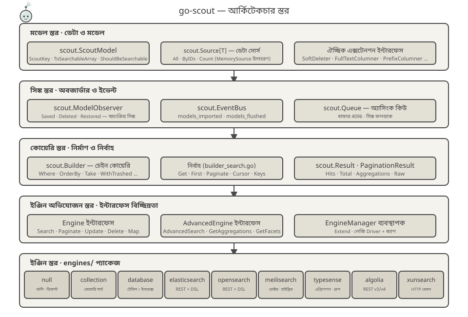
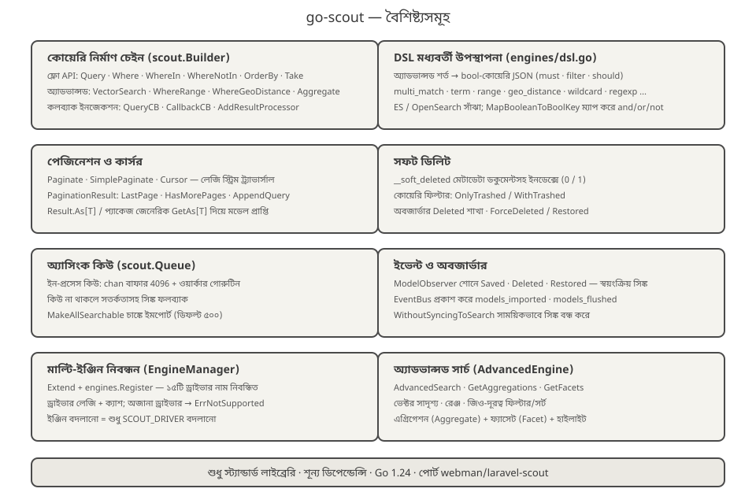
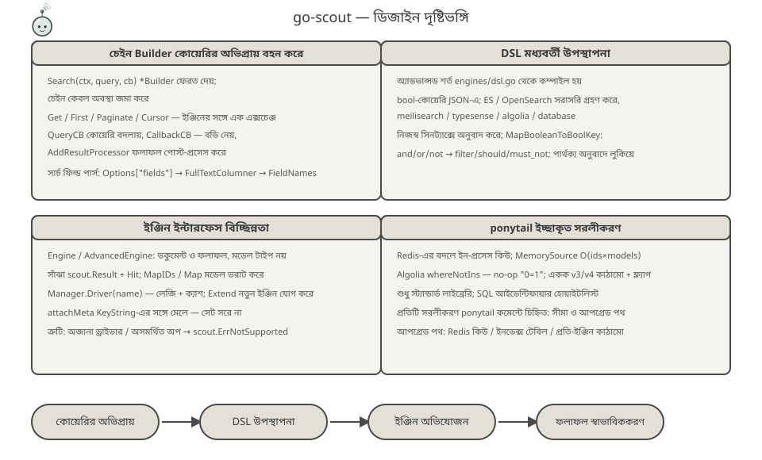
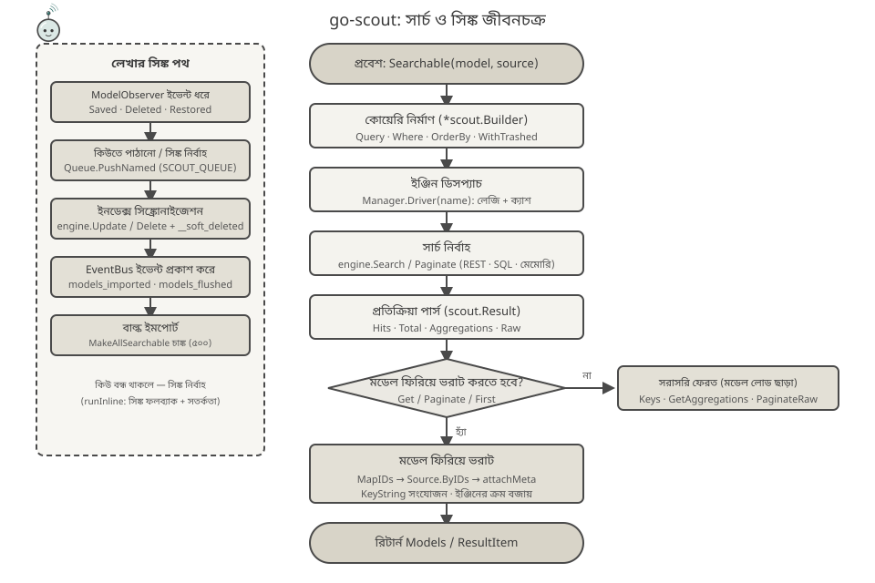

<p align="center">
  
</p>

<p align="center">
  <a href="https://pkg.go.dev/github.com/erikwang2013/go-scout"></a>
</p>

# go-scout

> Go ভাষায় লেখা সার্চ-সিঙ্ক লাইব্রেরি — Laravel Scout-এর Go পোর্ট (PHP প্লাগইন [webman-scout](https://github.com/shopwwi/webman-scout) ভিত্তিক)।
> Go 1.24 · শুধুমাত্র স্ট্যান্ডার্ড লাইব্রেরি, শূন্য থার্ড-পার্টি ডিপেন্ডেন্সি · সংস্করণ v1.3.1

**Languages / 语言**: [中文](../../../README.md) · [English](../en/README.md) · [한국어](../ko/README.md) · [Русский](../ru/README.md) · [Deutsch](../de/README.md) · [Français](../fr/README.md) · [Español](../es/README.md) · [Português](../pt/README.md) · [हिन्दी](../hi/README.md) · [العربية](../ar/README.md) · [বাংলা](./README.md) · [Bahasa Indonesia](../id/README.md) · [日本語](../ja/README.md)

## প্রকল্প পরিচিতি

go-scout "মডেল ও সার্চ ইঞ্জিনের মধ্যে সিঙ্ক্রোনাইজেশন" সমস্যা সমাধান করে: `scout.ScoutModel` ইন্টারফেস বাস্তবায়নকারী মডেলগুলো save/delete/restore হলে স্বয়ংক্রিয়ভাবে সার্চ ইঞ্জিনে লেখা বা মুছে যায়, আর খোঁজার জন্য একটি অভিন্ন চেইন-ভিত্তিক কোয়েরি API থাকে, যা বিভিন্ন সার্চ ইঞ্জিনের (Elasticsearch, OpenSearch, Meilisearch, Typesense, Algolia, XunSearch…) API পার্থক্য লুকিয়ে রাখে।

এটি মূল PHP লাইব্রেরির ক্লাস কাঠামো ও আচরণ আয়নার মতো প্রতিফলিত করে:

| PHP (webman/laravel-scout) | Go (go-scout) |
|---|---|
| `Scout` | `scout.Scout` (scout.go) |
| `Builder` | `scout.Builder` (builder.go / builder_search.go) |
| `EngineManager` | `scout.Manager` / `scout.EngineManager` (manager.go) |
| `ModelObserver` | `scout.ModelObserver` (observer.go) |
| `Searchable` trait | `scout.Searchable` (searchable.go) |
| `Engine` / `AdvancedEngine` ও ইঞ্জিন ক্লাস | `scout.Engine` / `scout.AdvancedEngine` এবং `engines` প্যাকেজের ৯টি ইঞ্জিন |

অন্তর্নির্মিত ইঞ্জিন (প্যাকেজ `engines`):

- **null** — খালি ইমপ্লিমেন্টেশন, ডিফল্ট ড্রাইভার (ইনডেক্সিং বন্ধ থাকলে ব্যবহৃত হয়)
- **collection** — মেমোরিতে খোঁজ, কোনো বাহ্যিক সার্ভিস লাগে না
- **database** — টেবিলই ইনডেক্স: সরাসরি DB টেবিলে LIKE/ILIKE ও ফুলটেক্সট খোঁজ (mysql / pgsql / sqlite)
- **elasticsearch** / **opensearch** — REST কোয়েরি, `engines/dsl.go`-তে সাঁঝা DSL মধ্যবর্তী উপস্থাপনা
- **meilisearch** — REST কোয়েরি, ভেক্টর ও হাইব্রিড খোঁজ, ফিল্টারিং, সর্টিং, ফ্যাসেট
- **typesense** — REST কোয়েরি, এগ্রিগেশন, গ্রুপিং, ভেক্টর-নিয়ারেস্ট-নেবার খোঁজ
- **algolia** — REST কোয়েরি, দুটি সংস্করণ: v3 / v4
- **xunsearch** — HTTP ডেমন প্রোটোকল (ইনডেক্স অংশ ও সার্চ অংশ)

`engines.Register` যোগে `advanced_*` উপনাম মিলিয়ে মোট ১৬টি ড্রাইভার নাম নিবন্ধিত হয় (দেখুন [engines/register.go](../../../engines/register.go))।

## প্রকল্পের মাসকট · Scouty

<p align="center">
  
</p>

**Scouty** হলো go-scout-এর খোঁজার স্কাউট: বিবর্ধক চশমা আর স্কাউট গলবন্ধনী পরা ছোট্ট একটি প্রোব। লাইব্রেরিটি আসলে যা করে তা থেকেই তাকে আঁকা হয়েছে — প্রতিটি অঙ্গ কোডের একটি স্তরের সঙ্গে মেলে:

- **বিবর্ধক চশমা** — `scout.Builder` কুয়েরি স্তর: `Where`, `OrderBy`, ভেক্টর ও ভৌগোলিক শর্ত সবই এই লেন্সে কম্পাইল হয়।
- **অ্যান্টেনা ও সিগন্যাল আর্ক** — `EngineManager`: একটি কুয়েরি, ১৬টি ড্রাইভার নাম; `Driver(name)` অলসভাবে তৈরি ও ক্যাশ হয়।
- **স্কাউট গলবন্ধনী** — `ModelObserver`: `Saved` / `Deleted` / `Restored` নিজেই সিঙ্ক হয়; গিঁটটি `EventBus` ইভেন্ট।
- **হাতে ধরা ডকুমেন্ট কার্ড** — `ToSearchableArray()`-এর পরের ডকুমেন্ট; কার্ডের কোণের রঙিন চিপটি প্রাইমারি কি (`KeyString`)।

Scouty কোডেও থাকে: [mascot.go](../../../mascot.go)-তে `scout.MascotName` / `scout.MascotSVG` / `scout.MascotASCII`; টার্মিনালে `go run ./cmd/scout mascot` (`-svg` দিলে ভেক্টর); লোগো [docs/logo.svg](../../../docs/logo.svg)। `mascot_test.go` নিশ্চিত করে এমবেড করা SVG `docs/mascot.svg`-এর সঙ্গে অভিন্ন, এবং `docs/`-এর সব SVG (১২টি ভাষার সেটসহ) বৈধ।

## আর্কিটেকচার ডিজাইন



নিচ থেকে উপরে পাঁচটি স্তর, প্রতিটি স্তরে দায়িত্ব সংকুচিত হয়:

1. **মডেল স্তর** — বিজনেস মডেল `scout.ScoutModel` বাস্তবায়ন করে (`ScoutKey`, `ToSearchableArray`, `ShouldBeSearchable`, `TableName` ইত্যাদি, দেখুন [model.go](../../../model.go)); ডেটা ইন্টারফেস `scout.Source[T]` (`All` / `ByIDs` / `Count`) থেকে আসে, অন্তর্নির্মিত `scout.NewMemorySource` সহ। `SoftDeleter`, `FullTextColumner`, `PrefixColumner`-এর মতো ঐচ্ছিক ইন্টারফেস প্রয়োজনমতো বাস্তবায়িত হয়।
2. **সিঙ্ক স্তর** — `scout.ModelObserver` মডেলের save/delete/restore ইভেন্ট ধরে; `scout.EventBus` ইভেন্ট `scout.models_imported`, `scout.models_flushed` প্রকাশ করে; `scout.Queue` ইন-প্রসেস অ্যাসিংক কিউ দেয় (বাফার 4096), কিউ না থাকলে সিঙ্ক ফলব্যাক।
3. **কোয়েরি স্তর** — `scout.Builder` চেইনের মাধ্যমে কোয়েরির অবস্থা জমা করে (`Where`, `OrderBy`, `Take`, `WithTrashed`…); `builder_search.go`-র নির্বাহ পদ্ধতি (`Get` / `First` / `Paginate` / `Cursor` / `Keys`) ইঞ্জিনের সঙ্গে একবার এক্সচেঞ্জ চালায়, ফলাফল `scout.Result` / `PaginationResult`-এ স্বাভাবিক হয়।
4. **ইঞ্জিন অভিযোজন স্তর** — ইন্টারফেস `Engine` (`Search`, `Paginate`, `Update`, `Delete`, `Map`, `Flush`, `CreateIndex`, `DeleteIndex`…) এবং অ্যাডভান্সড ইন্টারফেস `AdvancedEngine` (`AdvancedSearch`, `GetAggregations`, `GetFacets`) ইঞ্জিনের পার্থক্য ইন্টারফেসের আড়ালে রাখে; `scout.Manager` এগুলো `Extend` দিয়ে নিবন্ধিত করে, `Driver(name)` লেজি-ভাবে ড্রাইভার তৈরি করে ক্যাশ করে।
5. **ইঞ্জিন স্তর** — প্যাকেজ `engines`-এ ৯টি ইমপ্লিমেন্টেশন, প্রতিটি কেবল কনফিগ (`*scout.Config`) ও HTTP ক্লায়েন্টের উপর নির্ভরশীল, একে-অপরের সম্পর্কে জানে না।

## বৈশিষ্ট্যসমূহ



- **কোয়েরি নির্মাণ চেইন** — `scout.Builder`-এর ফ্লো-স্টাইল API: `Query` / `Where` / `WhereIn` / `WhereNotIn` / `OrderBy` / `OrderByDesc` / `Latest` / `Oldest` / `Take` / `Skip`; অ্যাডভান্সড শর্ত `VectorSearch` / `WhereRange` / `WhereGeoDistance` / `FulltextSearch` / `OrderByVectorSimilarity` / `OrderByGeoDistance`; কলব্যাক ইনজেকশন `QueryCB` / `CallbackCB` / `AddResultProcessor`। সার্চ ফিল্ড পার্স ক্রম: `Options["fields"]` → `FullTextColumner` → `FieldNames`।
- **DSL মধ্যবর্তী উপস্থাপনা** — [engines/dsl.go](../../../engines/dsl.go) অ্যাডভান্সড শর্তগুলোকে এক অভিন্ন bool-কোয়েরি JSON-এ কম্পাইল করে (`multi_match`, `term`, `range`, `geo_distance`, `wildcard`, `regexp` ইত্যাদি), যা Elasticsearch / OpenSearch সরাসরি গ্রহণ করে; `MapBooleanToBoolKey` and/or/not-কে `filter` / `should` / `must_not`-এ ম্যাপ করে।
- **পেজিনেশন ও কার্সর** — `Paginate` / `PaginateRaw` / `SimplePaginate` / `Cursor` (বাফার্ড চ্যানেল থেকে লেজি ট্র্যাভার্সাল); `PaginationResult`-এ `LastPage` / `HasMorePages` / `AppendQuery`; `Result.As[T]` এবং প্যাকেজ-স্তরের জেনেরিক `scout.GetAs[T]` টাইপ-অ্যাসারশন ছাড়াই মডেল আনে।
- **সফট ডিলিট** — ডকুমেন্টসহ ইনডেক্সে `__soft_deleted` মেটাডেটা (0/1) লেখা হয়; কোয়েরি ফিল্টার `OnlyTrashed` / `WithTrashed`; database ইঞ্জিন `deleted_at` কলাম ব্যবহার করে।
- **অ্যাসিংক কিউ** — ইন-প্রসেস কিউ (`chan` বাফার 4096 + ওয়ার্কার গোরুটিন), `SCOUT_QUEUE=1` চালু করে; কিউ না থাকলে সতর্কতাসহ সিঙ্ক ফলব্যাক; `MakeAllSearchable` চাঙ্কে ইমপোর্ট করে (ডিফল্ট ৫০০ প্রতি চাঙ্ক)।
- **ইভেন্ট ও অবজার্ভার** — `ModelObserver` `Saved` / `Deleted` / `Restored` শুনে স্বয়ংক্রিয় সিঙ্ক করে; `EventBus` `scout.models_imported`, `scout.models_flushed` প্রকাশ করে; `WithoutSyncingToSearch` সাময়িকভাবে সিঙ্ক বন্ধ করে।
- **মাল্টি-ইঞ্জিন নিবন্ধন** — `Manager.Extend` + `engines.Register` ১৬টি ড্রাইভার নাম নিবন্ধিত করে; ড্রাইভার লেজি তৈরি ও ক্যাশ হয়; অজানা ড্রাইভারে `scout.ErrNotSupported` পাওয়া যায়; ইঞ্জিন বদলানো = শুধু `SCOUT_DRIVER` কনফিগ বদলানো।

## ডিজাইন দৃষ্টিভঙ্গি



- **চেইন Builder কোয়েরির অভিপ্রায় বহন করে** — `Search(ctx, query, cb)` `*scout.Builder` ফেরত দেয়; চেইন কেবল অবস্থা জমা করে, ইঞ্জিনের সঙ্গে এক্সচেঞ্জ হয় `Get` / `First` / `Paginate` / `Cursor`-এ; কোয়েরি বদলানো, ইঞ্জিনের রিকোয়েস্ট বডি পাওয়া ও ফলাফল পোস্ট-প্রসেস করা — সব কলব্যাকে, ইঞ্জিন এ সম্পর্কে জানে না।
- **DSL মধ্যবর্তী উপস্থাপনা** — অ্যাডভান্সড শর্ত এক অভিন্ন bool-কোয়েরি JSON-এ কম্পাইল হয়; ES / OpenSearch সরাসরি গ্রহণ করে, আর Meilisearch / Typesense / Algolia / database নিজস্ব সিনট্যাক্সে অনুবাদ করে — ইঞ্জিনের পার্থক্য অনুবাদ স্তরে লুকিয়ে থাকে।
- **ইঞ্জিন ইন্টারফেস বিচ্ছিন্নতা** — `Engine` / `AdvancedEngine` কেবল ডকুমেন্ট ও ফলাফলের কথা বলে, মডেল টাইপ জানে না; `MapIDs` / `Map` ID থেকে মডেল ফিরিয়ে ভরাট করে, `attachMeta` `KeyString`-এর সঙ্গে মেলে — ফিল্টার করা মডেল সেট সরে যায় না।
- **ponytail ইচ্ছাকৃত সরলীকরণ** — কোডে প্রতিটি আপস `ponytail:` কমেন্টে চিহ্নিত: Redis-এর বদলে ইন-প্রসেস কিউ, `MemorySource` রৈখিক স্ক্যান O(ids×models), Algolia-তে `whereNotIns`-এর `"0=1"` no-op, ভার্সন-ফ্ল্যাগসহ একক v3/v4 কাঠামো, `_score asc` স্টাব দিয়ে র্যান্ডম সর্ট ইত্যাদি। শুধুমাত্র স্ট্যান্ডার্ড লাইব্রেরি, শূন্য থার্ড-পার্টি SDK।

## জীবনচক্র



**সার্চ পথ**: `Searchable(model, source).Search(ctx, query, cb)` `*scout.Builder` তৈরি করে → `Manager.Driver(name)` ইঞ্জিন নির্ধারণ করে (লেজি নির্মাণ + ক্যাশ) → `engine.Search` / `Paginate` (REST / SQL / মেমোরি) → `scout.Result`-এ পার্স (Hits · Total · Aggregations · Raw) → মডেল ফিরিয়ে ভরাট করতে হলে (`Get` / `Paginate` / `First`): `MapIDs` → `Source.ByIDs` → `attachMeta` (`KeyString` সংযোজন, ইঞ্জিনের ক্রম বজায় থাকে) → `ResultItem` / `PaginationResult` ফেরত; `Keys` / `GetAggregations` / `PaginateRaw` মডেল লোড না করেই সরাসরি ফেরত দেয়।

**লেখার পথ**: `ModelObserver` মডেল ইভেন্ট ধরে → `Queue.PushNamed("scout_make" / "scout_remove" / "scout_make_range")` অ্যাসিংক চালায় (কিউ ছাড়া — সিঙ্ক ফলব্যাক) → `engine.Update` / `Delete` (সফট ডিলিটে `__soft_deleted` মেটাডেটা যুক্ত হয়) → `EventBus` `scout.models_imported` / `scout.models_flushed` প্রকাশ করে।

## প্রকল্প কাঠামো

```
go-scout/
├── go.mod                      # মডিউল: github.com/erikwang2013/go-scout · go 1.24.1 · শূন্য ডিপেন্ডেন্সি
├── .gitignore                  # IDE / ক্যাশ / কী-ফাইলের বর্জন
├── LICENSE                     # BSD 3-Clause লাইসেন্স
├── scout.go                    # Scout ফ্যাসাড: Config / Manager / Events / Queue / Observer-এর সমাবেশ ও ফ্যাক্টরি
├── config.go                   # কনফিগ ট্রি: DefaultConfig + এনভায়রনমেন্ট-ভেরিয়েবল ওভাররাইড + dot-path ভ্যালু
├── engine.go                   # Engine / AdvancedEngine ইন্টারফেস + Result / Hit / PaginationResult টাইপ
├── manager.go                  # EngineManager: Extend রেজিস্ট্রেশন, Driver লেজি-ক্রিয়েশন ক্যাশ, ডিফল্ট null ইঞ্জিন
├── builder.go                  # Builder কাঠামো + চেইন শর্ত (Where / OrderBy / Take / অ্যাডভান্সড শর্ত)
├── builder_search.go           # কোয়েরি নির্বাহ: Raw / Get / First / Paginate / Cursor / GetAs[T]
├── searchable.go               # Searchable: মডেল-ডেটা-সোর্স বাইন্ডিং, পূর্ণ ইমপোর্ট/এক্সপোর্ট, সফট-ডিলিট মেটাডেটা
├── observer.go                 # ModelObserver: Saved / Deleted / Restored-এ স্বয়ংক্রিয় সিঙ্ক
├── events.go                   # EventBus: থ্রেড-নিরাপদ পাব-সাব + ইমপোর্ট/ফ্লাশ ইভেন্ট
├── queue.go                    # Queue: ইন-প্রসেস অ্যাসিংক কিউ (chan 4096) + সিঙ্ক ফলব্যাক
├── model.go                    # ScoutModel ইন্টারফেস + ঐচ্ছিক এক্সটেনশন ইন্টারফেস + KeyName/KeyString হেল্পার
├── source.go                   # Source[T] ইন্টারফেস + MemorySource (রৈখিক স্ক্যান)
├── exceptions.go               # ত্রুটি সিস্টেম ErrNotSupported / ErrScout
├── mascot.go                   # মাসকট Scouty: MascotName / MascotSVG / MascotASCII
├── mascot_test.go              # এমবেড করা SVG বনাম docs/mascot.svg + docs/-এর সব SVG যাচাই
├── cmd/scout/main.go           # CLI ডেমো: import / flush / index / queue-import ইত্যাদি মোট ৭টি উপকমান্ড
├── engines/
│   ├── engine.go               # HTTP ক্লায়েন্ট (auth, TLS স্কিপ) + সাঁঝা হেল্পার DoJSON/DoBytes
│   ├── register.go             # SetDatabase + Register — ১৬টি ড্রাইভার নাম নিবন্ধিত করে + Drivers()
│   ├── dsl.go                  # DSL মধ্যবর্তী উপস্থাপনা: bool কোয়েরি / সর্ট / এগ্রিগেশন / ফ্যাসেট / হাইলাইট
│   ├── null.go                 # NullEngine: খালি ইমপ্লিমেন্টেশন
│   ├── collection.go           # CollectionEngine: মেমোরি সার্চ (কেস-অসংবেদনশীল সাবস্ট্রিং ম্যাচ)
│   ├── database.go             # DatabaseEngine: টেবিল = ইনডেক্স SQL (LIKE/ILIKE + pgsql-এ tsvector)
│   ├── elasticsearch.go        # ElasticsearchEngine + OpenSearch-এর সাথে সাঁঝা es* হেল্পার
│   ├── opensearch.go           # OpenSearchEngine (বেস ড্রাইভারই অ্যাডভান্সড ইঞ্জিন)
│   ├── meilisearch.go          # MeilisearchEngine: ফিল্টার / সর্ট / ভেক্টর-হাইব্রিড / ফ্যাসেট
│   ├── meilisearch_advanced.go # Meilisearch অ্যাডভান্সড ইঞ্জিন: ভেক্টর / হাইব্রিড সার্চ এক্সটেনশন
│   ├── typesense.go            # TypesenseEngine: filter_by / এগ্রিগেশন / গ্রুপিং / নিয়ারেস্ট-নেবার সার্চ
│   ├── typesense_advanced.go   # Typesense অ্যাডভান্সড ইঞ্জিন: সার্চ প্যারামিটার / অ্যাগ্রিগেশন / ভেক্টর
│   ├── algolia.go              # AlgoliaEngine: v3/v4 একই কাঠামো + ভার্সন ফ্ল্যাগ
│   ├── xunsearch.go            # XunSearchEngine: ইনডেক্স ডেমন + সার্চ ডেমন
│   └── xunsearch_advanced.go   # XunSearch অ্যাডভান্সড ইঞ্জিন: অ্যাডভান্সড শর্ত / ফ্যাসেট
├── docs/
│   ├── arch.svg                # আর্কিটেকচার স্তর চিত্র
│   ├── features.svg            # বৈশিষ্ট্য চিত্র
│   ├── design.svg              # ডিজাইন দৃষ্টিভঙ্গি চিত্র
│   ├── logo.svg                # মূল ছবি: সম্পূর্ণ Scouty + go-scout ওয়ার্ডমার্ক
│   ├── mascot.svg              # মাসকট Scouty (একই ছবি mascot.go-তে এমবেড করা)
│   ├── alipay.png              # Alipay পেমেন্ট QR কোড (দান অংশ থেকে উল্লেখিত)
│   ├── weixinpay.png           # WeChat Pay পেমেন্ট QR কোড (দান অংশ থেকে উল্লেখিত)
│   ├── coin/                   # প্রতি-চেইন দান QR কোড (১০টি jpg)
│   └── lifecycle.svg           # সার্চ জীবনচক্র চিত্র
└── engines/
    ├── algolia_test.go         # Algolia ফিল্টার লিটারেল টেস্ট (algoliaLit / algoliaFilters)
    ├── elasticsearch_test.go   # Elasticsearch রিকোয়েস্ট/পার্স টেস্ট (httptest স্টাব)
    ├── opensearch_test.go      # OpenSearch রিকোয়েস্ট/পার্স টেস্ট (httptest স্টাব)
    ├── xunsearch_test.go       # XunSearch ডেমন প্রোটোকল টেস্ট (httptest স্টাব)
    ├── collection_test.go      # ইন-মেমোরি ইঞ্জিন আচরণ টেস্ট (ফিল্টার / সর্ট / পেজিনেশন / ব্যাকফিল)
    ├── database_test.go        # SQL জেনারেশন ও পরীক্ষা (assertSQL সঠিক মিল)
    ├── meilisearch_test.go     # Meilisearch অনুরোধ/পার্স টেস্ট (httptest স্টাব)
    ├── typesense_test.go       # Typesense অনুরোধ/পার্স টেস্ট (404-এ অটো-কালেকশনসহ)
    └── null_test.go            # NullEngine খালি-আচরণ টেস্ট
```

## দ্রুত শুরু/ব্যবহার নির্দেশিকা

### 1. সংযোজন (ইনস্টল)

```bash
go get github.com/erikwang2013/go-scout
```

কোনো থার্ড-পার্টি ডিপেন্ডেন্সি নেই — যোগ করলেই ব্যবহারের জন্য প্রস্তুত।

### 2. ড্রাইভার কনফিগারেশন

`scout.DefaultConfig()` এনভায়রনমেন্ট ভেরিয়েবল পড়ে। সাধারণ আইটেম:

| এনভায়রনমেন্ট ভেরিয়েবল | ডিফল্ট মান | বিবরণ |
|---|---|---|
| `SCOUT_DRIVER` | `database` | ইঞ্জিন ড্রাইভারের নাম; খালি স্ট্রিং বা `"false"` → `null`-এ ফলব্যাক |
| `SCOUT_PREFIX` | খালি | ইনডেক্স উপসর্গ |
| `SCOUT_QUEUE` | বন্ধ | `1` অ্যাসিংক কিউ চালু করে |
| `SCOUT_SOFT_DELETE` | বন্ধ | সফট-ডিলিট মেটাডেটা ডকুমেন্টসহ ইনডেক্সে লেখা হয় |
| `SCOUT_IDENTIFY` | বন্ধ | কনফিগ ট্রি `identify`: ইঞ্জিনকে জানায় কে খুঁজছে (algolia) |
| `SCOUT_CHUNK_SEARCHABLE` / `SCOUT_CHUNK_UNSEARCHABLE` | `500` | বাল্ক ইমপোর্ট/ডিলিটের চাঙ্ক আকার |
| `SCOUT_BULK_SIZE` | `100` | বাল্ক রাইট আকার (opensearch) |

ইঞ্জিন-নির্দিষ্ট (কনফিগ ট্রি পাথ `engine.key` env নামের সমতুল্য, যেমন `opensearch.host` ← `OPENSEARCH_HTTP_HOST`):

| ইঞ্জিন | এনভায়রনমেন্ট ভেরিয়েবল (ডিফল্ট মান) |
|---|---|
| meilisearch | `MEILISEARCH_HOST` (`http://127.0.0.1:7700`), `MEILISEARCH_KEY` |
| typesense | `TYPESENSE_HOST` (`127.0.0.1`), `TYPESENSE_PORT` (`8108`), `TYPESENSE_PROTOCOL` (`http`), `TYPESENSE_API_KEY` (`xyz`), `TYPESENSE_IMPORT_ACTION` (`upsert`), `TYPESENSE_MAX_TOTAL_RESULTS` (`1000`), `TYPESENSE_CONNECTION_TIMEOUT` (`2`) |
| elasticsearch | `ELASTICSEARCH_HOST` (`http://127.0.0.1:9200`, hosts তালিকার প্রথম উপাদান) + `elasticsearch.auth` (user/password) |
| opensearch | `OPENSEARCH_HTTP_HOST` (`https://127.0.0.1:6205`), `OPENSEARCH_USERNAME` / `OPENSEARCH_PASSWORD` (`admin`/`admin`), `OPENSEARCH_SSL_VERIFICATION` (ডিফল্ট TLS জাচ বন্ধ), `OPENSEARCH_TIMEOUT` (`30` সেকেন্ড), `OPENSEARCH_CONNECTION_TIMEOUT` (`10`) |
| xunsearch | `XUNSEARCH_INDEX_HOST` (`http://127.0.0.1`) + `XUNSEARCH_INDEX_PORT` (`8383`), `XUNSEARCH_SEARCH_HOST` (`http://127.0.0.1`) + `XUNSEARCH_SEARCH_PORT` (`8384`), `XUNSEARCH_DEFAULT_INDEX` (`default`), `XUNSEARCH_CHARSET` (`utf-8`), `XUNSEARCH_CONFIG_PATH`, `XUNSEARCH_BATCH_SIZE` (`100`) |
| algolia | `ALGOLIA_APP_ID`, `ALGOLIA_SECRET` (অনুপস্থিত থাকলে ইঞ্জিন কনস্ট্রাক্টর panic করে) |

`database` ড্রাইভারকে DB সংযোগ ও ডায়ালেক্টও লাগে:

```go
engines.SetDatabase(db, "mysql") // dialect: mysql / pgsql / postgres / sqlite
```

### 3. ন্যূনতম ব্যবহারের উদাহরণ

```go
package main

import (
	"context"
	"fmt"

	"github.com/erikwang2013/go-scout"
	"github.com/erikwang2013/go-scout/engines"
)

// Post 实现 scout.ScoutModel 即可参与搜索
type Post struct {
	ID    int
	Title string
	Body  string
}

func (p Post) ScoutKey() any            { return p.ID }
func (p Post) TableName() string        { return "posts" }
func (p Post) ShouldBeSearchable() bool { return p.Title != "" }
func (p Post) ToSearchableArray() map[string]any {
	return map[string]any{"title": p.Title, "body": p.Body}
}

func main() {
	ctx := context.Background()

	// 初始化：默认配置 + 注册全部引擎（SCOUT_DRIVER 决定用哪个）
	s := scout.NewWithConfig(scout.DefaultConfig())
	engines.Register(s.Manager)

	// 绑定模型与数据源，全量导入（chunk 传 0 表示用默认块大小 500）
	sr := s.Searchable(&Post{}, scout.NewMemorySource(
		Post{ID: 1, Title: "Go module layout", Body: "packages and imports"},
		Post{ID: 2, Title: "Indexing strategies", Body: "bulk writes"},
	))
	_ = sr.MakeAllSearchable(ctx, 0)

	// 链式查询：Search → Where → OrderByDesc → Take → Get
	items, err := sr.Search(ctx, "golang", nil). // 第三参为查询回调，可传 nil
		Where("title", "indexing").
		OrderByDesc("created_at").
		Take(10).
		Get(ctx)
	if err != nil {
		panic(err)
	}
	for _, it := range items {
		post := it.Model.(Post) // ResultItem.Model 已回填为原始模型
		fmt.Println(post.ID, it.Score)
	}

	// 泛型取数：GetAs[T] 免类型断言
	posts, _ := scout.GetAs[Post](ctx, sr.Search(ctx, "indexing", nil).Take(5))
	_ = posts
}
```

কোয়েরি নির্বাহের প্রধান পদ্ধতি: `Get(ctx) ([]ResultItem, error)`, `First(ctx)`, `Paginate(ctx, perPage, page, pageName)` (ডিফল্ট ১৫ প্রতি পৃষ্ঠা, পেজ প্যারামিটার নাম `page`), `Cursor(ctx)` (লেজি স্ট্রিম), `Keys(ctx)` (শুধু প্রাইমারি কী)। পেজিনেশন ফলাফল `PaginationResult`-এ পেজ লিংকের জন্য `LastPage()` / `HasMorePages()` / `AppendQuery()`ও আছে।

### 4. CLI ডেমো প্রোগ্রাম

`cmd/scout` — স্বয়ংসম্পূর্ণ ডেমো CLI: স্টার্টআপে `SCOUT_DRIVER`-কে `collection`-এ সেট করে এবং `NewMemorySource` দিয়ে ৭টি `post` রেকর্ড প্রি-লোড করে (খালি শিরোনামের ড্রাফট বাদ যায়, কারণ `ShouldBeSearchable` false ফেরত দেয়)।

```bash
go run ./cmd/scout                # 打印全部子命令用法
go run ./cmd/scout index posts --key id        # 创建索引
go run ./cmd/scout import --chunk 3 --fresh    # 全量导入（每块 3 条，先清空）
go run ./cmd/scout flush          # 清空索引
go run ./cmd/scout queue-import --chunk 3 --min 1 --max 100 --workers 4  # 按键范围入队导入
go run ./cmd/scout sync-index-settings --driver meilisearch  # 同步索引设置（需引擎实现 UpdateIndexSettings）
go run ./cmd/scout delete-index posts           # 删除单个索引
go run ./cmd/scout delete-all-indexes           # 删除全部索引
go run ./cmd/scout mascot                         # মাসকট প্রিন্ট করুন (-svg দিলে ভেক্টর)
```

## লাইসেন্স ও টীকা

প্রকল্পটি PHP প্লাগইন webman-scout-এর Go পোর্ট: ক্লাস কাঠামো, ড্রাইভার নাম ও আচরণের শব্দার্থ বজায় রাখা হয়েছে; সব ইচ্ছাকৃত সরলীকরণ সোর্স কোডে `ponytail:` কমেন্টে চিহ্নিত (ইন-প্রসেস কিউ, মেমোরি ডেটা সোর্সের রৈখিক স্ক্যান, Algolia-র `"0=1"` no-op ইত্যাদি)।

## দান (Donate)

আপনার সমর্থনের জন্য ধন্যবাদ! আপনার দান প্রকল্পটিকে ক্রমাগত বিকশিত ও রক্ষণাবেক্ষিত থাকতে সাহায্য করবে। প্রকল্পটি সমর্থন করুন:

<p align="center">
<table>
<tr>
<td align="center">
<b>微信（WeChat Pay）</b><br/>

</td>
<td align="center">
<b>支付宝（Alipay）</b><br/>

</td>
</tr>
</table>
</p>

### ক্রিপ্টোকারেন্সি দান (Crypto Donate)

নিম্নলিখিত নেটওয়ার্কগুলো সমর্থিত। ট্রান্সফার করার সময় ওয়ালেট ঠিকানা সংশ্লিষ্ট নেটওয়ার্কের সাথে মিলিয়ে নিন:

| নেটওয়ার্ক | ওয়ালেট ঠিকানা | QR কোড |
|---|---|---|
| BNB Smart Chain (BEP20) | `0x355d429f97511897ccb4e271ec888205f9ab6629` |  |
| Tron (TRC20) | `TEdDHWLajt1XvqtPDWmQctdrJaC3pzZZzz` |  |
| Ethereum (ERC20) | `0x355d429f97511897ccb4e271ec888205f9ab6629` |  |
| Aptos | `0x836e3780edfc3f7b2372b39e2a1a3a5d7adfaccd96c726f21cfde1b50dd68030` |  |
| Plasma | `0x355d429f97511897ccb4e271ec888205f9ab6629` |  |
| Polygon POS | `0x355d429f97511897ccb4e271ec888205f9ab6629` |  |
| Solana | `2hfhboHdmdrYsY25XfQSsEWxq5ip4EQsR7f4AzSRMUyr` |  |
| The Open Network (TON) | `UQB9kFQohzmXUir9QSSZq01iwl9aQZIDdBpNmDklljRtCoGK` |  |
| Arbitrum One | `0x355d429f97511897ccb4e271ec888205f9ab6629` |  |
| AVAX C-Chain | `0x355d429f97511897ccb4e271ec888205f9ab6629` |  |

### আন্তর্জাতিক ব্যাংক ট্রান্সফার (ব্যাংক রেমিট্যান্স)

**প্রাপকের তথ্য**

- প্রাপকের নাম: WANG KEXUN
- প্রাপকের অ্যাকাউন্ট নম্বর: 881015918251

**প্রাপকের ব্যাংক**

- ZA Bank-এর SWIFT কোড: `AABLHKHHXXX`
- ব্যাংকের নাম: ZA Bank Limited
- ব্যাংক কোড: 387
- ব্যাংকের ঠিকানা: `Core F, Cyberport 3, 100 Cyberport Road, Hong Kong`

**আন্তঃসীমান্ত রেমিট্যান্স করেসপন্ডেন্ট ব্যাংক (যদি প্রয়োজন হয়)**

> এটি আন্তঃসীমান্ত ট্রান্সফারের জন্য করেসপন্ডেন্ট (মধ্যস্থ) ব্যাংকের তথ্য, প্রাপকের ব্যাংক নয়। করেসপন্ডেন্ট ব্যাংকের তথ্য দেওয়া প্রয়োজন কিনা নিজের ব্যাংককে জিজ্ঞাসা করুন।

- হংকং ডলার, ইউয়ান ও মার্কিন ডলার ট্রান্সফারের করেসপন্ডেন্ট Citibank:
  - ব্যাংকের নাম: Citibank N.A. Hong Kong
  - SWIFT কোড: `CITIHKHXXXX`
  - ব্যাংক কোড: 006
  - শাখার নাম: Hong Kong Branch
  - শাখা কোড: 391
  - ব্যাংকের ঠিকানা: `Citibank Tower, Citibank Plaza, 3 Garden Road, Central, Hong Kong`
- অন্যান্য মুদ্রার ট্রান্সফারের করেসপন্ডেন্ট BNY Mellon:
  - ব্যাংকের নাম: THE BANK OF NEW YORK MELLON
  - SWIFT কোড: `IRVTUS3NXXX`
  - ব্যাংকের ঠিকানা: `THE BANK OF NEW YORK MELLON, 240 GREENWICH STREET, NEW YORK, United States`
