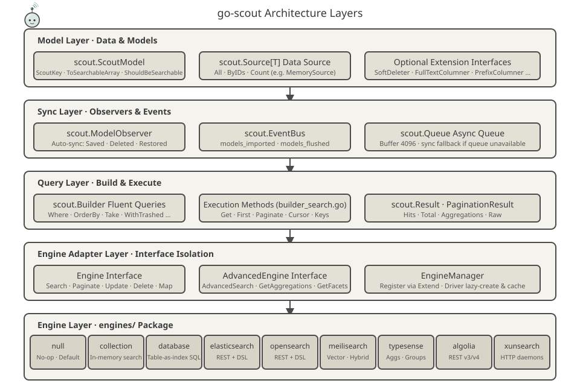
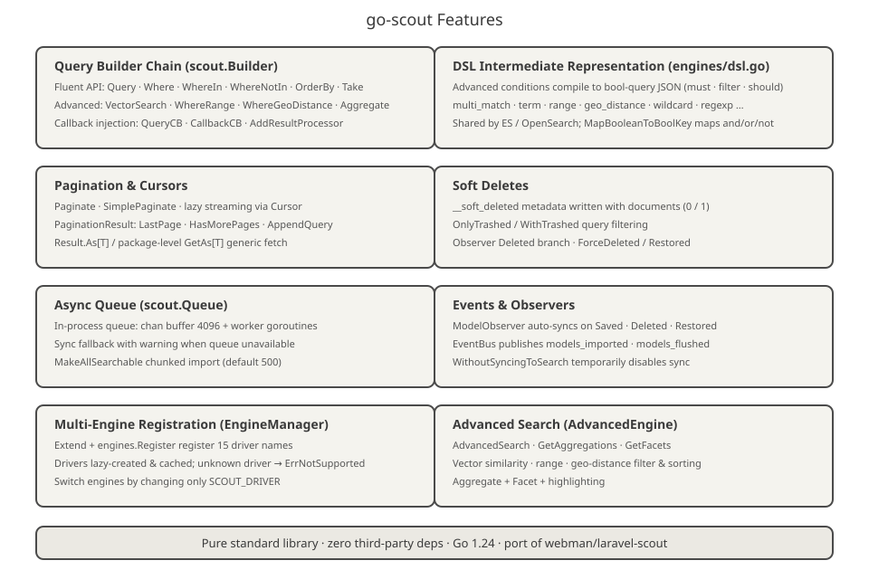
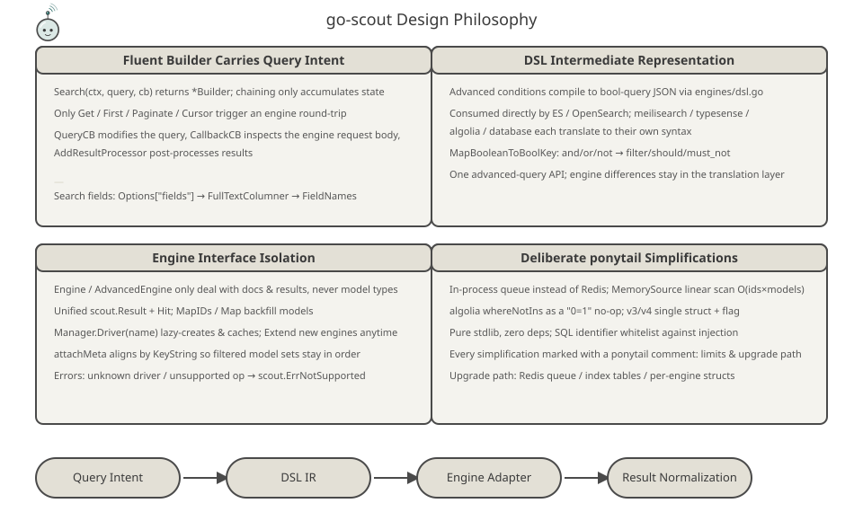
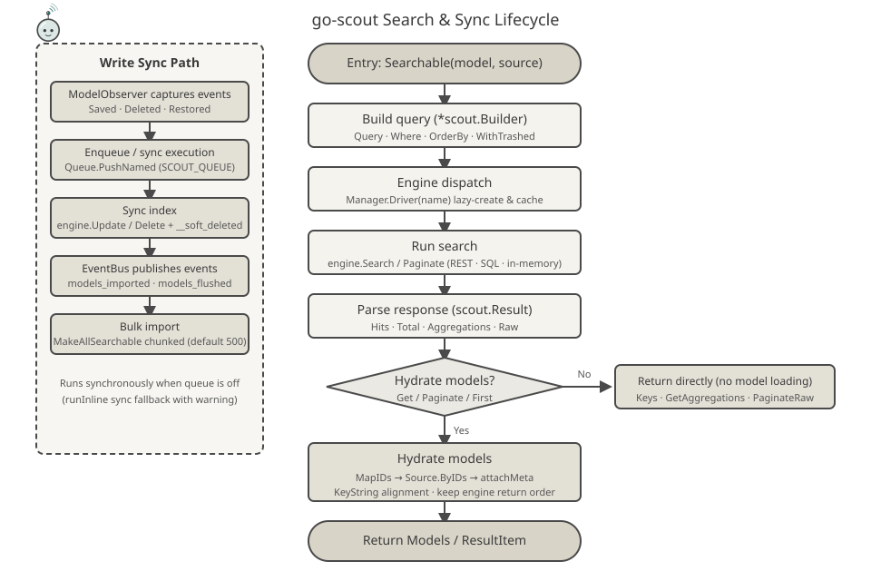

<p align="center">
  
</p>

<p align="center">
  <a href="https://pkg.go.dev/github.com/erikwang2013/go-scout"></a>
</p>

# go-scout

> A search synchronization library written in Go — a Go port of Laravel Scout (based on the PHP plugin [webman-scout](https://github.com/shopwwi/webman-scout)).
> Go 1.24 · pure standard library, zero third-party dependencies · version v1.4.0

**Languages / 语言**: [中文](../../../README.md) · [English](./README.md) · [한국어](../ko/README.md) · [Русский](../ru/README.md) · [Deutsch](../de/README.md) · [Français](../fr/README.md) · [Español](../es/README.md) · [Português](../pt/README.md) · [हिन्दी](../hi/README.md) · [العربية](../ar/README.md) · [বাংলা](../bn/README.md) · [Bahasa Indonesia](../id/README.md) · [日本語](../ja/README.md)

## Introduction

go-scout solves the "model-to-search-engine synchronization" problem: models implementing the `scout.ScoutModel` interface are automatically written to or removed from the search engine when saved, deleted, or restored, and searched through one unified fluent query API that shields callers from the API differences between search engines (Elasticsearch, OpenSearch, Meilisearch, Typesense, Algolia, XunSearch…).

It mirrors the class structure and behavior of the original PHP library:

| PHP (webman/laravel-scout) | Go (go-scout) |
|---|---|
| `Scout` | `scout.Scout` (scout.go) |
| `Builder` | `scout.Builder` (builder.go / builder_search.go) |
| `EngineManager` | `scout.Manager` / `scout.EngineManager` (manager.go) |
| `ModelObserver` | `scout.ModelObserver` (observer.go) |
| `Searchable` trait | `scout.Searchable` (searchable.go) |
| `Engine` / `AdvancedEngine` and engine classes | `scout.Engine` / `scout.AdvancedEngine` plus the 9 engines in the `engines` package |

Built-in engines (the `engines` package):

- **null** — no-op implementation, the default fallback driver (used when indexing is disabled)
- **collection** — in-memory search, no external services required
- **database** — table-as-index: LIKE/ILIKE and full-text search directly against database tables (mysql / pgsql / sqlite)
- **elasticsearch** / **opensearch** — REST queries sharing the DSL intermediate representation in `engines/dsl.go`
- **meilisearch** — REST queries with vector & hybrid search, filtering, sorting, facets
- **typesense** — REST queries with aggregations, grouping, vector nearest-neighbor
- **algolia** — REST queries, both v3 / v4
- **xunsearch** — HTTP daemon protocol (index side + search side)

Together with the `advanced_*` aliases, `engines.Register` registers 16 driver names in total (see [engines/register.go](../../../engines/register.go)).

## Project Mascot · Scouty

<p align="center">
  
</p>

**Scouty** is go-scout's search scout: a little probe in a magnifier goggle and a scout's neckerchief. He is drawn from what this library actually does — every part maps onto a layer of the code:

- **Magnifier goggle** — the `scout.Builder` query layer: `Where`, `OrderBy`, vector and geo conditions are all compiled into that lens.
- **Antenna and signal arcs** — `EngineManager` fan-out: one query, 16 driver names; `Driver(name)` is created lazily and cached.
- **Scout neckerchief** — `ModelObserver`: `Saved` / `Deleted` / `Restored` sync themselves; the knot is the `EventBus` event.
- **Document cards in hand** — the searchable document after `ToSearchableArray()`; the coloured chip is the primary key (`KeyString`).

Scouty also lives in the code: `scout.MascotName` / `scout.MascotSVG` / `scout.MascotASCII` in [mascot.go](../../../mascot.go); `go run ./cmd/scout mascot` in the terminal (`-svg` for the vector version); [docs/logo.svg](../../../docs/logo.svg) for the hero at the very top of this README. `mascot_test.go` keeps the embedded SVG identical to `docs/mascot.svg` and parses every SVG under `docs/`, all 12 translated diagram sets included.

## Architecture



Five layers from bottom to top, with responsibility narrowing at each layer:

1. **Model layer** — business models implement `scout.ScoutModel` (`ScoutKey`, `ToSearchableArray`, `ShouldBeSearchable`, `TableName`, etc.; see [model.go](../../../model.go)); data is supplied through the `scout.Source[T]` interface (`All` / `ByIDs` / `Count`), with the built-in `scout.NewMemorySource`. Optional interfaces such as `SoftDeleter`, `FullTextColumner`, `PrefixColumner` are implemented as needed.
2. **Sync layer** — `scout.ModelObserver` captures model save/delete/restore events; `scout.EventBus` publishes the `scout.models_imported` and `scout.models_flushed` events; `scout.Queue` provides an in-process async queue (buffer 4096) with a synchronous fallback when the queue is unavailable.
3. **Query layer** — `scout.Builder` accumulates query state via fluent calls (`Where`, `OrderBy`, `Take`, `WithTrashed`…); the execution methods in `builder_search.go` (`Get` / `First` / `Paginate` / `Cursor` / `Keys`) trigger a single engine round-trip, and results are normalized into `scout.Result` / `PaginationResult`.
4. **Engine adapter layer** — the `Engine` interface (`Search`, `Paginate`, `Update`, `Delete`, `Map`, `Flush`, `CreateIndex`, `DeleteIndex`…) and the `AdvancedEngine` extension interface (`AdvancedSearch`, `GetAggregations`, `GetFacets`) isolate engine differences behind the interfaces; `scout.Manager` registers drivers via `Extend` and lazily creates and caches them through `Driver(name)`.
5. **Engine layer** — 9 engine implementations in the `engines` package, each depending only on configuration (`*scout.Config`) and an HTTP client, unaware of one another.

## Features



- **Query builder chain** — the `scout.Builder` fluent API: `Query` / `Where` / `WhereIn` / `WhereNotIn` / `OrderBy` / `OrderByDesc` / `Latest` / `Oldest` / `Take` / `Skip`; advanced conditions `VectorSearch` / `WhereRange` / `WhereGeoDistance` / `FulltextSearch` / `OrderByVectorSimilarity` / `OrderByGeoDistance`; callback injection `QueryCB` / `CallbackCB` / `AddResultProcessor`. Search-field resolution order: `Options["fields"]` → `FullTextColumner` → `FieldNames`.
- **DSL intermediate representation** — [engines/dsl.go](../../../engines/dsl.go) compiles advanced conditions into unified bool-query JSON (`multi_match`, `term`, `range`, `geo_distance`, `wildcard`, `regexp`, etc.), consumed directly by Elasticsearch / OpenSearch; `MapBooleanToBoolKey` maps and/or/not to `filter` / `should` / `must_not`.
- **Pagination & cursors** — `Paginate` / `PaginateRaw` / `SimplePaginate` / `Cursor` (lazy traversal over a buffered channel); `PaginationResult` provides `LastPage` / `HasMorePages` / `AppendQuery`; `Result.As[T]` and the package-level generic function `scout.GetAs[T]` fetch models without type assertions.
- **Soft deletes** — index documents carry `__soft_deleted` metadata (0/1); `OnlyTrashed` / `WithTrashed` filter queries; the database engine uses the `deleted_at` column.
- **Async queue** — in-process queue (`chan` buffer 4096 + worker goroutines), enabled with `SCOUT_QUEUE=1`; synchronous fallback with a warning when the queue is unavailable; `MakeAllSearchable` imports in chunks (default 500 per chunk).
- **Events & observers** — `ModelObserver` listens to `Saved` / `Deleted` / `Restored` and syncs automatically; `EventBus` publishes `scout.models_imported` and `scout.models_flushed`; `WithoutSyncingToSearch` temporarily disables sync.
- **Multi-engine registration** — `Manager.Extend` + `engines.Register` register 16 driver names; drivers are lazily created and cached; unknown drivers return `scout.ErrNotSupported`; switching engines only requires changing the `SCOUT_DRIVER` config.

## Design Philosophy



- **Fluent Builder carries query intent** — `Search(ctx, query, cb)` returns a `*scout.Builder`; fluent calls only accumulate state, and only `Get` / `First` / `Paginate` / `Cursor` trigger an engine round-trip; query modification, request-body interception, and result post-processing are all injected via callbacks, so the engine never has to care.
- **DSL intermediate representation** — advanced conditions compile into bool-query JSON consumed directly by ES / OpenSearch, while Meilisearch / Typesense / Algolia / database each translate to their own syntax; engine differences stay in the translation layer.
- **Engine interface isolation** — `Engine` / `AdvancedEngine` only speak in terms of documents and results, never model types; `MapIDs` / `Map` backfill result IDs into models, and `attachMeta` aligns by `KeyString`, so filtered model sets never get misaligned.
- **Deliberate `ponytail:` simplifications** — trade-offs are marked with `ponytail:` comments throughout the code: an in-process queue instead of Redis, `MemorySource` with linear scan O(ids×models), Algolia's `whereNotIns` as a `"0=1"` no-op, v3/v4 as a single struct with a version flag, random sorting as a `_score asc` placeholder, etc. Pure standard library, zero third-party SDKs.

## Lifecycle



**Search path**: `Searchable(model, source).Search(ctx, query, cb)` builds a `*scout.Builder` → `Manager.Driver(name)` dispatches the engine (lazily created and cached) → `engine.Search` / `Paginate` (REST / SQL / in-memory) → parsed into a `scout.Result` (Hits · Total · Aggregations · Raw) → if model backfill is needed (`Get` / `Paginate` / `First`): `MapIDs` → `Source.ByIDs` → `attachMeta` (aligned by `KeyString`, preserving the engine's return order) → returns `ResultItem` / `PaginationResult`; `Keys` / `GetAggregations` / `PaginateRaw` return directly without loading models.

**Write path**: `ModelObserver` captures model events → `Queue.PushNamed("scout_make" / "scout_remove" / "scout_make_range")` executes asynchronously (synchronous fallback when not enabled) → `engine.Update` / `Delete` (with `__soft_deleted` metadata on soft delete) → `EventBus` publishes `scout.models_imported` / `scout.models_flushed`.

## Project Structure

```
go-scout/
├── go.mod                      # Module definition: github.com/erikwang2013/go-scout · go 1.24.1 · zero deps
├── .gitignore                  # IDE / cache / key-file ignores
├── LICENSE                     # BSD 3-Clause license
├── scout.go                    # Scout facade: assembles Config / Manager / Events / Queue / Observer, factories
├── config.go                   # Config tree: DefaultConfig + env overrides + dot-path lookups
├── engine.go                   # Engine / AdvancedEngine interfaces + Result / Hit / PaginationResult types
├── manager.go                  # EngineManager: Extend registration, lazy Driver creation & cache, default null engine
├── builder.go                  # Builder struct + fluent condition building (Where / OrderBy / Take / advanced)
├── builder_search.go           # Query execution: Raw / Get / First / Paginate / Cursor / GetAs[T]
├── searchable.go               # Searchable: model–source binding, full import/export, soft-delete metadata
├── observer.go                 # ModelObserver: auto-sync on Saved / Deleted / Restored
├── events.go                   # EventBus: thread-safe synchronous pub/sub + import/flush events
├── queue.go                    # Queue: in-process async queue (chan 4096) + sync fallback
├── model.go                    # ScoutModel interface + optional extension interfaces + KeyName/KeyString helpers
├── source.go                   # Source[T] interface + MemorySource (linear scan)
├── exceptions.go               # ErrNotSupported / ErrScout error system
├── identity.go                 # Identity plumbing: `scout.WithUser` / `scout.WithClientIP` (used by Algolia identify)
├── mascot.go                   # Project mascot Scouty: MascotName / MascotSVG / MascotASCII
├── mascot_test.go              # Embedded SVG vs docs/mascot.svg + every SVG under docs/ parses
├── cmd/scout/main.go           # CLI demo: import / flush / index / queue-import and 8 subcommands in total
├── engines/
│   ├── engine.go               # HTTP client (auth, TLS skip) + shared DoJSON/DoBytes helpers
│   ├── register.go             # SetDatabase + Register: 16 driver names + Drivers()
│   ├── dsl.go                  # DSL intermediate representation: bool queries / sorting / aggregations / facets / highlighting
│   ├── null.go                 # NullEngine: no-op implementation
│   ├── collection.go           # CollectionEngine: in-memory search (case-insensitive substring match)
│   ├── database.go             # DatabaseEngine: table-as-index SQL (LIKE/ILIKE + pgsql tsvector)
│   ├── elasticsearch.go        # ElasticsearchEngine + es* helpers shared with OpenSearch
│   ├── opensearch.go           # OpenSearchEngine (base driver that is also the advanced engine)
│   ├── meilisearch.go          # MeilisearchEngine: filtering / sorting / vector hybrid / facets
│   ├── meilisearch_advanced.go # Meilisearch advanced engine: vector / hybrid search extensions
│   ├── typesense.go            # TypesenseEngine: filter_by / aggregations / grouping / nearest-neighbor
│   ├── typesense_advanced.go   # Typesense advanced engine: search parameters / aggregations / vectors
│   ├── algolia.go              # AlgoliaEngine: single v3/v4 struct + version flag
│   ├── xunsearch.go            # XunSearchEngine: index daemon + search daemon
│   └── xunsearch_advanced.go   # XunSearch advanced engine: advanced conditions / facet extensions
├── docs/
│   ├── arch.svg                # Architecture layer diagram
│   ├── features.svg            # Features diagram
│   ├── design.svg              # Design philosophy diagram
│   ├── logo.svg                # Hero: the complete Scouty + go-scout wordmark
│   ├── mascot.svg              # Project mascot Scouty (same drawing embedded in mascot.go)
│   ├── alipay.png              # Alipay QR code (referenced by the donation section)
│   ├── weixinpay.png           # WeChat Pay QR code (referenced by the donation section)
│   ├── coin/                   # Per-chain donation QR codes (10 jpgs)
│   └── lifecycle.svg           # Search lifecycle flow diagram
└── engines/
    ├── algolia_test.go         # Algolia filter-literal tests (algoliaLit / algoliaFilters)
    ├── elasticsearch_test.go   # Elasticsearch request/parse tests (httptest stubs)
    ├── opensearch_test.go      # OpenSearch request/parse tests (httptest stubs)
    ├── xunsearch_test.go       # XunSearch daemon protocol tests (httptest stubs)
    ├── collection_test.go      # In-memory engine behavior tests (filter / sort / paginate / backfill)
    ├── database_test.go        # SQL generation & assertions (assertSQL exact match)
    ├── meilisearch_test.go     # Meilisearch request/parse tests (httptest stubs)
    ├── typesense_test.go       # Typesense request/parse tests (incl. 404 auto-create collection)
    └── null_test.go            # NullEngine no-op behavior tests
```

## Quick Start / Usage

### 1. Install

```bash
go get github.com/erikwang2013/go-scout
```

No third-party dependencies — install and use.

### 2. Configure the driver

`scout.DefaultConfig()` reads environment variables; common options:

| Environment variable | Default | Description |
|---|---|---|
| `SCOUT_DRIVER` | `database` | Engine driver name; empty string or `"false"` falls back to `null` |
| `SCOUT_PREFIX` | empty | Index prefix |
| `SCOUT_QUEUE` | off | Set to 1 to enable the async queue |
| `SCOUT_SOFT_DELETE` | off | Soft-delete metadata written to the index with documents |
| `SCOUT_IDENTIFY` | off | Forwards who is searching to Algolia: `X-Algolia-UserToken` (the key from `scout.WithUser`) and `X-Forwarded-For` (from `scout.WithClientIP`, public IPs only) |
| `SCOUT_CHUNK_SEARCHABLE` / `SCOUT_CHUNK_UNSEARCHABLE` | `500` | Chunk size for bulk import/removal |
| `SCOUT_BULK_SIZE` | `100` | Bulk write size (opensearch) |

Engine-specific (config-tree keys `engine.key` match the env names, e.g. `opensearch.host` ← `OPENSEARCH_HTTP_HOST`):

| Engine | Environment variables (defaults) |
|---|---|
| meilisearch | `MEILISEARCH_HOST` (`http://127.0.0.1:7700`), `MEILISEARCH_KEY` |
| typesense | `TYPESENSE_HOST` (`127.0.0.1`), `TYPESENSE_PORT` (`8108`), `TYPESENSE_PROTOCOL` (`http`), `TYPESENSE_API_KEY` (`xyz`), `TYPESENSE_IMPORT_ACTION` (`upsert`), `TYPESENSE_MAX_TOTAL_RESULTS` (`1000`), `TYPESENSE_CONNECTION_TIMEOUT` (`2`) |
| elasticsearch | `ELASTICSEARCH_HOST` (`http://127.0.0.1:9200`, first entry of the hosts list) + `elasticsearch.auth` (user/password) |
| opensearch | `OPENSEARCH_HTTP_HOST` (`https://127.0.0.1:6205`), `OPENSEARCH_USERNAME` / `OPENSEARCH_PASSWORD` (`admin`/`admin`), `OPENSEARCH_SSL_VERIFICATION` (TLS verification skipped by default), `OPENSEARCH_TIMEOUT` (`30` seconds), `OPENSEARCH_CONNECTION_TIMEOUT` (`10`) |
| xunsearch | `XUNSEARCH_INDEX_HOST` (`http://127.0.0.1`) + `XUNSEARCH_INDEX_PORT` (`8383`), `XUNSEARCH_SEARCH_HOST` (`http://127.0.0.1`) + `XUNSEARCH_SEARCH_PORT` (`8384`), `XUNSEARCH_DEFAULT_INDEX` (`default`), `XUNSEARCH_CHARSET` (`utf-8`), `XUNSEARCH_CONFIG_PATH` (empty = the hosts above; when set, `<path>/<index>.ini` supplies the project name, daemons and charset), `XUNSEARCH_BATCH_SIZE` (`100`) |
| algolia | `ALGOLIA_APP_ID`, `ALGOLIA_SECRET` (constructing the engine panics when missing), `ALGOLIA_HOST` (optional; defaults to `https://<appID>.algolia.net`, point it at a proxy or compatible endpoint) |

The `database` driver also needs a database connection and dialect injected:

```go
engines.SetDatabase(db, "mysql") // dialect: mysql / pgsql / postgres / sqlite
```

### 3. Minimal usage example

```go
package main

import (
	"context"
	"fmt"

	"github.com/erikwang2013/go-scout"
	"github.com/erikwang2013/go-scout/engines"
)

// Post participates in search by implementing scout.ScoutModel
type Post struct {
	ID    int
	Title string
	Body  string
}

func (p Post) ScoutKey() any            { return p.ID }
func (p Post) TableName() string        { return "posts" }
func (p Post) ShouldBeSearchable() bool { return p.Title != "" }
func (p Post) ToSearchableArray() map[string]any {
	return map[string]any{"title": p.Title, "body": p.Body}
}

func main() {
	ctx := context.Background()

	// Initialize: default config + register all engines (SCOUT_DRIVER decides which is used)
	s := scout.NewWithConfig(scout.DefaultConfig())
	engines.Register(s.Manager)

	// Bind model and source, then do a full import (chunk 0 means the default chunk size 500)
	sr := s.Searchable(&Post{}, scout.NewMemorySource(
		Post{ID: 1, Title: "Go module layout", Body: "packages and imports"},
		Post{ID: 2, Title: "Indexing strategies", Body: "bulk writes"},
	))
	_ = sr.MakeAllSearchable(ctx, 0)

	// Fluent query: Search → Where → OrderByDesc → Take → Get
	items, err := sr.Search(ctx, "golang", nil). // third arg is the query callback, nil is fine
		Where("title", "indexing").
		OrderByDesc("created_at").
		Take(10).
		Get(ctx)
	if err != nil {
		panic(err)
	}
	for _, it := range items {
		post := it.Model.(Post) // ResultItem.Model is already backfilled with the original model
		fmt.Println(post.ID, it.Score)
	}

	// Generic fetch: GetAs[T] without type assertions
	posts, _ := scout.GetAs[Post](ctx, sr.Search(ctx, "indexing", nil).Take(5))
	_ = posts
}
```

Key execution methods: `Get(ctx) ([]ResultItem, error)`, `First(ctx)`, `Paginate(ctx, perPage, page, pageName)` (15 items per page by default, page parameter named `page` by default), `Cursor(ctx)` (lazy streaming), `Keys(ctx)` (primary keys only). The paginated result `PaginationResult` also provides `LastPage()` / `HasMorePages()` / `AppendQuery()` for paging links.

### 4. CLI demo program

`cmd/scout` is a self-contained demo CLI: on startup it sets `SCOUT_DRIVER` to `collection` and preloads 7 `post` records via `NewMemorySource` (drafts with an empty title are skipped because `ShouldBeSearchable` is false).

```bash
go run ./cmd/scout                # print usage of all subcommands
go run ./cmd/scout index posts --key id        # create an index
go run ./cmd/scout import --chunk 3 --fresh    # full import (3 per chunk, flush first)
go run ./cmd/scout flush          # flush the index
go run ./cmd/scout queue-import --chunk 3 --min 1 --max 100 --workers 4  # enqueue import by key range
go run ./cmd/scout sync-index-settings --driver meilisearch  # sync index settings (requires engine support for UpdateIndexSettings)
go run ./cmd/scout delete-index posts           # delete a single index
go run ./cmd/scout delete-all-indexes           # delete all indexes
go run ./cmd/scout mascot                         # print the project mascot (-svg for the vector version)
```

## License & Notes

This project is a Go port of the PHP plugin webman-scout; class structure, driver naming, and behavioral semantics stay consistent with the original. Every simplification trade-off is marked with a `ponytail:` comment in the source (in-process queue, linear scan of the in-memory data source, Algolia's `"0=1"` no-op, etc.).

## Donate

Thank you for your support! Your donation will help keep this project maintained and growing. Welcome to support:

<p align="center">
<table>
<tr>
<td align="center">
<b>WeChat Pay</b><br/>

</td>
<td align="center">
<b>Alipay</b><br/>

</td>
</tr>
</table>
</p>

### Crypto Donate

The following mainnets are supported. Please double-check the receiving address against the corresponding mainnet before transferring:

| Mainnet | Wallet address | QR code |
|---|---|---|
| BNB Smart Chain (BEP20) | `0x355d429f97511897ccb4e271ec888205f9ab6629` |  |
| Tron (TRC20) | `TEdDHWLajt1XvqtPDWmQctdrJaC3pzZZzz` |  |
| Ethereum (ERC20) | `0x355d429f97511897ccb4e271ec888205f9ab6629` |  |
| Aptos | `0x836e3780edfc3f7b2372b39e2a1a3a5d7adfaccd96c726f21cfde1b50dd68030` |  |
| Plasma | `0x355d429f97511897ccb4e271ec888205f9ab6629` |  |
| Polygon POS | `0x355d429f97511897ccb4e271ec888205f9ab6629` |  |
| Solana | `2hfhboHdmdrYsY25XfQSsEWxq5ip4EQsR7f4AzSRMUyr` |  |
| The Open Network (TON) | `UQB9kFQohzmXUir9QSSZq01iwl9aQZIDdBpNmDklljRtCoGK` |  |
| Arbitrum One | `0x355d429f97511897ccb4e271ec888205f9ab6629` |  |
| AVAX C-Chain | `0x355d429f97511897ccb4e271ec888205f9ab6629` |  |

### Global Transfer (Bank Transfer)

**Payee information**

- Payee name: WANG KEXUN
- Payee account number: 881015918251

**Receiving bank**

- ZA Bank SWIFT Code: `AABLHKHHXXX`
- Bank name: ZA Bank Limited
- Bank code: 387
- Bank address: `Core F, Cyberport 3, 100 Cyberport Road, Hong Kong`

**Correspondent bank for cross-border remittance (if required)**

> The following is the correspondent (intermediary) bank for cross-border remittance, not the receiving bank. Please check with your remitting bank whether correspondent bank information is required.

- For remittances in HKD, CNY, and USD, the correspondent bank is Citibank:
  - Bank name: Citibank N.A. Hong Kong
  - SWIFT Code: `CITIHKHXXXX`
  - Bank code: 006
  - Branch name: Hong Kong Branch
  - Branch code: 391
  - Bank address: `Citibank Tower, Citibank Plaza, 3 Garden Road, Central, Hong Kong`
- For remittances in other currencies, the correspondent bank is BNY Mellon:
  - Bank name: THE BANK OF NEW YORK MELLON
  - SWIFT Code: `IRVTUS3NXXX`
  - Bank address: `THE BANK OF NEW YORK MELLON, 240 GREENWICH STREET, NEW YORK, United States`
