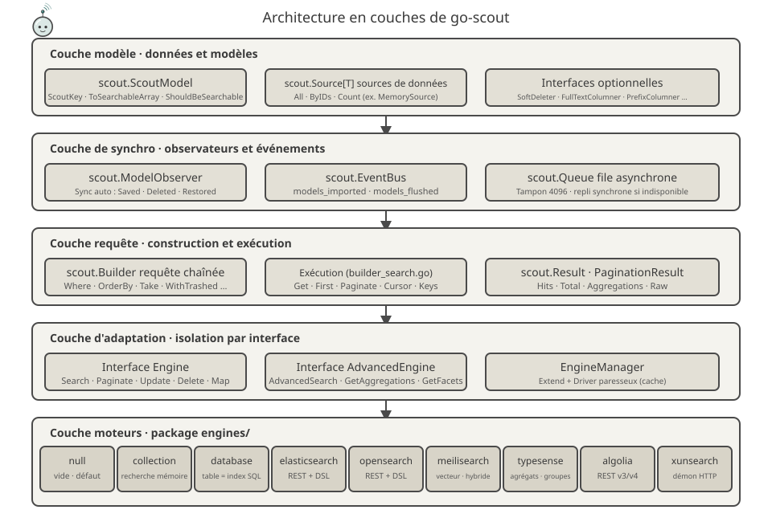
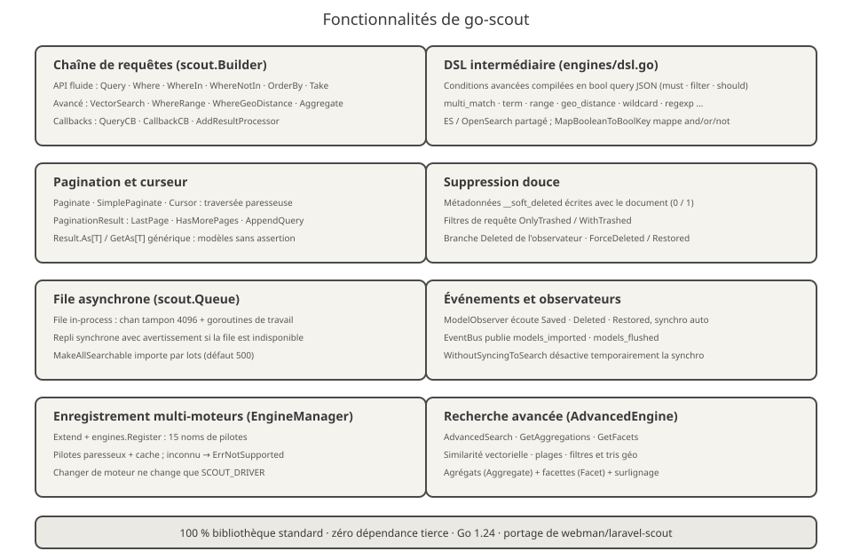
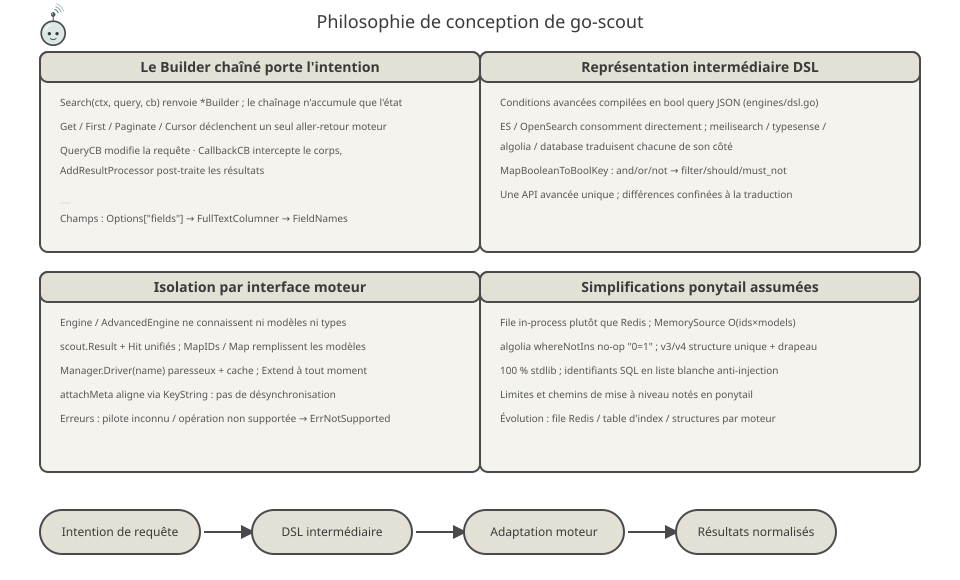
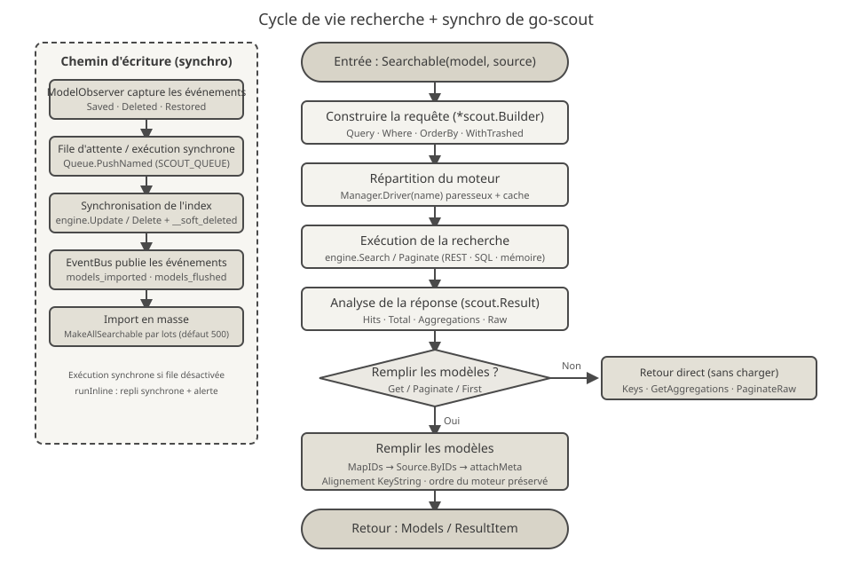

<p align="center">
  
</p>

# go-scout

> Bibliothèque de synchronisation de recherche écrite en Go — un portage Go de Laravel Scout (basé sur le plugin PHP [webman-scout](https://github.com/shopwwi/webman-scout)).
> Go 1.24 · implémentation 100 % bibliothèque standard, zéro dépendance tierce · version v1.3.0

**Languages / 语言**: [中文](../../../README.md) · [English](../en/README.md) · [한국어](../ko/README.md) · [Русский](../ru/README.md) · [Deutsch](../de/README.md) · [Français](./README.md) · [Español](../es/README.md) · [Português](../pt/README.md) · [हिन्दी](../hi/README.md) · [العربية](../ar/README.md) · [বাংলা](../bn/README.md) · [Bahasa Indonesia](../id/README.md) · [日本語](../ja/README.md)

## Présentation du projet

go-scout résout le problème de la « synchronisation entre les modèles et le moteur de recherche » : les modèles implémentant l'interface `scout.ScoutModel` sont automatiquement écrits ou retirés du moteur de recherche lors de leur enregistrement, de leur suppression ou de leur restauration, et sont interrogeables via une API de requête chaînée unifiée qui masque les différences d'API entre les moteurs de recherche (Elasticsearch, OpenSearch, Meilisearch, Typesense, Algolia, XunSearch…).

Il reflète la structure de classes et le comportement de la bibliothèque PHP d'origine :

| PHP（webman/laravel-scout） | Go（go-scout） |
|---|---|
| `Scout` | `scout.Scout`（scout.go） |
| `Builder` | `scout.Builder`（builder.go / builder_search.go） |
| `EngineManager` | `scout.Manager` / `scout.EngineManager`（manager.go） |
| `ModelObserver` | `scout.ModelObserver`（observer.go） |
| `Searchable` trait | `scout.Searchable`（searchable.go） |
| `Engine` / `AdvancedEngine` 及各引擎类 | `scout.Engine` / `scout.AdvancedEngine` 及 `engines` 包 9 个引擎 |

Moteurs intégrés (package `engines`) :

- **null** — implémentation vide, pilote de repli par défaut (utilisé lorsque l'indexation est désactivée)
- **collection** — recherche en mémoire, sans aucun service externe
- **database** — la table sert d'index : recherche LIKE/ILIKE et plein texte directement sur les tables de la base (mysql / pgsql / sqlite)
- **elasticsearch** / **opensearch** — requêtes REST, partagent la représentation intermédiaire DSL de `engines/dsl.go`
- **meilisearch** — requêtes REST, prend en charge le vectoriel et l'hybride, les filtres, le tri et les facettes
- **typesense** — requêtes REST, agrégations, regroupement, voisinage vectoriel
- **algolia** — requêtes REST, versions v3 / v4
- **xunsearch** — protocole de démon HTTP (côté indexation + côté recherche)

Avec les alias `advanced_*`, `engines.Register` enregistre au total 16 noms de pilotes (voir [engines/register.go](../../../engines/register.go)).

## Mascotte du projet · Scouty

<p align="center">
  
</p>

**Scouty** est l'éclaireur de go-scout : une petite sonde à lunettes-loupe et foulard de scout. Il est dessiné d'après ce que fait réellement la bibliothèque — chaque pièce correspond à une couche du code :

- **Lunettes-loupe** — la couche de requête `scout.Builder` : `Where`, `OrderBy`, vecteurs et conditions géo sont tous compilés dans cette lentille.
- **Antenne et arcs de signal** — `EngineManager` : une requête, 16 noms de pilotes ; `Driver(name)` est créé et mis en cache à la demande.
- **Foulard de scout** — `ModelObserver` : `Saved` / `Deleted` / `Restored` se synchronisent seuls ; le nœud est l'événement `EventBus`.
- **Fiches documents en main** — le document après `ToSearchableArray()` ; la pastille colorée est la clé primaire (`KeyString`).

Scouty vit aussi dans le code : `scout.MascotName` / `scout.MascotSVG` / `scout.MascotASCII` dans [mascot.go](../../../mascot.go) ; `go run ./cmd/scout mascot` au terminal (`-svg` pour le vecteur) ; [docs/logo.svg](../../../docs/logo.svg) pour le logo. `mascot_test.go` garantit que le SVG embarqué est identique à `docs/mascot.svg` et analyse tous les SVG de `docs/`, les 12 jeux traduits compris.

## Conception de l'architecture



Cinq couches de bas en haut, avec des responsabilités de plus en plus étroites :

1. **Couche modèle** — les modèles métier implémentent `scout.ScoutModel` (`ScoutKey`, `ToSearchableArray`, `ShouldBeSearchable`, `TableName`, etc., voir [model.go](../../../model.go)) ; les données sont fournies via l'interface `scout.Source[T]` (`All` / `ByIDs` / `Count`), avec `scout.NewMemorySource` intégré. Les interfaces optionnelles telles que `SoftDeleter`, `FullTextColumner`, `PrefixColumner` sont implémentées selon les besoins.
2. **Couche de synchronisation** — `scout.ModelObserver` capture les événements d'enregistrement/suppression/restauration des modèles ; `scout.EventBus` publie les événements `scout.models_imported`, `scout.models_flushed` ; `scout.Queue` fournit une file asynchrone in-process (tampon de 4096), avec repli synchrone si la file est indisponible.
3. **Couche de requête** — `scout.Builder` accumule l'état de la requête par chaînage (`Where`, `OrderBy`, `Take`, `WithTrashed`…), les méthodes d'exécution de `builder_search.go` (`Get` / `First` / `Paginate` / `Cursor` / `Keys`) déclenchent un aller-retour vers le moteur, et le résultat est normalisé en `scout.Result` / `PaginationResult`.
4. **Couche d'adaptation des moteurs** — l'interface `Engine` (`Search`, `Paginate`, `Update`, `Delete`, `Map`, `Flush`, `CreateIndex`, `DeleteIndex`…) et l'interface étendue `AdvancedEngine` (`AdvancedSearch`, `GetAggregations`, `GetFacets`) isolent les différences entre moteurs derrière l'interface ; `scout.Manager` enregistre via `Extend` et crée paresseusement puis met en cache les pilotes via `Driver(name)`.
5. **Couche des moteurs** — les 9 moteurs du package `engines` ne dépendent chacun que de la configuration (`*scout.Config`) et d'un client HTTP, sans se connaître mutuellement.

## Fonctionnalités



- **Chaîne de construction de requêtes** — API fluide de `scout.Builder` : `Query` / `Where` / `WhereIn` / `WhereNotIn` / `OrderBy` / `OrderByDesc` / `Latest` / `Oldest` / `Take` / `Skip` ; conditions avancées `VectorSearch` / `WhereRange` / `WhereGeoDistance` / `FulltextSearch` / `OrderByVectorSimilarity` / `OrderByGeoDistance` ; injection de callbacks `QueryCB` / `CallbackCB` / `AddResultProcessor`. Ordre de résolution des champs de recherche : `Options["fields"]` → `FullTextColumner` → `FieldNames`.
- **Représentation intermédiaire DSL** — [engines/dsl.go](../../../engines/dsl.go) compile les conditions avancées en JSON de requête bool (`multi_match`, `term`, `range`, `geo_distance`, `wildcard`, `regexp`, etc.), consommé directement par Elasticsearch / OpenSearch ; `MapBooleanToBoolKey` mappe and/or/not vers `filter` / `should` / `must_not`.
- **Pagination et curseur** — `Paginate` / `PaginateRaw` / `SimplePaginate` / `Cursor` (traversée paresseuse via canal tamponné) ; `PaginationResult` fournit `LastPage` / `HasMorePages` / `AppendQuery` ; `Result.As[T]` et la fonction générique de package `scout.GetAs[T]` récupèrent les modèles sans assertion de type.
- **Suppression douce** — les documents indexés reçoivent les métadonnées `__soft_deleted` (0/1) ; filtrage des requêtes par `OnlyTrashed` / `WithTrashed` ; le moteur database utilise la colonne `deleted_at`.
- **File asynchrone** — file in-process (canal `chan` tamponné à 4096 + goroutines de travail), activée par `SCOUT_QUEUE=1` ; repli synchrone avec avertissement si la file est indisponible ; `MakeAllSearchable` importe par lots (`chunk`, 500 éléments par défaut).
- **Événements et observateurs** — `ModelObserver` écoute `Saved` / `Deleted` / `Restored` et synchronise automatiquement ; `EventBus` publie `scout.models_imported`, `scout.models_flushed` ; `WithoutSyncingToSearch` désactive temporairement la synchronisation.
- **Enregistrement multi-moteurs** — `Manager.Extend` + `engines.Register` enregistrent 16 noms de pilotes, créés paresseusement puis mis en cache ; un pilote inconnu renvoie `scout.ErrNotSupported` ; changer de moteur ne nécessite que la configuration `SCOUT_DRIVER`.

## Philosophie de conception



- **Le Builder chaîné porte l'intention de la requête** — `Search(ctx, query, cb)` renvoie un `*scout.Builder` ; le chaînage n'accumule que de l'état, seuls `Get` / `First` / `Paginate` / `Cursor` déclenchent un aller-retour vers le moteur ; modification de la requête, interception du corps de la requête HTTP et post-traitement des résultats passent tous par des callbacks, sans que le moteur ait à s'en soucier.
- **Représentation intermédiaire DSL** — les conditions avancées sont compilées en JSON de requête bool, consommé directement par ES / OpenSearch ; Meilisearch / Typesense / Algolia / database traduisent chacune de leur côté ; les différences entre moteurs sont confinées dans la couche de traduction.
- **Isolation par l'interface moteur** — `Engine` / `AdvancedEngine` ne parlent que de documents et de résultats, sans connaître le type du modèle ; `MapIDs` / `Map` remplissent les modèles à partir des ID de résultats, `attachMeta` aligne via `KeyString`, les ensembles de modèles filtrés ne se désynchronisent jamais.
- **Simplifications délibérées ponytail** — le code signale partout ses compromis par des commentaires `ponytail:` : file in-process plutôt que Redis, balayage linéaire de `MemorySource` en O(ids×models), `whereNotIns` d'Algolia comme no-op `"0=1"`, structure unique v3/v4 avec drapeau de version, tri aléatoire remplacé par `_score asc`, etc. 100 % bibliothèque standard, zéro SDK tiers.

## Cycle de vie



**Chemin de recherche** : `Searchable(model, source).Search(ctx, query, cb)` construit un `*scout.Builder` → `Manager.Driver(name)` répartit vers le moteur (création paresseuse et mise en cache) → `engine.Search` / `Paginate` (REST / SQL / mémoire) → analyse en `scout.Result` (Hits · Total · Aggregations · Raw) → si le remplissage des modèles est nécessaire (`Get` / `Paginate` / `First`) : `MapIDs` → `Source.ByIDs` → `attachMeta` (alignement via `KeyString`, préservation de l'ordre renvoyé par le moteur) → retour de `ResultItem` / `PaginationResult` ; `Keys` / `GetAggregations` / `PaginateRaw` renvoient directement sans charger les modèles.

**Chemin d'écriture** : `ModelObserver` capture les événements du modèle → `Queue.PushNamed("scout_make" / "scout_remove" / "scout_make_range")` exécution asynchrone (repli synchrone si non activée) → `engine.Update` / `Delete` (métadonnées `__soft_deleted` en cas de suppression douce) → `EventBus` publie `scout.models_imported` / `scout.models_flushed`.

## Structure du projet

```
go-scout/
├── go.mod                      # Définition du module : github.com/erikwang2013/go-scout · go 1.24.1 · zéro dépendance
├── .gitignore                  # Ignore les fichiers IDE / caches / clés
├── scout.go                    # Façade Scout : assemblage et usines Config / Manager / Events / Queue / Observer
├── config.go                   # Arbre de configuration : DefaultConfig + surcharge par variables d'environnement + accès dot-path
├── engine.go                   # Interfaces Engine / AdvancedEngine + types Result / Hit / PaginationResult
├── manager.go                  # EngineManager : enregistrement Extend, création paresseuse et cache de Driver, moteur null par défaut
├── builder.go                  # Structure Builder + construction chaînée des conditions (Where / OrderBy / Take / conditions avancées)
├── builder_search.go           # Exécution des requêtes : Raw / Get / First / Paginate / Cursor / GetAs[T]
├── searchable.go               # Searchable : liaison modèle-source, import/export complet, métadonnées de suppression douce
├── observer.go                 # ModelObserver : synchronisation automatique Saved / Deleted / Restored
├── events.go                   # EventBus : publication-abonnement synchrone thread-safe + événements d'import / de purge
├── queue.go                    # Queue : file asynchrone in-process (chan 4096) + repli synchrone
├── model.go                    # Interface ScoutModel + interfaces d'extension optionnelles + aides KeyName/KeyString…
├── source.go                   # Interface Source[T] + MemorySource (balayage linéaire)
├── exceptions.go               # Système d'erreurs ErrNotSupported / ErrScout
├── mascot.go                   # Mascotte Scouty : MascotName / MascotSVG / MascotASCII
├── mascot_test.go              # SVG embarqué vs docs/mascot.svg + tous les SVG de docs/
├── cmd/scout/main.go           # Programme de démonstration CLI : 8 sous-commandes import / flush / index / queue-import…
├── engines/
│   ├── engine.go               # Client HTTP (authentification, saut de vérification TLS) + aides partagées DoJSON/DoBytes
│   ├── register.go             # SetDatabase + Register enregistrent 16 noms de pilotes + Drivers()
│   ├── dsl.go                  # Représentation intermédiaire DSL : requête bool / tri / agrégations / facettes / surlignage
│   ├── null.go                 # NullEngine : implémentation vide
│   ├── collection.go           # CollectionEngine : recherche en mémoire (correspondance de sous-chaîne insensible à la casse)
│   ├── database.go             # DatabaseEngine : la table sert d'index SQL (LIKE/ILIKE + tsvector pgsql)
│   ├── elasticsearch.go        # ElasticsearchEngine + aides es* partagées avec OpenSearch
│   ├── opensearch.go           # OpenSearchEngine (le pilote de base est aussi un moteur avancé)
│   ├── meilisearch.go          # MeilisearchEngine : filtres / tri / hybride vectoriel / facettes
│   ├── meilisearch_advanced.go # Moteur avancé Meilisearch : extensions recherche vectorielle / hybride
│   ├── typesense.go            # TypesenseEngine : filter_by / agrégations / regroupement / recherche de voisinage
│   ├── typesense_advanced.go   # Moteur avancé Typesense : paramètres de recherche / agrégations / vecteurs
│   ├── algolia.go              # AlgoliaEngine : structure unique v3/v4 + drapeau de version
│   ├── xunsearch.go            # XunSearchEngine : démon d'indexation + démon de recherche
│   └── xunsearch_advanced.go   # Moteur avancé XunSearch : conditions avancées / facettes
├── docs/
│   ├── arch.svg                # Diagramme d'architecture en couches
│   ├── features.svg            # Diagramme des fonctionnalités
│   ├── design.svg              # Diagramme de conception
│   ├── logo.svg                # Visuel : Scouty en entier + logotype go-scout
│   ├── mascot.svg              # Mascotte Scouty (même dessin embarqué dans mascot.go)
│   ├── alipay.png              # Code QR Alipay (référencé par la section dons)
│   ├── weixinpay.png           # Code QR WeChat Pay (référencé par la section dons)
│   ├── coin/                   # Codes QR de don par chaîne (10 jpg)
│   └── lifecycle.svg           # Diagramme du cycle de vie de la recherche
└── engines/
    ├── algolia_test.go         # Tests des littéraux de filtre Algolia (algoliaLit / algoliaFilters)
    ├── elasticsearch_test.go   # Tests requête et analyse Elasticsearch (stubs httptest)
    ├── opensearch_test.go      # Tests requête et analyse OpenSearch (stubs httptest)
    ├── xunsearch_test.go       # Tests du protocole du démon XunSearch (stubs httptest)
    ├── collection_test.go      # Tests de comportement du moteur mémoire (filtres / tri / pagination / remplissage)
    ├── database_test.go        # Génération et assertions SQL (assertSQL avec correspondance exacte)
    ├── meilisearch_test.go     # Tests requête/analyse Meilisearch (stubs httptest)
    ├── typesense_test.go       # Tests requête/analyse Typesense (création automatique de collection sur 404)
    └── null_test.go            # Tests du comportement vide de NullEngine
```

## Démarrage rapide / Guide d'utilisation

### 1. Installation

```bash
go get github.com/erikwang2013/go-scout
```

Aucune dépendance tierce, prêt à l'emploi dès l'import.

### 2. Configuration des pilotes

`scout.DefaultConfig()` lit les variables d'environnement ; éléments communs :

| Variable d'environnement | Valeur par défaut | Description |
|---|---|---|
| `SCOUT_DRIVER` | `database` | Nom du pilote du moteur ; chaîne vide ou `"false"` → repli sur `null` |
| `SCOUT_PREFIX` | vide | Préfixe d'index |
| `SCOUT_QUEUE` | désactivé | Mettre à 1 pour activer la file asynchrone |
| `SCOUT_SOFT_DELETE` | désactivé | Métadonnées de suppression douce écrites avec le document dans l'index |
| `SCOUT_IDENTIFY` | désactivé | Arbre de configuration `identify` : indique au moteur qui effectue la recherche (algolia) |
| `SCOUT_CHUNK_SEARCHABLE` / `SCOUT_CHUNK_UNSEARCHABLE` | `500` | Taille des lots d'import/retrait en masse |
| `SCOUT_BULK_SIZE` | `100` | Taille d'écriture en masse (opensearch) |

Spécifiques à chaque moteur (le chemin `engine.key` dans l'arbre de configuration porte le même nom que la variable d'environnement, ex. `opensearch.host` ← `OPENSEARCH_HTTP_HOST`) :

| Moteur | Variable d'environnement (valeur par défaut) |
|---|---|
| meilisearch | `MEILISEARCH_HOST` (`http://127.0.0.1:7700`), `MEILISEARCH_KEY` |
| typesense | `TYPESENSE_HOST` (`127.0.0.1`), `TYPESENSE_PORT` (`8108`), `TYPESENSE_PROTOCOL` (`http`), `TYPESENSE_API_KEY` (`xyz`), `TYPESENSE_IMPORT_ACTION` (`upsert`), `TYPESENSE_MAX_TOTAL_RESULTS` (`1000`), `TYPESENSE_CONNECTION_TIMEOUT` (`2`) |
| elasticsearch | `ELASTICSEARCH_HOST` (`http://127.0.0.1:9200`, première entrée de la liste hosts) + `elasticsearch.auth` (user/password) |
| opensearch | `OPENSEARCH_HTTP_HOST` (`https://127.0.0.1:6205`), `OPENSEARCH_USERNAME` / `OPENSEARCH_PASSWORD` (`admin`/`admin`), `OPENSEARCH_SSL_VERIFICATION` (vérification TLS ignorée par défaut), `OPENSEARCH_TIMEOUT` (`30` secondes), `OPENSEARCH_CONNECTION_TIMEOUT` (`10`) |
| xunsearch | `XUNSEARCH_INDEX_HOST` (`http://127.0.0.1`) + `XUNSEARCH_INDEX_PORT` (`8383`), `XUNSEARCH_SEARCH_HOST` (`http://127.0.0.1`) + `XUNSEARCH_SEARCH_PORT` (`8384`), `XUNSEARCH_DEFAULT_INDEX` (`default`), `XUNSEARCH_CHARSET` (`utf-8`), `XUNSEARCH_CONFIG_PATH`, `XUNSEARCH_BATCH_SIZE` (`100`) |
| algolia | `ALGOLIA_APP_ID`, `ALGOLIA_SECRET` (panic à la construction du moteur si absent) |

Le pilote `database` requiert aussi l'injection de la connexion et du dialecte de la base de données :

```go
engines.SetDatabase(db, "mysql") // dialect: mysql / pgsql / postgres / sqlite
```

### 3. Exemple minimal d'utilisation

```go
package main

import (
	"context"
	"fmt"

	"github.com/erikwang2013/go-scout"
	"github.com/erikwang2013/go-scout/engines"
)

// Post 实现 scout.ScoutModel 即可参与搜索
type Post struct {
	ID    int
	Title string
	Body  string
}

func (p Post) ScoutKey() any            { return p.ID }
func (p Post) TableName() string        { return "posts" }
func (p Post) ShouldBeSearchable() bool { return p.Title != "" }
func (p Post) ToSearchableArray() map[string]any {
	return map[string]any{"title": p.Title, "body": p.Body}
}

func main() {
	ctx := context.Background()

	// 初始化：默认配置 + 注册全部引擎（SCOUT_DRIVER 决定用哪个）
	s := scout.NewWithConfig(scout.DefaultConfig())
	engines.Register(s.Manager)

	// 绑定模型与数据源，全量导入（chunk 传 0 表示用默认块大小 500）
	sr := s.Searchable(&Post{}, scout.NewMemorySource(
		Post{ID: 1, Title: "Go module layout", Body: "packages and imports"},
		Post{ID: 2, Title: "Indexing strategies", Body: "bulk writes"},
	))
	_ = sr.MakeAllSearchable(ctx, 0)

	// 链式查询：Search → Where → OrderByDesc → Take → Get
	items, err := sr.Search(ctx, "golang", nil). // 第三参为查询回调，可传 nil
		Where("title", "indexing").
		OrderByDesc("created_at").
		Take(10).
		Get(ctx)
	if err != nil {
		panic(err)
	}
	for _, it := range items {
		post := it.Model.(Post) // ResultItem.Model 已回填为原始模型
		fmt.Println(post.ID, it.Score)
	}

	// 泛型取数：GetAs[T] 免类型断言
	posts, _ := scout.GetAs[Post](ctx, sr.Search(ctx, "indexing", nil).Take(5))
	_ = posts
}
```

Méthodes clés d'exécution des requêtes : `Get(ctx) ([]ResultItem, error)`, `First(ctx)`, `Paginate(ctx, perPage, page, pageName)` (15 éléments par page par défaut, nom du paramètre de page `page` par défaut), `Cursor(ctx)` (flux paresseux), `Keys(ctx)` (clés primaires uniquement). Le résultat paginé `PaginationResult` fournit aussi `LastPage()` / `HasMorePages()` / `AppendQuery()` pour générer les liens de pagination.

### 4. Programme de démonstration CLI

`cmd/scout` est un CLI de démonstration autonome : au démarrage, il définit `SCOUT_DRIVER` sur `collection` et précharge 7 documents `post` via `NewMemorySource` (les brouillons sans titre sont ignorés car `ShouldBeSearchable` renvoie false).

```bash
go run ./cmd/scout                # 打印全部子命令用法
go run ./cmd/scout index posts --key id        # 创建索引
go run ./cmd/scout import --chunk 3 --fresh    # 全量导入（每块 3 条，先清空）
go run ./cmd/scout flush          # 清空索引
go run ./cmd/scout queue-import --chunk 3 --min 1 --max 100 --workers 4  # 按键范围入队导入
go run ./cmd/scout sync-index-settings --driver meilisearch  # 同步索引设置（需引擎实现 UpdateIndexSettings）
go run ./cmd/scout delete-index posts           # 删除单个索引
go run ./cmd/scout delete-all-indexes           # 删除全部索引
go run ./cmd/scout mascot                         # afficher la mascotte (-svg pour le vecteur)
```

## Licence et remarques

Ce projet est un portage Go du plugin PHP webman-scout ; la structure des classes, les noms de pilotes et la sémantique des comportements restent cohérents avec l'original ; les simplifications sont signalées dans le code source par des commentaires `ponytail:` (file in-process, balayage linéaire de la source mémoire, no-op `"0=1"` d'Algolia, etc.).

## Faire un don (Donate)

Merci pour votre soutien ! Votre don aidera à maintenir et faire évoluer le projet en continu. Tout soutien est le bienvenu :

<p align="center">
<table>
<tr>
<td align="center">
<b>WeChat Pay</b><br/>

</td>
<td align="center">
<b>Alipay</b><br/>

</td>
</tr>
</table>
</p>

### Dons en cryptomonnaies (Crypto Donate)

Les réseaux suivants sont pris en charge ; vérifiez bien l'adresse de réception et le réseau correspondant avant de transférer :

| Réseau | Adresse du portefeuille | Code QR |
|---|---|---|
| BNB Smart Chain (BEP20) | `0x355d429f97511897ccb4e271ec888205f9ab6629` |  |
| Tron (TRC20) | `TEdDHWLajt1XvqtPDWmQctdrJaC3pzZZzz` |  |
| Ethereum (ERC20) | `0x355d429f97511897ccb4e271ec888205f9ab6629` |  |
| Aptos | `0x836e3780edfc3f7b2372b39e2a1a3a5d7adfaccd96c726f21cfde1b50dd68030` |  |
| Plasma | `0x355d429f97511897ccb4e271ec888205f9ab6629` |  |
| Polygon POS | `0x355d429f97511897ccb4e271ec888205f9ab6629` |  |
| Solana | `2hfhboHdmdrYsY25XfQSsEWxq5ip4EQsR7f4AzSRMUyr` |  |
| The Open Network (TON) | `UQB9kFQohzmXUir9QSSZq01iwl9aQZIDdBpNmDklljRtCoGK` |  |
| Arbitrum One | `0x355d429f97511897ccb4e271ec888205f9ab6629` |  |
| AVAX C-Chain | `0x355d429f97511897ccb4e271ec888205f9ab6629` |  |

### Virement international (virement bancaire)

**Informations du bénéficiaire**

- Nom du bénéficiaire : WANG KEXUN
- Numéro de compte du bénéficiaire : 881015918251

**Banque du bénéficiaire**

- SWIFT Code de ZA Bank : `AABLHKHHXXX`
- Nom de la banque : ZA Bank Limited
- Numéro de banque : 387
- Adresse de la banque : `Core F, Cyberport 3, 100 Cyberport Road, Hong Kong`

**Banque correspondante pour les virements transfrontaliers (si nécessaire)**

> Il s'agit des informations de la banque correspondante (banque intermédiaire) pour les virements transfrontaliers, et non de celles de la banque du bénéficiaire. Veuillez demander à votre banque si les informations de la banque correspondante sont requises.

- Pour les virements en dollars de Hong Kong, en RMB et en dollars américains, la banque correspondante est Citibank :
  - Nom de la banque : Citibank N.A. Hong Kong
  - SWIFT Code : `CITIHKHXXXX`
  - Numéro de banque : 006
  - Nom de la succursale : Hong Kong Branch
  - Numéro de succursale : 391
  - Adresse de la banque : `Citibank Tower, Citibank Plaza, 3 Garden Road, Central, Hong Kong`
- Pour les autres devises, la banque correspondante est BNY Mellon :
  - Nom de la banque : THE BANK OF NEW YORK MELLON
  - SWIFT Code : `IRVTUS3NXXX`
  - Adresse de la banque : `THE BANK OF NEW YORK MELLON, 240 GREENWICH STREET, NEW YORK, United States`
