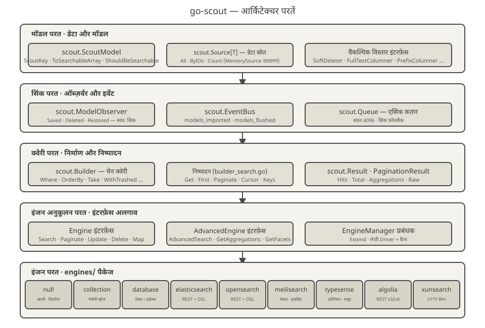
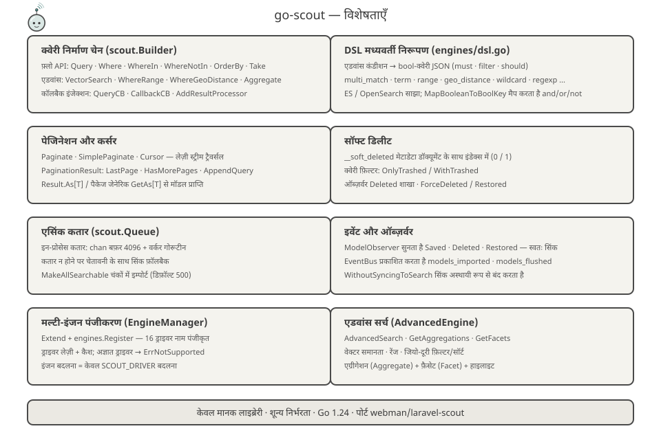
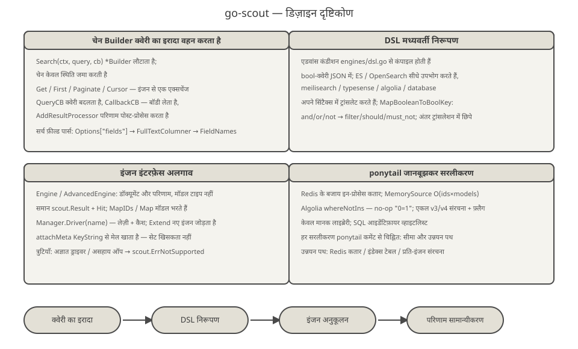
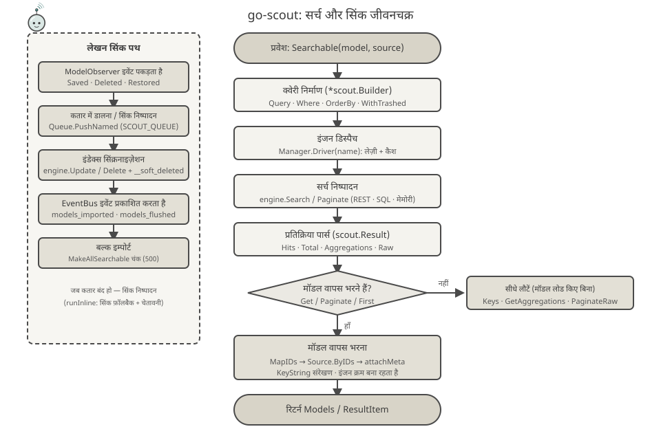

<p align="center">
  
</p>

<p align="center">
  <a href="https://pkg.go.dev/github.com/erikwang2013/go-scout"></a>
</p>

# go-scout

> Go में लिखा गया सर्च-सिंक लाइब्रेरी — Laravel Scout का Go पोर्ट (PHP प्लगइन [webman-scout](https://github.com/shopwwi/webman-scout) पर आधारित)।
> Go 1.24 · केवल मानक लाइब्रेरी, शून्य थर्ड-पार्टी निर्भरता · संस्करण v1.4.0

**Languages / 语言**: [中文](../../../README.md) · [English](../en/README.md) · [한국어](../ko/README.md) · [Русский](../ru/README.md) · [Deutsch](../de/README.md) · [Français](../fr/README.md) · [Español](../es/README.md) · [Português](../pt/README.md) · [हिन्दी](./README.md) · [العربية](../ar/README.md) · [বাংলা](../bn/README.md) · [Bahasa Indonesia](../id/README.md) · [日本語](../ja/README.md)

## परियोजना परिचय

go-scout "मॉडल और सर्च इंजन के बीच सिंक्रोनाइज़ेशन" की समस्या हल करता है: `scout.ScoutModel` इंटरफ़ेस लागू करने वाले मॉडल सेव, डिलीट और रिस्टोर होने पर स्वतः सर्च इंजन में लिखे या हटाए जाते हैं, और उन्हें खोजने के लिए एक समान चेन-आधारित क्वेरी API उपलब्ध है, जो विभिन्न सर्च इंजनों (Elasticsearch, OpenSearch, Meilisearch, Typesense, Algolia, XunSearch…) के API अंतरों को छिपाता है।

यह मूल PHP लाइब्रेरी की क्लास संरचना और व्यवहार को दर्पण की तरह दोहराता है:

| PHP (webman/laravel-scout) | Go (go-scout) |
|---|---|
| `Scout` | `scout.Scout` (scout.go) |
| `Builder` | `scout.Builder` (builder.go / builder_search.go) |
| `EngineManager` | `scout.Manager` / `scout.EngineManager` (manager.go) |
| `ModelObserver` | `scout.ModelObserver` (observer.go) |
| `Searchable` trait | `scout.Searchable` (searchable.go) |
| `Engine` / `AdvancedEngine` और इंजन क्लास | `scout.Engine` / `scout.AdvancedEngine` और `engines` पैकेज के 9 इंजन |

अंतर्निहित इंजन (पैकेज `engines`):

- **null** — खाली इम्प्लीमेंटेशन, डिफ़ॉल्ट ड्राइवर (जब इंडेक्सिंग बंद हो तो उपयोग होता है)
- **collection** — मेमोरी में खोज, किसी बाहरी सर्विस की ज़रूरत नहीं
- **database** — टेबल ही इंडेक्स: LIKE/ILIKE और फुलटेक्स्ट खोज सीधे DB टेबल पर (mysql / pgsql / sqlite)
- **elasticsearch** / **opensearch** — REST क्वेरी, साझा DSL मध्यवर्ती निरूपण `engines/dsl.go` में
- **meilisearch** — REST क्वेरी, वेक्टर और हाइब्रिड खोज, फ़िल्टरिंग, सॉर्टिंग, फ़ैसेट
- **typesense** — REST क्वेरी, एग्रीगेशन, ग्रुपिंग, वेक्टर-नियरेस्ट-नबर खोज
- **algolia** — REST क्वेरी, दो वर्ज़न: v3 / v4
- **xunsearch** — HTTP डेमन प्रोटोकॉल (इंडेक्स भाग और सर्च भाग)

`engines.Register` प्लस `advanced_*` उपनाम मिलाकर कुल 16 ड्राइवर नाम पंजीकृत करता है (देखें [engines/register.go](../../../engines/register.go))।

## प्रोजेक्ट मैस्कॉट · Scouty

<p align="center">
  
</p>

**Scouty** go-scout का खोजी स्काउट है: आवर्धक चश्मे और स्काउट गमछे वाला छोटा प्रोब। यह उसी से बनाया गया है जो यह लाइब्रेरी वाकई करती है — हर अंग कोड की एक परत से मेल खाता है:

- **आवर्धक चश्मा** — `scout.Builder` क्वेरी परत: `Where`, `OrderBy`, वेक्टर और भू-शर्तें सब इसी लेंस में संकलित होती हैं।
- **एंटेना और सिग्नल चाप** — `EngineManager`: एक क्वेरी, 16 ड्राइवर नाम; `Driver(name)` आलसी रूप से बनता और कैश होता है।
- **स्काउट गमछा** — `ModelObserver`: `Saved` / `Deleted` / `Restored` स्वयं सिंक होते हैं; गाँठ `EventBus` इवेंट है।
- **हाथ में दस्तावेज़ कार्ड** — `ToSearchableArray()` के बाद का दस्तावेज़; कार्ड के कोने का रंगीन चिप प्राथमिक कुंजी (`KeyString`) है।

Scouty कोड में भी रहता है: [mascot.go](../../../mascot.go) में `scout.MascotName` / `scout.MascotSVG` / `scout.MascotASCII`; टर्मिनल में `go run ./cmd/scout mascot` (`-svg` से वेक्टर); लोगो [docs/logo.svg](../../../docs/logo.svg)। `mascot_test.go` सुनिश्चित करता है कि अंतर्निहित SVG `docs/mascot.svg` के समान रहे और `docs/` के सभी SVG (12 भाषाओं सहित) मान्य हों।

## आर्किटेक्चर डिज़ाइन



नीचे से ऊपर पाँच परतें, हर परत के साथ ज़िम्मेदारी संकुचित होती है:

1. **मॉडल परत** — बिज़नेस मॉडल `scout.ScoutModel` लागू करते हैं (`ScoutKey`, `ToSearchableArray`, `ShouldBeSearchable`, `TableName` आदि, देखें [model.go](../../../model.go)); डेटा इंटरफ़ेस `scout.Source[T]` (`All` / `ByIDs` / `Count`) से आता है, अंतर्निहित `scout.NewMemorySource` के साथ। वैकल्पिक इंटरफ़ेस जैसे `SoftDeleter`, `FullTextColumner`, `PrefixColumner` ज़रूरत अनुसार लागू किए जाते हैं।
2. **सिंक परत** — `scout.ModelObserver` मॉडल के सेव/डिलीट/रिस्टोर इवेंट पकड़ता है; `scout.EventBus` इवेंट `scout.models_imported`, `scout.models_flushed` प्रकाशित करता है; `scout.Queue` इन-प्रोसेस एसिंक कतार देता है (बफ़र 4096), कतार उपलब्ध न होने पर सिंक फ़ॉलबैक।
3. **क्वेरी परत** — `scout.Builder` चेन के ज़रिए क्वेरी की स्थिति जमा करता है (`Where`, `OrderBy`, `Take`, `WithTrashed`…); `builder_search.go` के निष्पादन मेथड (`Get` / `First` / `Paginate` / `Cursor` / `Keys`) इंजन से एक ही एक्सचेंज चलाते हैं, परिणाम `scout.Result` / `PaginationResult` में सामान्यीकृत होता है।
4. **इंजन अनुकूलन परत** — इंटरफ़ेस `Engine` (`Search`, `Paginate`, `Update`, `Delete`, `Map`, `Flush`, `CreateIndex`, `DeleteIndex`…) और एडवांस इंटरफ़ेस `AdvancedEngine` (`AdvancedSearch`, `GetAggregations`, `GetFacets`) इंजनों के अंतर को इंटरफ़ेस के पीछे छिपाते हैं; `scout.Manager` इन्हें `Extend` से पंजीकृत करता है, `Driver(name)` लेज़ी रूप से ड्राइवर बनाकर कैश करता है।
5. **इंजन परत** — पैकेज `engines` में 9 इम्प्लीमेंटेशन, हर एक केवल कॉन्फ़िगरेशन (`*scout.Config`) और HTTP क्लाइंट पर निर्भर है, एक-दूसरे के बारे में नहीं जानते।

## विशेषताएँ



- **क्वेरी निर्माण चेन** — `scout.Builder` का फ़्लो-स्टाइल API: `Query` / `Where` / `WhereIn` / `WhereNotIn` / `OrderBy` / `OrderByDesc` / `Latest` / `Oldest` / `Take` / `Skip`; एडवांस कंडीशन `VectorSearch` / `WhereRange` / `WhereGeoDistance` / `FulltextSearch` / `OrderByVectorSimilarity` / `OrderByGeoDistance`; कॉलबैक इंजेक्शन `QueryCB` / `CallbackCB` / `AddResultProcessor`। सर्च फ़ील्ड पार्स क्रम: `Options["fields"]` → `FullTextColumner` → `FieldNames`।
- **DSL मध्यवर्ती निरूपण** — [engines/dsl.go](../../../engines/dsl.go) एडवांस कंडीशन को एक समान bool-क्वेरी JSON में कंपाइल करता है (`multi_match`, `term`, `range`, `geo_distance`, `wildcard`, `regexp` आदि), जिसे Elasticsearch / OpenSearch सीधे उपभोग करते हैं; `MapBooleanToBoolKey` and/or/not को `filter` / `should` / `must_not` में मैप करता है।
- **पेजिनेशन और कर्सर** — `Paginate` / `PaginateRaw` / `SimplePaginate` / `Cursor` (बफ़र किए गए चैनल से लेज़ी ट्रैवर्सल); `PaginationResult` में `LastPage` / `HasMorePages` / `AppendQuery`; `Result.As[T]` और पैकेज-लेवल जेनेरिक `scout.GetAs[T]` बिना टाइप-असर्शन के मॉडल लाते हैं।
- **सॉफ्ट डिलीट** — डॉक्यूमेंट के साथ इंडेक्स में `__soft_deleted` मेटाडेटा (0/1) लिखा जाता है; क्वेरी फ़िल्टर `OnlyTrashed` / `WithTrashed`; database इंजन `deleted_at` कॉलम का उपयोग करता है।
- **एसिंक कतार** — इन-प्रोसेस कतार (`chan` बफ़र 4096 + वर्कर गोरूटीन), `SCOUT_QUEUE=1` से चालू; कतार उपलब्ध न होने पर चेतावनी के साथ सिंक फ़ॉलबैक; `MakeAllSearchable` चंकों में इम्पोर्ट करता है (डिफ़ॉल्ट 500 प्रति चंक)।
- **इवेंट और ऑब्ज़र्वर** — `ModelObserver` `Saved` / `Deleted` / `Restored` सुनकर स्वतः सिंक करता है; `EventBus` `scout.models_imported`, `scout.models_flushed` प्रकाशित करता है; `WithoutSyncingToSearch` सिंक को अस्थायी रूप से बंद करता है।
- **मल्टी-इंजन पंजीकरण** — `Manager.Extend` + `engines.Register` 16 ड्राइवर नाम पंजीकृत करते हैं; ड्राइवर लेज़ी बनते हैं और कैश होते हैं; अज्ञात ड्राइवर पर `scout.ErrNotSupported` मिलता है; इंजन बदलना = सिर्फ़ `SCOUT_DRIVER` कॉन्फ़िग बदलना।

## डिज़ाइन दृष्टिकोण



- **चेन Builder क्वेरी का इरादा वहन करता है** — `Search(ctx, query, cb)` `*scout.Builder` लौटाता है; चेन केवल स्थिति जमा करती है, इंजन से एक्सचेंज `Get` / `First` / `Paginate` / `Cursor` पर होता है; क्वेरी बदलना, इंजन का रिक्वेस्ट बॉडी पाना और परिणाम पोस्ट-प्रोसेस करना — सब कॉलबैक से, इंजन को इसकी जानकारी नहीं होती।
- **DSL मध्यवर्ती निरूपण** — एडवांस कंडीशन एक समान bool-क्वेरी JSON में कंपाइल होती हैं; ES / OpenSearch इसे सीधे उपभोग करते हैं, जबकि Meilisearch / Typesense / Algolia / database अपने सिंटैक्स में ट्रांसलेट करते हैं — इंजन के अंतर ट्रांसलेशन परत में छिपे रहते हैं।
- **इंजन इंटरफ़ेस अलगाव** — `Engine` / `AdvancedEngine` केवल डॉक्यूमेंट और परिणामों की बात करते हैं, मॉडल टाइप नहीं जानते; `MapIDs` / `Map` ID से मॉडल वापस भरते हैं, `attachMeta` `KeyString` से मेल खाता है — फ़िल्टर किया गया मॉडल सेट खिसकता नहीं।
- **ponytail जानबूझकर सरलीकरण** — कोड में हर समझौता `ponytail:` कमेंट से चिह्नित है: Redis के बजाय इन-प्रोसेस कतार, `MemorySource` रैखिक स्कैन O(ids×models), Algolia में `whereNotIns` का `"0=1"` no-op, वर्ज़न-फ़्लैग के साथ एकल v3/v4 संरचना, `_score asc` स्टब से रैंडम सॉर्ट आदि। केवल मानक लाइब्रेरी, शून्य थर्ड-पार्टी SDK।

## जीवनचक्र



**सर्च पथ**: `Searchable(model, source).Search(ctx, query, cb)` `*scout.Builder` बनाता है → `Manager.Driver(name)` इंजन तय करता है (लेज़ी निर्माण + कैश) → `engine.Search` / `Paginate` (REST / SQL / मेमोरी) → `scout.Result` में पार्स (Hits · Total · Aggregations · Raw) → जब मॉडल वापस भरना हो (`Get` / `Paginate` / `First`): `MapIDs` → `Source.ByIDs` → `attachMeta` (`KeyString` संरेखण, इंजन का क्रम बना रहता है) → `ResultItem` / `PaginationResult` लौटता है; `Keys` / `GetAggregations` / `PaginateRaw` बिना मॉडल लोड किए सीधे लौटते हैं।

**लेखन पथ**: `ModelObserver` मॉडल इवेंट पकड़ता है → `Queue.PushNamed("scout_make" / "scout_remove" / "scout_make_range")` एसिंक चलता है (बिना कतार — सिंक फ़ॉलबैक) → `engine.Update` / `Delete` (सॉफ्ट डिलीट पर `__soft_deleted` मेटाडेटा जुड़ता है) → `EventBus` `scout.models_imported` / `scout.models_flushed` प्रकाशित करता है।

## परियोजना संरचना

```
go-scout/
├── go.mod                      # मॉड्यूल: github.com/erikwang2013/go-scout · go 1.24.1 · शून्य निर्भरता
├── .gitignore                  # IDE / कैश / कुंजी-फ़ाइलों के बहिष्करण
├── LICENSE                     # BSD 3-Clause लाइसेंस
├── scout.go                    # Scout फ़ेसाडे: Config / Manager / Events / Queue / Observer की असेंबली और फ़ैक्टरियाँ
├── config.go                   # कॉन्फ़िग ट्री: DefaultConfig + एनवायरनमेंट-वेरिएबल ओवरराइड + dot-path वैल्यू
├── engine.go                   # Engine / AdvancedEngine इंटरफ़ेस + Result / Hit / PaginationResult टाइप
├── manager.go                  # EngineManager: Extend रजिस्ट्रेशन, Driver लेज़ी-क्रिएशन कैश, डिफ़ॉल्ट null इंजन
├── builder.go                  # Builder संरचना + चेन कंडीशन (Where / OrderBy / Take / एडवांस कंडीशन)
├── builder_search.go           # क्वेरी निष्पादन: Raw / Get / First / Paginate / Cursor / GetAs[T]
├── searchable.go               # Searchable: मॉडल-डेटा-स्रोत बाइंडिंग, पूर्ण इम्पोर्ट/एक्सपोर्ट, सॉफ्ट-डिलीट मेटाडेटा
├── observer.go                 # ModelObserver: Saved / Deleted / Restored पर स्वतः सिंक
├── events.go                   # EventBus: थ्रेड-सुरक्षित पब-सब + इम्पोर्ट/फ्लश इवेंट
├── queue.go                    # Queue: इन-प्रोसेस एसिंक कतार (chan 4096) + सिंक फ़ॉलबैक
├── model.go                    # ScoutModel इंटरफ़ेस + वैकल्पिक एक्सटेंशन इंटरफ़ेस + KeyName/KeyString हेल्पर
├── source.go                   # Source[T] इंटरफ़ेस + MemorySource (रैखिक स्कैन)
├── exceptions.go               # त्रुटि प्रणाली ErrNotSupported / ErrScout
├── identity.go                 # पहचान: `scout.WithUser` / `scout.WithClientIP` (Algolia identify हेतु)
├── mascot.go                   # मैस्कॉट Scouty: MascotName / MascotSVG / MascotASCII
├── mascot_test.go              # एम्बेडेड SVG बनाम docs/mascot.svg + docs/ के सभी SVG की जाँच
├── cmd/scout/main.go           # CLI डेमो: import / flush / index / queue-import आदि कुल 8 उपकमांड
├── engines/
│   ├── engine.go               # HTTP क्लाइंट (auth, TLS स्किप) + साझा हेल्पर DoJSON/DoBytes
│   ├── register.go             # SetDatabase + Register — 16 ड्राइवर नाम पंजीकृत करते हैं + Drivers()
│   ├── dsl.go                  # DSL मध्यवर्ती निरूपण: bool क्वेरी / सॉर्ट / एग्रीगेशन / फ़ैसेट / हाइलाइट
│   ├── null.go                 # NullEngine: खाली इम्प्लीमेंटेशन
│   ├── collection.go           # CollectionEngine: मेमोरी सर्च (केस-असंवेदनशील सबस्ट्रिंग मैच)
│   ├── database.go             # DatabaseEngine: टेबल = इंडेक्स SQL (LIKE/ILIKE + pgsql में tsvector)
│   ├── elasticsearch.go        # ElasticsearchEngine + OpenSearch के साथ साझा es* हेल्पर
│   ├── opensearch.go           # OpenSearchEngine (बेस ड्राइवर ही एडवांस इंजन है)
│   ├── meilisearch.go          # MeilisearchEngine: फ़िल्टर / सॉर्ट / वेक्टर-हाइब्रिड / फ़ैसेट
│   ├── meilisearch_advanced.go # Meilisearch उन्नत इंजन: वेक्टर / हाइब्रिड खोज एक्सटेंशन
│   ├── typesense.go            # TypesenseEngine: filter_by / एग्रीगेशन / ग्रुपिंग / नियरेस्ट-नबर सर्च
│   ├── typesense_advanced.go   # Typesense उन्नत इंजन: खोज पैरामीटर / एग्रीगेशन / वेक्टर
│   ├── algolia.go              # AlgoliaEngine: v3/v4 एक ही संरचना + वर्ज़न फ़्लैग
│   ├── xunsearch.go            # XunSearchEngine: इंडेक्स डेमन + सर्च डेमन
│   └── xunsearch_advanced.go   # XunSearch उन्नत इंजन: उन्नत शर्तें / फ़ेसेट
├── docs/
│   ├── arch.svg                # आर्किटेक्चर परत आरेख
│   ├── features.svg            # फ़ीचर आरेख
│   ├── design.svg              # डिज़ाइन दृष्टिकोण आरेख
│   ├── logo.svg                # मुख्य चित्र: पूरा Scouty + go-scout शब्दचिह्न
│   ├── mascot.svg              # मैस्कॉट Scouty (वही चित्र mascot.go में अंतर्निहित)
│   ├── alipay.png              # Alipay भुगतान QR कोड (दान अनुभाग से संदर्भित)
│   ├── weixinpay.png           # WeChat Pay भुगतान QR कोड (दान अनुभाग से संदर्भित)
│   ├── coin/                   # प्रति-चेन दान QR कोड (10 jpg)
│   └── lifecycle.svg           # सर्च जीवनचक्र आरेख
└── engines/
    ├── algolia_test.go         # Algolia फ़िल्टर लिटरल परीक्षण (algoliaLit / algoliaFilters)
    ├── elasticsearch_test.go   # Elasticsearch रिक्वेस्ट/पार्स परीक्षण (httptest स्टब)
    ├── opensearch_test.go      # OpenSearch रिक्वेस्ट/पार्स परीक्षण (httptest स्टब)
    ├── xunsearch_test.go       # XunSearch डेमन प्रोटोकॉल परीक्षण (httptest स्टब)
    ├── collection_test.go      # इन-मेमोरी इंजन व्यवहार टेस्ट (फ़िल्टर / सॉर्ट / पेजिनेशन / बैकफ़िल)
    ├── database_test.go        # SQL जनरेशन और परीक्षण (assertSQL सटीक मिलान)
    ├── meilisearch_test.go     # Meilisearch अनुरोध/पार्स टेस्ट (httptest स्टब)
    ├── typesense_test.go       # Typesense अनुरोध/पार्स टेस्ट (404 पर ऑटो-कलेक्शन सहित)
    └── null_test.go            # NullEngine खाली-व्यवहार टेस्ट
```

## त्वरित आरंभ / उपयोग निर्देश

### 1. परिचय (इंस्टॉल)

```bash
go get github.com/erikwang2013/go-scout
```

कोई थर्ड-पार्टी निर्भरता नहीं — जोड़ते ही उपयोग के लिए तैयार।

### 2. ड्राइवर कॉन्फ़िगरेशन

`scout.DefaultConfig()` एनवायरनमेंट वेरिएबल पढ़ता है। सामान्य आइटम:

| एनवायरनमेंट वेरिएबल | डिफ़ॉल्ट मान | विवरण |
|---|---|---|
| `SCOUT_DRIVER` | `database` | इंजन ड्राइवर का नाम; खाली स्ट्रिंग या `"false"` → `null` पर फ़ॉलबैक |
| `SCOUT_PREFIX` | खाली | इंडेक्स उपसर्ग |
| `SCOUT_QUEUE` | बंद | `1` एसिंक कतार चालू करता है |
| `SCOUT_SOFT_DELETE` | बंद | सॉफ्ट-डिलीट मेटाडेटा डॉक्यूमेंट के साथ इंडेक्स में लिखा जाता है |
| `SCOUT_IDENTIFY` | बंद | चालू होने पर "कौन खोज रहा है" Algolia को भेजता है: `X-Algolia-UserToken` (`scout.WithUser` की कुंजी) और `X-Forwarded-For` (`scout.WithClientIP`, केवल सार्वजनिक IP) |
| `SCOUT_CHUNK_SEARCHABLE` / `SCOUT_CHUNK_UNSEARCHABLE` | `500` | बल्क इम्पोर्ट/डिलीट का चंक आकार |
| `SCOUT_BULK_SIZE` | `100` | बल्क राइट आकार (opensearch) |

इंजन-विशिष्ट (कॉन्फ़िग ट्री पथ `engine.key` env नाम के समान है, जैसे `opensearch.host` ← `OPENSEARCH_HTTP_HOST`):

| इंजन | एनवायरनमेंट वेरिएबल (डिफ़ॉल्ट मान) |
|---|---|
| meilisearch | `MEILISEARCH_HOST` (`http://127.0.0.1:7700`), `MEILISEARCH_KEY` |
| typesense | `TYPESENSE_HOST` (`127.0.0.1`), `TYPESENSE_PORT` (`8108`), `TYPESENSE_PROTOCOL` (`http`), `TYPESENSE_API_KEY` (`xyz`), `TYPESENSE_IMPORT_ACTION` (`upsert`), `TYPESENSE_MAX_TOTAL_RESULTS` (`1000`), `TYPESENSE_CONNECTION_TIMEOUT` (`2`) |
| elasticsearch | `ELASTICSEARCH_HOST` (`http://127.0.0.1:9200`, hosts सूची का पहला तत्व) + `elasticsearch.auth` (user/password) |
| opensearch | `OPENSEARCH_HTTP_HOST` (`https://127.0.0.1:6205`), `OPENSEARCH_USERNAME` / `OPENSEARCH_PASSWORD` (`admin`/`admin`), `OPENSEARCH_SSL_VERIFICATION` (डिफ़ॉल्ट रूप से TLS जाँच बंद), `OPENSEARCH_TIMEOUT` (`30` सेकंड), `OPENSEARCH_CONNECTION_TIMEOUT` (`10`) |
| xunsearch | `XUNSEARCH_INDEX_HOST` (`http://127.0.0.1`) + `XUNSEARCH_INDEX_PORT` (`8383`), `XUNSEARCH_SEARCH_HOST` (`http://127.0.0.1`) + `XUNSEARCH_SEARCH_PORT` (`8384`), `XUNSEARCH_DEFAULT_INDEX` (`default`), `XUNSEARCH_CHARSET` (`utf-8`), `XUNSEARCH_CONFIG_PATH` (खाली = ऊपर के होस्ट; सेट होने पर `<पथ>/<इंडेक्स>.ini` से प्रोजेक्ट नाम, डेमन और charset), `XUNSEARCH_BATCH_SIZE` (`100`) |
| algolia | `ALGOLIA_APP_ID`, `ALGOLIA_SECRET` (न हों तो इंजन बनाते समय panic), `ALGOLIA_HOST` (वैकल्पिक; डिफ़ॉल्ट `https://<appID>.algolia.net`, प्रॉक्सी या संगत एंडपॉइंट के लिए) |

`database` ड्राइवर को DB कनेक्शन और डायलेक्ट भी चाहिए:

```go
engines.SetDatabase(db, "mysql") // dialect: mysql / pgsql / postgres / sqlite
```

### 3. न्यूनतम उपयोग उदाहरण

```go
package main

import (
	"context"
	"fmt"

	"github.com/erikwang2013/go-scout"
	"github.com/erikwang2013/go-scout/engines"
)

// Post 实现 scout.ScoutModel 即可参与搜索
type Post struct {
	ID    int
	Title string
	Body  string
}

func (p Post) ScoutKey() any            { return p.ID }
func (p Post) TableName() string        { return "posts" }
func (p Post) ShouldBeSearchable() bool { return p.Title != "" }
func (p Post) ToSearchableArray() map[string]any {
	return map[string]any{"title": p.Title, "body": p.Body}
}

func main() {
	ctx := context.Background()

	// 初始化：默认配置 + 注册全部引擎（SCOUT_DRIVER 决定用哪个）
	s := scout.NewWithConfig(scout.DefaultConfig())
	engines.Register(s.Manager)

	// 绑定模型与数据源，全量导入（chunk 传 0 表示用默认块大小 500）
	sr := s.Searchable(&Post{}, scout.NewMemorySource(
		Post{ID: 1, Title: "Go module layout", Body: "packages and imports"},
		Post{ID: 2, Title: "Indexing strategies", Body: "bulk writes"},
	))
	_ = sr.MakeAllSearchable(ctx, 0)

	// 链式查询：Search → Where → OrderByDesc → Take → Get
	items, err := sr.Search(ctx, "golang", nil). // 第三参为查询回调，可传 nil
		Where("title", "indexing").
		OrderByDesc("created_at").
		Take(10).
		Get(ctx)
	if err != nil {
		panic(err)
	}
	for _, it := range items {
		post := it.Model.(Post) // ResultItem.Model 已回填为原始模型
		fmt.Println(post.ID, it.Score)
	}

	// 泛型取数：GetAs[T] 免类型断言
	posts, _ := scout.GetAs[Post](ctx, sr.Search(ctx, "indexing", nil).Take(5))
	_ = posts
}
```

क्वेरी निष्पादन के मुख्य मेथड: `Get(ctx) ([]ResultItem, error)`, `First(ctx)`, `Paginate(ctx, perPage, page, pageName)` (डिफ़ॉल्ट 15 प्रति पेज, पेज पैरामीटर नाम `page`), `Cursor(ctx)` (लेज़ी स्ट्रीम), `Keys(ctx)` (केवल प्राइमरी कीज़)। पेजिनेशन परिणाम `PaginationResult` में पेज लिंक के लिए `LastPage()` / `HasMorePages()` / `AppendQuery()` भी उपलब्ध हैं।

### 4. CLI डेमो प्रोग्राम

`cmd/scout` — स्व-पर्याप्त डेमो CLI: स्टार्टअप पर `SCOUT_DRIVER` को `collection` पर सेट करता है और `NewMemorySource` से 7 `post` रिकॉर्ड पहले से भरता है (खाली शीर्षक वाले ड्राफ्ट छूट जाते हैं, क्योंकि `ShouldBeSearchable` false लौटाता है)।

```bash
go run ./cmd/scout                # 打印全部子命令用法
go run ./cmd/scout index posts --key id        # 创建索引
go run ./cmd/scout import --chunk 3 --fresh    # 全量导入（每块 3 条，先清空）
go run ./cmd/scout flush          # 清空索引
go run ./cmd/scout queue-import --chunk 3 --min 1 --max 100 --workers 4  # 按键范围入队导入
go run ./cmd/scout sync-index-settings --driver meilisearch  # 同步索引设置（需引擎实现 UpdateIndexSettings）
go run ./cmd/scout delete-index posts           # 删除单个索引
go run ./cmd/scout delete-all-indexes           # 删除全部索引
go run ./cmd/scout mascot                         # मैस्कॉट प्रिंट करें (-svg से वेक्टर)
```

## लाइसेंस और टिप्पणियाँ

यह प्रोजेक्ट PHP प्लगइन webman-scout का Go पोर्ट है: क्लास संरचना, ड्राइवर नाम और व्यवहार की शब्दार्थता बरकरार है; सभी जानबूझकर किए गए सरलीकरण स्रोत कोड में `ponytail:` कमेंट से चिह्नित हैं (इन-प्रोसेस कतार, मेमोरी डेटा स्रोत का रैखिक स्कैन, Algolia का `"0=1"` no-op आदि)।

## दान (Donate)

आपके समर्थन के लिए धन्यवाद! आपका दान परियोजना को निरंतर विकसित और अनुरक्षित रहने में मदद करेगा। परियोजना का समर्थन करें:

<p align="center">
<table>
<tr>
<td align="center">
<b>微信（WeChat Pay）</b><br/>

</td>
<td align="center">
<b>支付宝（Alipay）</b><br/>

</td>
</tr>
</table>
</p>

### क्रिप्टोकरेंसी दान (Crypto Donate)

निम्नलिखित नेटवर्क समर्थित हैं। ट्रांसफ़र करते समय वॉलेट पता संबंधित नेटवर्क से मिलाएँ:

| नेटवर्क | वॉलेट पता | QR कोड |
|---|---|---|
| BNB Smart Chain (BEP20) | `0x355d429f97511897ccb4e271ec888205f9ab6629` |  |
| Tron (TRC20) | `TEdDHWLajt1XvqtPDWmQctdrJaC3pzZZzz` |  |
| Ethereum (ERC20) | `0x355d429f97511897ccb4e271ec888205f9ab6629` |  |
| Aptos | `0x836e3780edfc3f7b2372b39e2a1a3a5d7adfaccd96c726f21cfde1b50dd68030` |  |
| Plasma | `0x355d429f97511897ccb4e271ec888205f9ab6629` |  |
| Polygon POS | `0x355d429f97511897ccb4e271ec888205f9ab6629` |  |
| Solana | `2hfhboHdmdrYsY25XfQSsEWxq5ip4EQsR7f4AzSRMUyr` |  |
| The Open Network (TON) | `UQB9kFQohzmXUir9QSSZq01iwl9aQZIDdBpNmDklljRtCoGK` |  |
| Arbitrum One | `0x355d429f97511897ccb4e271ec888205f9ab6629` |  |
| AVAX C-Chain | `0x355d429f97511897ccb4e271ec888205f9ab6629` |  |

### अंतर्राष्ट्रीय बैंक ट्रांसफ़र (बैंक रेमिटेंस)

**प्राप्तकर्ता की जानकारी**

- प्राप्तकर्ता का नाम: WANG KEXUN
- प्राप्तकर्ता का खाता नंबर: 881015918251

**प्राप्तकर्ता का बैंक**

- ZA Bank का SWIFT कोड: `AABLHKHHXXX`
- बैंक का नाम: ZA Bank Limited
- बैंक कोड: 387
- बैंक का पता: `Core F, Cyberport 3, 100 Cyberport Road, Hong Kong`

**क्रॉस-बॉर्डर रेमिटेंस कोरस्पॉन्डेंट बैंक (यदि आवश्यक हो)**

> यह क्रॉस-बॉर्डर ट्रांसफ़र के लिए कोरस्पॉन्डेंट (मध्यस्थ) बैंक की जानकारी है, प्राप्तकर्ता के बैंक की नहीं। अपने बैंक से पूछें कि क्या कोरस्पॉन्डेंट बैंक की जानकारी देना आवश्यक है।

- हांगकांग डॉलर, युआन और अमेरिकी डॉलर ट्रांसफ़र के लिए कोरस्पॉन्डेंट Citibank है:
  - बैंक का नाम: Citibank N.A. Hong Kong
  - SWIFT कोड: `CITIHKHXXXX`
  - बैंक कोड: 006
  - शाखा का नाम: Hong Kong Branch
  - शाखा कोड: 391
  - बैंक का पता: `Citibank Tower, Citibank Plaza, 3 Garden Road, Central, Hong Kong`
- अन्य मुद्राओं के ट्रांसफ़र के लिए कोरस्पॉन्डेंट BNY Mellon है:
  - बैंक का नाम: THE BANK OF NEW YORK MELLON
  - SWIFT कोड: `IRVTUS3NXXX`
  - बैंक का पता: `THE BANK OF NEW YORK MELLON, 240 GREENWICH STREET, NEW YORK, United States`
