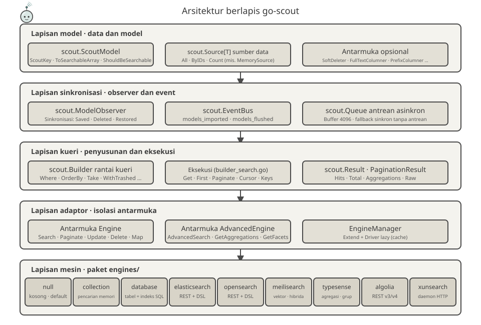
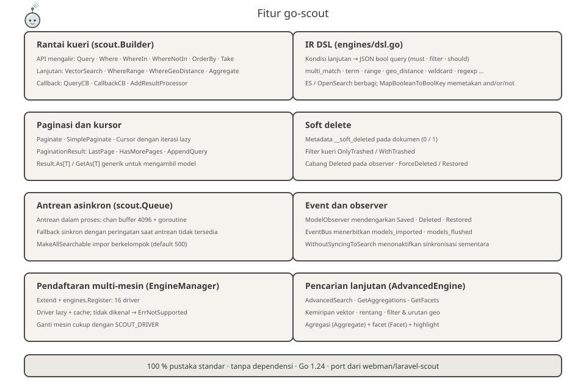
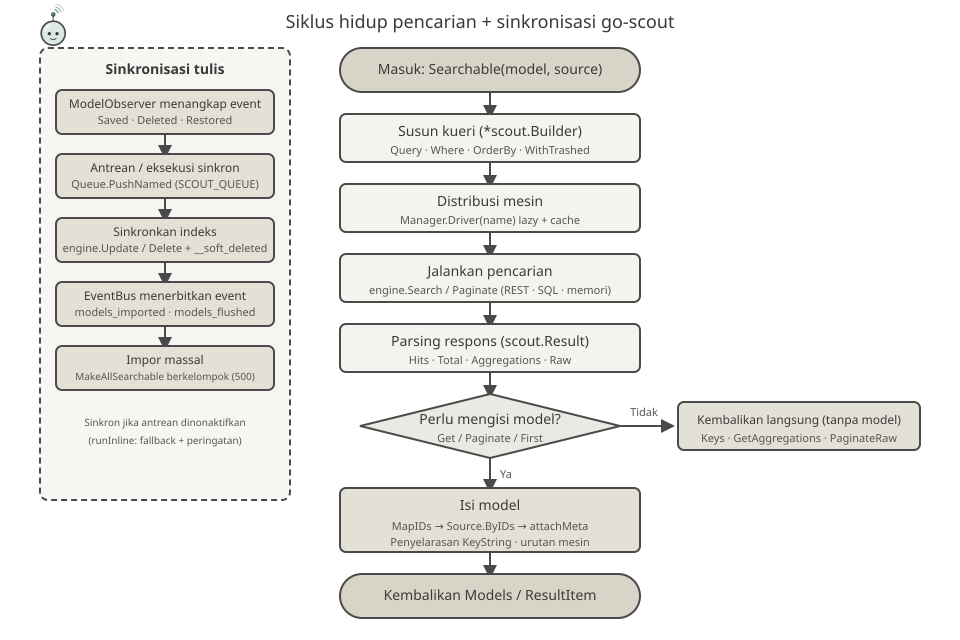

<p align="center">
  
</p>

<p align="center">
  <a href="https://pkg.go.dev/github.com/erikwang2013/go-scout"></a>
</p>

# go-scout

> Pustaka sinkronisasi pencarian yang ditulis dalam Go — port Laravel Scout ke Go (berbasis plugin PHP [webman-scout](https://github.com/shopwwi/webman-scout)).
> Go 1.24 · 100 % implementasi pustaka standar, tanpa dependensi pihak ketiga · versi v1.3.1

**Languages / 语言**: [中文](../../../README.md) · [English](../en/README.md) · [한국어](../ko/README.md) · [Русский](../ru/README.md) · [Deutsch](../de/README.md) · [Français](../fr/README.md) · [Español](../es/README.md) · [Português](../pt/README.md) · [हिन्दी](../hi/README.md) · [العربية](../ar/README.md) · [বাংলা](../bn/README.md) · [Bahasa Indonesia](./README.md) · [日本語](../ja/README.md)

## Pengenalan Proyek

go-scout memecahkan masalah «sinkronisasi antara model dan mesin pencarian»: model yang mengimplementasikan antarmuka `scout.ScoutModel` otomatis ditulis atau dihapus dari mesin pencarian saat disimpan, dihapus, atau dipulihkan, dan dapat dicari melalui API kueri berantai yang terpadu yang menyembunyikan perbedaan API antar mesin pencarian (Elasticsearch, OpenSearch, Meilisearch, Typesense, Algolia, XunSearch…).

Merefleksikan struktur kelas dan perilaku pustaka PHP asli:

| PHP（webman/laravel-scout） | Go（go-scout） |
|---|---|
| `Scout` | `scout.Scout`（scout.go） |
| `Builder` | `scout.Builder`（builder.go / builder_search.go） |
| `EngineManager` | `scout.Manager` / `scout.EngineManager`（manager.go） |
| `ModelObserver` | `scout.ModelObserver`（observer.go） |
| `Searchable` trait | `scout.Searchable`（searchable.go） |
| `Engine` / `AdvancedEngine` 及各引擎类 | `scout.Engine` / `scout.AdvancedEngine` 及 `engines` 包 9 个引擎 |

Mesin bawaan (paket `engines`):

- **null** — implementasi kosong, driver fallback default (dipakai saat pengindeksan dinonaktifkan)
- **collection** — pencarian dalam memori, tanpa layanan eksternal apa pun
- **database** — tabel sebagai indeks: pencarian LIKE/ILIKE dan teks lengkap langsung di atas tabel (mysql / pgsql / sqlite)
- **elasticsearch** / **opensearch** — kueri REST, berbagi representasi antara DSL dari `engines/dsl.go`
- **meilisearch** — kueri REST, mendukung vektor dan hibrida, filter, pengurutan, dan facet
- **typesense** — kueri REST, agregasi, pengelompokan, ketetanggaan vektor
- **algolia** — kueri REST, versi v3 / v4
- **xunsearch** — protokol daemon HTTP (sisi indeks + sisi pencarian)

Dengan alias `advanced_*`, `engines.Register` mendaftarkan total 16 nama driver (lihat [engines/register.go](../../../engines/register.go)).

## Maskot Proyek · Scouty

<p align="center">
  
</p>

**Scouty** adalah pengintai go-scout: probe kecil berkacamata pembesar dan syal pramuka. Ia digambar dari apa yang sebenarnya dilakukan pustaka ini — setiap bagian mewakili satu lapisan kode:

- **Kacamata pembesar** — lapisan kueri `scout.Builder`: `Where`, `OrderBy`, vektor, dan kondisi geo semuanya dikompilasi ke lensa ini.
- **Antena dan busur sinyal** — `EngineManager`: satu kueri, 16 nama driver; `Driver(name)` dibuat dan di-cache secara lazy.
- **Syal pramuka** — `ModelObserver`: `Saved` / `Deleted` / `Restored` menyinkron sendiri; simpulnya adalah peristiwa `EventBus`.
- **Kartu dokumen di tangan** — dokumen setelah `ToSearchableArray()`; cip berwarna di sudut kartu adalah kunci utama (`KeyString`).

Scouty juga tinggal di dalam kode: `scout.MascotName` / `scout.MascotSVG` / `scout.MascotASCII` di [mascot.go](../../../mascot.go); `go run ./cmd/scout mascot` di terminal (`-svg` untuk vektor); logo di [docs/logo.svg](../../../docs/logo.svg). `mascot_test.go` menjaga SVG tertanam tetap identik dengan `docs/mascot.svg` dan memvalidasi semua SVG di `docs/`, termasuk 12 set terjemahan.

## Desain Arsitektur



Lima lapisan dari bawah ke atas, dengan tanggung jawab yang semakin sempit:

1. **Lapisan model** — model bisnis mengimplementasikan `scout.ScoutModel` (`ScoutKey`, `ToSearchableArray`, `ShouldBeSearchable`, `TableName`, dst., lihat [model.go](../../../model.go)); data disediakan melalui antarmuka `scout.Source[T]` (`All` / `ByIDs` / `Count`), dengan `scout.NewMemorySource` bawaan. Antarmuka opsional seperti `SoftDeleter`, `FullTextColumner`, `PrefixColumner` diimplementasikan sesuai kebutuhan.
2. **Lapisan sinkronisasi** — `scout.ModelObserver` menangkap event simpan/hapus/pulihkan model; `scout.EventBus` menerbitkan event `scout.models_imported`, `scout.models_flushed`; `scout.Queue` menyediakan antrean asinkron dalam proses (buffer 4096), dengan fallback sinkron jika antrean tidak tersedia.
3. **Lapisan kueri** — `scout.Builder` menumpuk status kueri melalui rantai (`Where`, `OrderBy`, `Take`, `WithTrashed`…), metode eksekusi di `builder_search.go` (`Get` / `First` / `Paginate` / `Cursor` / `Keys`) memicu satu perjalanan ke mesin, dan hasil dinormalisasi ke `scout.Result` / `PaginationResult`.
4. **Lapisan adaptor mesin** — antarmuka `Engine` (`Search`, `Paginate`, `Update`, `Delete`, `Map`, `Flush`, `CreateIndex`, `DeleteIndex`…) dan antarmuka perluasan `AdvancedEngine` (`AdvancedSearch`, `GetAggregations`, `GetFacets`) mengisolasi perbedaan antar mesin di balik antarmuka; `scout.Manager` mendaftarkan melalui `Extend` dan membuat lazy serta menyimpan cache driver melalui `Driver(name)`.
5. **Lapisan mesin** — 9 mesin di paket `engines` hanya bergantung pada konfigurasi (`*scout.Config`) dan satu klien HTTP, tanpa saling mengenal.

## Fitur



- **Rantai penyusunan kueri** — API mengalir dari `scout.Builder`: `Query` / `Where` / `WhereIn` / `WhereNotIn` / `OrderBy` / `OrderByDesc` / `Latest` / `Oldest` / `Take` / `Skip`; kondisi lanjutan `VectorSearch` / `WhereRange` / `WhereGeoDistance` / `FulltextSearch` / `OrderByVectorSimilarity` / `OrderByGeoDistance`; injeksi callback `QueryCB` / `CallbackCB` / `AddResultProcessor`. Urutan resolusi kolom pencarian: `Options["fields"]` → `FullTextColumner` → `FieldNames`.
- **Representasi antara DSL** — [engines/dsl.go](../../../engines/dsl.go) mengompilasi kondisi lanjutan menjadi JSON bool query (`multi_match`, `term`, `range`, `geo_distance`, `wildcard`, `regexp`, dst.), dikonsumsi langsung oleh Elasticsearch / OpenSearch; `MapBooleanToBoolKey` memetakan and/or/not ke `filter` / `should` / `must_not`.
- **Paginasi dan kursor** — `Paginate` / `PaginateRaw` / `SimplePaginate` / `Cursor` (iterasi lazy melalui kanal berbuffer); `PaginationResult` menyediakan `LastPage` / `HasMorePages` / `AppendQuery`; `Result.As[T]` dan fungsi generik paket `scout.GetAs[T]` mengambil model tanpa asersi tipe.
- **Soft delete** — dokumen terindeks menerima metadata `__soft_deleted` (0/1); pemfilteran kueri dengan `OnlyTrashed` / `WithTrashed`; mesin database menggunakan kolom `deleted_at`.
- **Antrean asinkron** — antrean dalam proses (kanal `chan` buffer 4096 + goroutine pekerja), diaktifkan dengan `SCOUT_QUEUE=1`; fallback sinkron dengan peringatan jika antrean tidak tersedia; `MakeAllSearchable` mengimpor berkelompok (`chunk`, 500 item secara default).
- **Event dan observer** — `ModelObserver` mendengarkan `Saved` / `Deleted` / `Restored` dan menyinkronkan secara otomatis; `EventBus` menerbitkan `scout.models_imported`, `scout.models_flushed`; `WithoutSyncingToSearch` menonaktifkan sinkronisasi sementara.
- **Pendaftaran multi-mesin** — `Manager.Extend` + `engines.Register` mendaftarkan 16 nama driver, dibuat lazy dan disimpan cache; driver yang tidak dikenal mengembalikan `scout.ErrNotSupported`; mengganti mesin cukup dengan pengaturan `SCOUT_DRIVER`.

## Filosofi Desain


- **Builder berantai membawa niat kueri** — `Search(ctx, query, cb)` mengembalikan `*scout.Builder`; rantai hanya menumpuk status, hanya `Get` / `First` / `Paginate` / `Cursor` yang memicu perjalanan ke mesin; mengubah kueri, menyadap badan permintaan HTTP, dan pasca-pemrosesan hasil semuanya melalui callback, tanpa membuat mesin peduli.
- **Representasi antara DSL** — kondisi lanjutan dikompilasi menjadi JSON bool query, dikonsumsi langsung oleh ES / OpenSearch; Meilisearch / Typesense / Algolia / database masing-masing menerjemahkan; perbedaan antar mesin terkungkung di lapisan terjemahan.
- **Isolasi melalui antarmuka mesin** — `Engine` / `AdvancedEngine` hanya berbicara tentang dokumen dan hasil, tanpa mengenal tipe model; `MapIDs` / `Map` mengisi model dari ID hasil, `attachMeta` menyelaraskan melalui `KeyString`, set model yang difilter tidak pernah misalignment.
- **Penyederhanaan ponytail yang disengaja** — kode menandai komprominya dalam komentar `ponytail:`: antrean dalam proses, bukan Redis; pemindaian linear `MemorySource` O(ids×models); `whereNotIns` Algolia sebagai no-op `"0=1"`; struktur tunggal v3/v4 dengan bendera versi; urutan acak diganti `_score asc`, dst. 100 % pustaka standar, tanpa SDK pihak ketiga.

## Siklus Hidup



**Jalur pencarian**: `Searchable(model, source).Search(ctx, query, cb)` menyusun `*scout.Builder` → `Manager.Driver(name)` mendistribusikan ke mesin (pembuatan lazy dan cache) → `engine.Search` / `Paginate` (REST / SQL / memori) → penguraian ke `scout.Result` (Hits · Total · Aggregations · Raw) → jika perlu mengisi model (`Get` / `Paginate` / `First`): `MapIDs` → `Source.ByIDs` → `attachMeta` (penyelarasan via `KeyString`, mempertahankan urutan yang dikembalikan mesin) → mengembalikan `ResultItem` / `PaginationResult`; `Keys` / `GetAggregations` / `PaginateRaw` mengembalikan langsung tanpa memuat model.

**Jalur tulis**: `ModelObserver` menangkap event model → `Queue.PushNamed("scout_make" / "scout_remove" / "scout_make_range")` eksekusi asinkron (fallback sinkron jika tidak diaktifkan) → `engine.Update` / `Delete` (metadata `__soft_deleted` untuk soft delete) → `EventBus` menerbitkan `scout.models_imported` / `scout.models_flushed`.

## Struktur Proyek

```
go-scout/
├── go.mod                      # Definisi modul: github.com/erikwang2013/go-scout · go 1.24.1 · tanpa dependensi
├── .gitignore                  # Mengabaikan file IDE / cache / kunci
├── LICENSE                     # Lisensi BSD 3-Clause
├── scout.go                    # Fasad Scout: perakitan & factory Config / Manager / Events / Queue / Observer
├── config.go                   # Pohon konfigurasi: DefaultConfig + override env var + akses dot-path
├── engine.go                   # Antarmuka Engine / AdvancedEngine + tipe Result / Hit / PaginationResult
├── manager.go                  # EngineManager: registrasi Extend, pembuatan lazy & cache Driver, mesin null default
├── builder.go                  # Struktur Builder + rantai kondisi (Where / OrderBy / Take / lanjutan)
├── builder_search.go           # Eksekusi kueri: Raw / Get / First / Paginate / Cursor / GetAs[T]
├── searchable.go               # Searchable: tautan model-sumber, impor/ekspor penuh, metadata soft delete
├── observer.go                 # ModelObserver: sinkronisasi otomatis Saved / Deleted / Restored
├── events.go                   # EventBus: pub-sub sinkron thread-safe + event impor / purge
├── queue.go                    # Queue: antrean asinkron dalam proses (chan 4096) + fallback sinkron
├── model.go                    # Antarmuka ScoutModel + antarmuka ekstensi opsional + helper KeyName/KeyString…
├── source.go                   # Antarmuka Source[T] + MemorySource (pemindaian linear)
├── exceptions.go               # Sistem error ErrNotSupported / ErrScout
├── identity.go                 # Identitas: `scout.WithUser` / `scout.WithClientIP` (untuk Algolia identify)
├── mascot.go                   # Maskot Scouty: MascotName / MascotSVG / MascotASCII
├── mascot_test.go              # SVG tertanam vs docs/mascot.svg + semua SVG di docs/
├── cmd/scout/main.go           # Program demo CLI: 8 subperintah import / flush / index / queue-import…
├── engines/
│   ├── engine.go               # Klien HTTP (autentikasi, lewati verifikasi TLS) + helper bersama DoJSON/DoBytes
│   ├── register.go             # SetDatabase + Register mendaftarkan 16 nama driver + Drivers()
│   ├── dsl.go                  # IR DSL: bool query / pengurutan / agregasi / facet / highlight
│   ├── null.go                 # NullEngine: implementasi kosong
│   ├── collection.go           # CollectionEngine: pencarian memori (pencocokan substring case-insensitive)
│   ├── database.go             # DatabaseEngine: tabel sebagai indeks SQL (LIKE/ILIKE + tsvector pgsql)
│   ├── elasticsearch.go        # ElasticsearchEngine + helper es* bersama OpenSearch
│   ├── opensearch.go           # OpenSearchEngine (driver dasar juga mesin lanjutan)
│   ├── meilisearch.go          # MeilisearchEngine: filter / urutan / hibrida vektor / facet
│   ├── meilisearch_advanced.go # Mesin lanjutan Meilisearch: ekstensi pencarian vektor / hibrida
│   ├── typesense.go            # TypesenseEngine: filter_by / agregasi / pengelompokan / pencarian tetangga
│   ├── typesense_advanced.go   # Mesin lanjutan Typesense: parameter pencarian / agregasi / vektor
│   ├── algolia.go              # AlgoliaEngine: struktur tunggal v3/v4 + bendera versi
│   ├── xunsearch.go            # XunSearchEngine: daemon indeks + daemon pencarian
│   └── xunsearch_advanced.go   # Mesin lanjutan XunSearch: kondisi lanjutan / faset
├── docs/
│   ├── arch.svg                # Diagram arsitektur berlapis
│   ├── features.svg            # Diagram fitur
│   ├── design.svg              # Diagram filosofi desain
│   ├── logo.svg                # Gambar utama: Scouty utuh + go-scout
│   ├── mascot.svg              # Maskot Scouty (gambar yang sama tertanam di mascot.go)
│   ├── alipay.png              # Kode QR Alipay (dirujuk oleh bagian donasi)
│   ├── weixinpay.png           # Kode QR WeChat Pay (dirujuk oleh bagian donasi)
│   ├── coin/                   # Kode QR donasi per chain (10 jpg)
│   └── lifecycle.svg           # Diagram siklus hidup pencarian
└── engines/
    ├── algolia_test.go         # Uji literal filter Algolia (algoliaLit / algoliaFilters)
    ├── elasticsearch_test.go   # Uji permintaan dan parse Elasticsearch (stub httptest)
    ├── opensearch_test.go      # Uji permintaan dan parse OpenSearch (stub httptest)
    ├── xunsearch_test.go       # Uji protokol daemon XunSearch (stub httptest)
    ├── collection_test.go      # Uji perilaku mesin memori (filter / urutan / paginasi / pengisian)
    ├── database_test.go        # Pembuatan & asersi SQL (assertSQL pencocokan persis)
    ├── meilisearch_test.go     # Uji kueri/parse Meilisearch (stub httptest)
    ├── typesense_test.go       # Uji kueri/parse Typesense (pembuatan koleksi otomatis saat 404)
    └── null_test.go            # Uji perilaku kosong NullEngine
```

## Mulai Cepat / Panduan Penggunaan

### 1. Instalasi

```bash
go get github.com/erikwang2013/go-scout
```

Tanpa dependensi pihak ketiga, langsung siap pakai setelah import.

### 2. Konfigurasi Driver

`scout.DefaultConfig()` membaca variabel lingkungan; item umum:

| Variabel lingkungan | Default | Deskripsi |
|---|---|---|
| `SCOUT_DRIVER` | `database` | Nama driver mesin; string kosong atau `"false"` → fallback ke `null` |
| `SCOUT_PREFIX` | kosong | Awalan indeks |
| `SCOUT_QUEUE` | nonaktif | Atur ke 1 untuk mengaktifkan antrean asinkron |
| `SCOUT_SOFT_DELETE` | nonaktif | Metadata soft delete ditulis bersama dokumen ke indeks |
| `SCOUT_IDENTIFY` | mati | meneruskan «siapa yang mencari» ke Algolia: `X-Algolia-UserToken` (kunci dari `scout.WithUser`) dan `X-Forwarded-For` (dari `scout.WithClientIP`, hanya IP publik) |
| `SCOUT_CHUNK_SEARCHABLE` / `SCOUT_CHUNK_UNSEARCHABLE` | `500` | Ukuran kelompok impor/penghapusan massal |
| `SCOUT_BULK_SIZE` | `100` | Ukuran tulis massal (opensearch) |

Khusus per mesin (kunci `engine.key` pada pohon konfigurasi sama dengan nama variabel lingkungan, mis.: `opensearch.host` ← `OPENSEARCH_HTTP_HOST`):

| Mesin | Variabel lingkungan (default) |
|---|---|
| meilisearch | `MEILISEARCH_HOST` (`http://127.0.0.1:7700`), `MEILISEARCH_KEY` |
| typesense | `TYPESENSE_HOST` (`127.0.0.1`), `TYPESENSE_PORT` (`8108`), `TYPESENSE_PROTOCOL` (`http`), `TYPESENSE_API_KEY` (`xyz`), `TYPESENSE_IMPORT_ACTION` (`upsert`), `TYPESENSE_MAX_TOTAL_RESULTS` (`1000`), `TYPESENSE_CONNECTION_TIMEOUT` (`2`) |
| elasticsearch | `ELASTICSEARCH_HOST` (`http://127.0.0.1:9200`, entri pertama daftar host) + `elasticsearch.auth` (user/password) |
| opensearch | `OPENSEARCH_HTTP_HOST` (`https://127.0.0.1:6205`), `OPENSEARCH_USERNAME` / `OPENSEARCH_PASSWORD` (`admin`/`admin`), `OPENSEARCH_SSL_VERIFICATION` (verifikasi TLS dilewati secara default), `OPENSEARCH_TIMEOUT` (`30` detik), `OPENSEARCH_CONNECTION_TIMEOUT` (`10`) |
| xunsearch | `XUNSEARCH_INDEX_HOST` (`http://127.0.0.1`) + `XUNSEARCH_INDEX_PORT` (`8383`), `XUNSEARCH_SEARCH_HOST` (`http://127.0.0.1`) + `XUNSEARCH_SEARCH_PORT` (`8384`), `XUNSEARCH_DEFAULT_INDEX` (`default`), `XUNSEARCH_CHARSET` (`utf-8`), `XUNSEARCH_CONFIG_PATH` (kosong = host di atas; bila diisi, `<path>/<index>.ini` memberi nama proyek, daemon, dan charset), `XUNSEARCH_BATCH_SIZE` (`100`) |
| algolia | `ALGOLIA_APP_ID`, `ALGOLIA_SECRET` (panic saat membangun mesin jika tidak ada) |

Driver `database` juga memerlukan injeksi koneksi dan dialek basis data:

```go
engines.SetDatabase(db, "mysql") // dialect: mysql / pgsql / postgres / sqlite
```

### 3. Contoh Penggunaan Minimal

```go
package main

import (
	"context"
	"fmt"

	"github.com/erikwang2013/go-scout"
	"github.com/erikwang2013/go-scout/engines"
)

// Post 实现 scout.ScoutModel 即可参与搜索
type Post struct {
	ID    int
	Title string
	Body  string
}

func (p Post) ScoutKey() any            { return p.ID }
func (p Post) TableName() string        { return "posts" }
func (p Post) ShouldBeSearchable() bool { return p.Title != "" }
func (p Post) ToSearchableArray() map[string]any {
	return map[string]any{"title": p.Title, "body": p.Body}
}

func main() {
	ctx := context.Background()

	// 初始化：默认配置 + 注册全部引擎（SCOUT_DRIVER 决定用哪个）
	s := scout.NewWithConfig(scout.DefaultConfig())
	engines.Register(s.Manager)

	// 绑定模型与数据源，全量导入（chunk 传 0 表示用默认块大小 500）
	sr := s.Searchable(&Post{}, scout.NewMemorySource(
		Post{ID: 1, Title: "Go module layout", Body: "packages and imports"},
		Post{ID: 2, Title: "Indexing strategies", Body: "bulk writes"},
	))
	_ = sr.MakeAllSearchable(ctx, 0)

	// 链式查询：Search → Where → OrderByDesc → Take → Get
	items, err := sr.Search(ctx, "golang", nil). // 第三参为查询回调，可传 nil
		Where("title", "indexing").
		OrderByDesc("created_at").
		Take(10).
		Get(ctx)
	if err != nil {
		panic(err)
	}
	for _, it := range items {
		post := it.Model.(Post) // ResultItem.Model 已回填为原始模型
		fmt.Println(post.ID, it.Score)
	}

	// 泛型取数：GetAs[T] 免类型断言
	posts, _ := scout.GetAs[Post](ctx, sr.Search(ctx, "indexing", nil).Take(5))
	_ = posts
}
```

Metode eksekusi kueri utama: `Get(ctx) ([]ResultItem, error)`, `First(ctx)`, `Paginate(ctx, perPage, page, pageName)` (15 item per halaman secara default, nama parameter halaman `page` secara default), `Cursor(ctx)` (aliran lazy), `Keys(ctx)` (hanya kunci utama). Hasil terpaginasi `PaginationResult` juga menyediakan `LastPage()` / `HasMorePages()` / `AppendQuery()` untuk membuat tautan paginasi.

### 4. Program Demo CLI

`cmd/scout` adalah CLI demo mandiri: saat dimulai, mengunci `SCOUT_DRIVER` ke `collection` dan memuat 7 dokumen `post` melalui `NewMemorySource` (draf tanpa judul dihilangkan karena `ShouldBeSearchable` mengembalikan false).

```bash
go run ./cmd/scout                # 打印全部子命令用法
go run ./cmd/scout index posts --key id        # 创建索引
go run ./cmd/scout import --chunk 3 --fresh    # 全量导入（每块 3 条，先清空）
go run ./cmd/scout flush          # 清空索引
go run ./cmd/scout queue-import --chunk 3 --min 1 --max 100 --workers 4  # 按键范围入队导入
go run ./cmd/scout sync-index-settings --driver meilisearch  # 同步索引设置（需引擎实现 UpdateIndexSettings）
go run ./cmd/scout delete-index posts           # 删除单个索引
go run ./cmd/scout delete-all-indexes           # 删除全部索引
go run ./cmd/scout mascot                         # cetak maskot (-svg untuk vektor)
```

## Lisensi dan Catatan

Proyek ini merupakan port Go dari plugin PHP webman-scout; struktur kelas, nama driver, dan semantik perilaku dipertahankan konsisten dengan aslinya; penyederhanaan ditandai di kode sumber dengan komentar `ponytail:` (antrean dalam proses, pemindaian linear sumber memori, no-op `"0=1"` Algolia, dst.).

## Donasi (Donate)

Terima kasih atas dukungan Anda! Donasi Anda akan membantu menjaga dan mengembangkan proyek ini secara berkelanjutan. Segala bentuk dukungan sangat diterima:

<p align="center">
<table>
<tr>
<td align="center">
<b>WeChat Pay</b><br/>

</td>
<td align="center">
<b>Alipay</b><br/>

</td>
</tr>
</table>
</p>

### Donasi Kripto (Crypto Donate)

Jaringan berikut didukung; periksa baik-baik alamat penerima dan jaringan yang sesuai sebelum mentransfer:

| Jaringan | Alamat dompet | Kode QR |
|---|---|---|
| BNB Smart Chain (BEP20) | `0x355d429f97511897ccb4e271ec888205f9ab6629` |  |
| Tron (TRC20) | `TEdDHWLajt1XvqtPDWmQctdrJaC3pzZZzz` |  |
| Ethereum (ERC20) | `0x355d429f97511897ccb4e271ec888205f9ab6629` |  |
| Aptos | `0x836e3780edfc3f7b2372b39e2a1a3a5d7adfaccd96c726f21cfde1b50dd68030` |  |
| Plasma | `0x355d429f97511897ccb4e271ec888205f9ab6629` |  |
| Polygon POS | `0x355d429f97511897ccb4e271ec888205f9ab6629` |  |
| Solana | `2hfhboHdmdrYsY25XfQSsEWxq5ip4EQsR7f4AzSRMUyr` |  |
| The Open Network (TON) | `UQB9kFQohzmXUir9QSSZq01iwl9aQZIDdBpNmDklljRtCoGK` |  |
| Arbitrum One | `0x355d429f97511897ccb4e271ec888205f9ab6629` |  |
| AVAX C-Chain | `0x355d429f97511897ccb4e271ec888205f9ab6629` |  |

### Transfer Global (transfer bank)

**Informasi Penerima**

- Nama penerima: WANG KEXUN
- Nomor rekening penerima: 881015918251

**Bank Penerima**

- Kode SWIFT ZA Bank: `AABLHKHHXXX`
- Nama bank: ZA Bank Limited
- Nomor bank: 387
- Alamat bank: `Core F, Cyberport 3, 100 Cyberport Road, Hong Kong`

**Bank koresponden untuk transfer lintas negara (jika diperlukan)**

> Ini adalah informasi bank koresponden (bank perantara) untuk transfer lintas negara, bukan bank penerima. Konsultasikan dengan bank Anda apakah informasi bank koresponden perlu disediakan.

- Untuk penyetoran dolar Hong Kong, RMB, dan dolar AS, bank korespondennya adalah Citibank:
  - Nama bank: Citibank N.A. Hong Kong
  - Kode SWIFT: `CITIHKHXXXX`
  - Nomor bank: 006
  - Nama cabang: Hong Kong Branch
  - Nomor cabang: 391
  - Alamat bank: `Citibank Tower, Citibank Plaza, 3 Garden Road, Central, Hong Kong`
- Untuk mata uang lain, bank korespondennya adalah BNY Mellon:
  - Nama bank: THE BANK OF NEW YORK MELLON
  - Kode SWIFT: `IRVTUS3NXXX`
  - Alamat bank: `THE BANK OF NEW YORK MELLON, 240 GREENWICH STREET, NEW YORK, United States`
