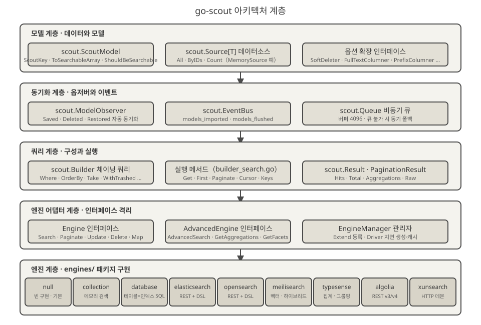
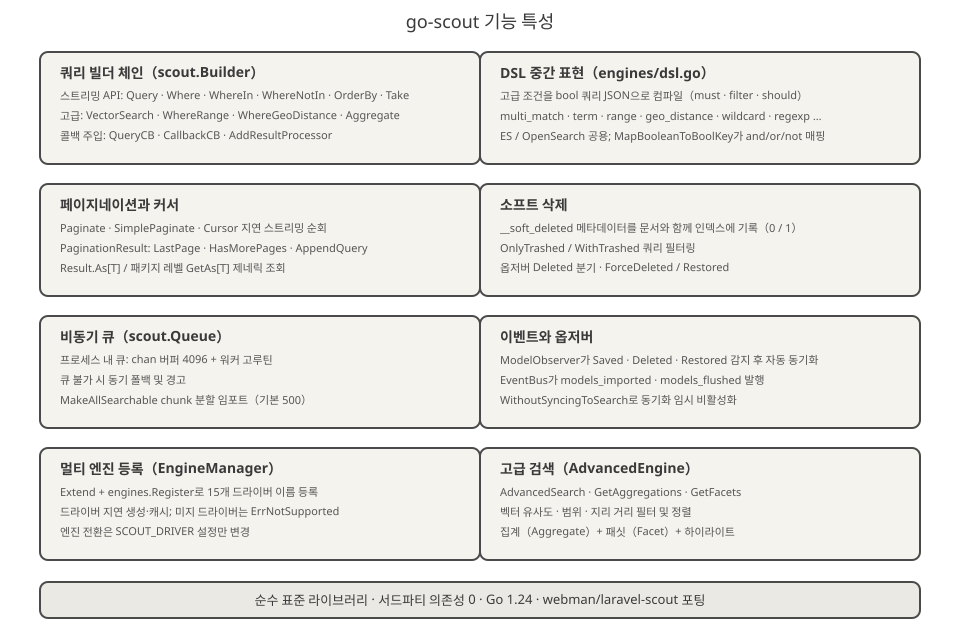
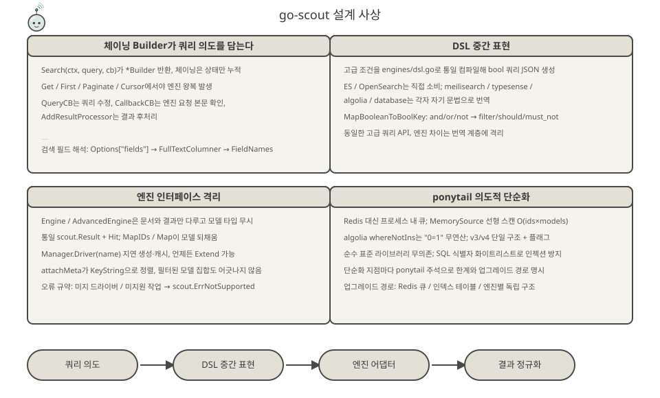
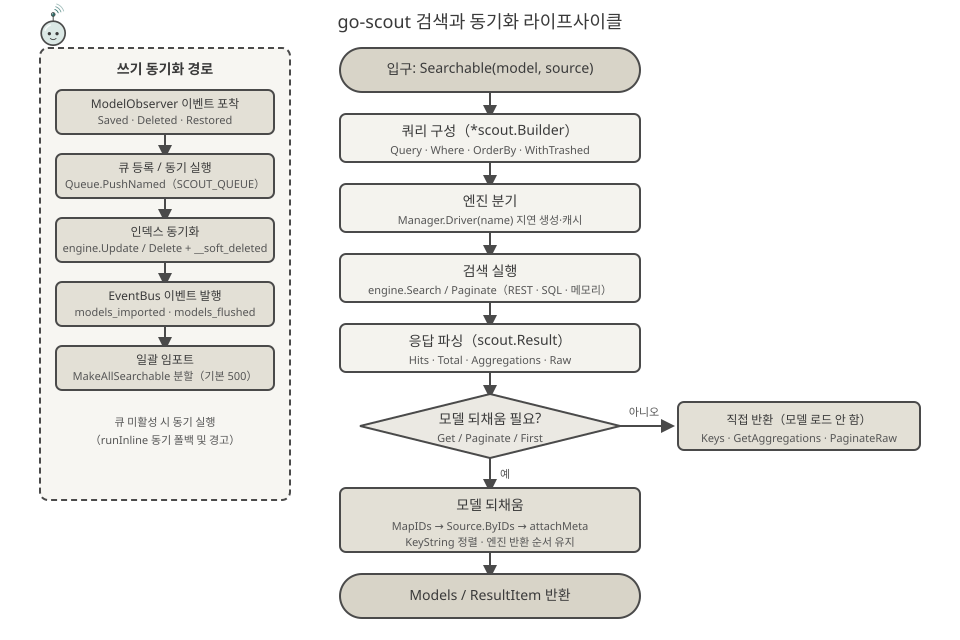

<p align="center">
  
</p>

<p align="center">
  <a href="https://pkg.go.dev/github.com/erikwang2013/go-scout"></a>
</p>

# go-scout

> Go로 작성된 검색 동기화 라이브러리 — Laravel Scout의 Go 포팅 (PHP 플러그인 [webman-scout](https://github.com/shopwwi/webman-scout) 기반).
> Go 1.24 · 순수 표준 라이브러리 구현, 서드파티 의존성 0개 · 버전 v1.4.0

**Languages / 语言**: [中文](../../../README.md) · [English](../en/README.md) · [한국어](./README.md) · [Русский](../ru/README.md) · [Deutsch](../de/README.md) · [Français](../fr/README.md) · [Español](../es/README.md) · [Português](../pt/README.md) · [हिन्दी](../hi/README.md) · [العربية](../ar/README.md) · [বাংলা](../bn/README.md) · [Bahasa Indonesia](../id/README.md) · [日本語](../ja/README.md)

## 프로젝트 소개

go-scout은 "모델과 검색 엔진 사이의 동기화" 문제를 해결합니다. `scout.ScoutModel` 인터페이스를 구현한 모델이 저장·삭제·복원될 때 자동으로 검색 엔진에 기록되거나 제거되고, 통일된 체이닝 쿼리 API로 검색할 수 있습니다. 각 검색 엔진(Elasticsearch, OpenSearch, Meilisearch, Typesense, Algolia, XunSearch…) 간 API 차이는 모두 감춰집니다.

원래 PHP 라이브러리의 클래스 구조와 동작을 그대로 미러링합니다:

| PHP (webman/laravel-scout) | Go (go-scout) |
|---|---|
| `Scout` | `scout.Scout` (scout.go) |
| `Builder` | `scout.Builder` (builder.go / builder_search.go) |
| `EngineManager` | `scout.Manager` / `scout.EngineManager` (manager.go) |
| `ModelObserver` | `scout.ModelObserver` (observer.go) |
| `Searchable` trait | `scout.Searchable` (searchable.go) |
| `Engine` / `AdvancedEngine` 및 각 엔진 클래스 | `scout.Engine` / `scout.AdvancedEngine` 및 `engines` 패키지의 9개 엔진 |

내장 엔진 (`engines` 패키지):

- **null** — 빈 구현, 기본 폴백 드라이버 (인덱싱이 비활성화된 경우 사용)
- **collection** — 메모리 내 검색, 외부 서비스 불필요
- **database** — 테이블이 곧 인덱스. 데이터베이스 테이블에 직접 LIKE/ILIKE 및 전문(full-text) 검색 (mysql / pgsql / sqlite)
- **elasticsearch** / **opensearch** — REST 쿼리, `engines/dsl.go`의 DSL 중간 표현 공유
- **meilisearch** — REST 쿼리, 벡터·하이브리드 검색, 필터링, 정렬, 패싯 지원
- **typesense** — REST 쿼리, 집계, 그룹핑, 벡터 최근접 이웃 지원
- **algolia** — REST 쿼리, v3 / v4 두 버전
- **xunsearch** — HTTP 데몬 프로토콜 (인덱스 측 + 검색 측)

`advanced_*` 별칭과 함께 `engines.Register`는 총 16개의 드라이버 이름을 등록합니다 ([engines/register.go](../../../engines/register.go) 참고).

## 프로젝트 마스코트 · Scouty

<p align="center">
  
</p>

**Scouty(小侦)** 는 go-scout의 탐색 요원입니다. 돋보기 고글과 스카우트 목도리를 두른 작은 탐침으로, 이 라이브러리가 실제로 하는 일을 그대로 그렸습니다. 부위마다 코드의 계층이 하나씩 대응합니다:

- **돋보기 고글** — `scout.Builder`(쿼리 계층). `Where` / `OrderBy` / 벡터 / 지리 조건이 모두 이 렌즈로 컴파일됩니다.
- **안테나와 신호 호** — `EngineManager` 팬아웃. 쿼리 한 번에 드라이버 이름 16개, `Driver(name)`은 지연 생성 후 캐시됩니다.
- **스카우트 목도리** — `ModelObserver`. `Saved` / `Deleted` / `Restored`가 스스로 동기화되고, 매듭은 `EventBus` 이벤트입니다.
- **손에 든 문서 카드** — `ToSearchableArray()` 이후의 문서. 카드 모서리의 색 칩이 기본 키(`KeyString`)입니다.

Scouty는 코드에도 살고 있습니다: [mascot.go](../../../mascot.go)의 `scout.MascotName` / `scout.MascotSVG` / `scout.MascotASCII`, 터미널에서는 `go run ./cmd/scout mascot`(`-svg`는 벡터), 로고는 [docs/logo.svg](../../../docs/logo.svg). `mascot_test.go`가 내장 SVG와 `docs/mascot.svg`의 일치, 그리고 `docs/` 아래 모든 SVG(12개 언어 세트 포함)의 정합성을 검증합니다.

## 아키텍처 설계



아래에서 위로 총 5개 계층이며, 각 계층의 책임은 점점 좁아집니다:

1. **모델 계층** — 비즈니스 모델이 `scout.ScoutModel` (`ScoutKey`, `ToSearchableArray`, `ShouldBeSearchable`, `TableName` 등, [model.go](../../../model.go) 참고)을 구현합니다. 데이터는 `scout.Source[T]` 인터페이스 (`All` / `ByIDs` / `Count`)로 공급되며, 내장 `scout.NewMemorySource`가 제공됩니다. `SoftDeleter`, `FullTextColumner`, `PrefixColumner` 같은 옵션 인터페이스는 필요에 따라 구현합니다.
2. **동기화 계층** — `scout.ModelObserver`가 모델의 저장/삭제/복원 이벤트를 포착합니다. `scout.EventBus`가 `scout.models_imported`, `scout.models_flushed` 이벤트를 발행합니다. `scout.Queue`는 프로세스 내 비동기 큐(버퍼 4096)를 제공하며, 큐를 사용할 수 없으면 동기 실행으로 폴백합니다.
3. **쿼리 계층** — `scout.Builder`가 체이닝 호출로 쿼리 상태를 누적합니다 (`Where`, `OrderBy`, `Take`, `WithTrashed`…). `builder_search.go`의 실행 메서드 (`Get` / `First` / `Paginate` / `Cursor` / `Keys`)가 엔진 왕복을 한 번 발생시키고, 결과는 `scout.Result` / `PaginationResult`로 정규화됩니다.
4. **엔진 어댑터 계층** — `Engine` 인터페이스 (`Search`, `Paginate`, `Update`, `Delete`, `Map`, `Flush`, `CreateIndex`, `DeleteIndex`…)와 `AdvancedEngine` 확장 인터페이스 (`AdvancedSearch`, `GetAggregations`, `GetFacets`)가 엔진 차이를 인터페이스 뒤로 격리합니다. `scout.Manager`는 `Extend`로 드라이버를 등록하고 `Driver(name)`으로 지연 생성·캐시합니다.
5. **엔진 계층** — `engines` 패키지의 9개 엔진 구현. 각각 설정 (`*scout.Config`)과 HTTP 클라이언트에만 의존하며 서로를 알지 못합니다.

## 기능 특성



- **쿼리 빌더 체인** — `scout.Builder` 스트리밍 API: `Query` / `Where` / `WhereIn` / `WhereNotIn` / `OrderBy` / `OrderByDesc` / `Latest` / `Oldest` / `Take` / `Skip`; 고급 조건 `VectorSearch` / `WhereRange` / `WhereGeoDistance` / `FulltextSearch` / `OrderByVectorSimilarity` / `OrderByGeoDistance`; 콜백 주입 `QueryCB` / `CallbackCB` / `AddResultProcessor`. 검색 필드 해석 순서: `Options["fields"]` → `FullTextColumner` → `FieldNames`.
- **DSL 중간 표현** — [engines/dsl.go](../../../engines/dsl.go)가 고급 조건을 통일된 bool 쿼리 JSON (`multi_match`, `term`, `range`, `geo_distance`, `wildcard`, `regexp` 등)으로 컴파일하며, Elasticsearch / OpenSearch가 직접 소비합니다. `MapBooleanToBoolKey`가 and/or/not을 `filter` / `should` / `must_not`으로 매핑합니다.
- **페이지네이션과 커서** — `Paginate` / `PaginateRaw` / `SimplePaginate` / `Cursor` (버퍼 채널의 지연 순회); `PaginationResult`는 `LastPage` / `HasMorePages` / `AppendQuery`를 제공합니다. `Result.As[T]`와 패키지 레벨 제네릭 함수 `scout.GetAs[T]`는 타입 단언 없이 모델을 가져옵니다.
- **소프트 삭제** — 인덱스 문서에 `__soft_deleted` 메타데이터(0/1)를 기록합니다. `OnlyTrashed` / `WithTrashed` 쿼리 필터링; database 엔진은 `deleted_at` 컬럼을 사용합니다.
- **비동기 큐** — 프로세스 내 큐 (`chan` 버퍼 4096 + 워커 고루틴), `SCOUT_QUEUE=1`로 활성화. 큐를 사용할 수 없으면 경고와 함께 동기 폴백. `MakeAllSearchable`은 chunk 단위로 분할 임포트합니다 (기본 500개/chunk).
- **이벤트와 옵저버** — `ModelObserver`가 `Saved` / `Deleted` / `Restored`를 감지해 자동 동기화. `EventBus`가 `scout.models_imported`, `scout.models_flushed`를 발행. `WithoutSyncingToSearch`로 동기화를 임시로 끌 수 있습니다.
- **멀티 엔진 등록** — `Manager.Extend` + `engines.Register`로 16개 드라이버 이름 등록. 드라이버는 지연 생성되고 캐시됩니다. 알 수 없는 드라이버는 `scout.ErrNotSupported`를 반환합니다. 엔진 전환은 `SCOUT_DRIVER` 설정만 바꾸면 됩니다.

## 설계 사상



- **체이닝 Builder가 쿼리 의도를 담는다** — `Search(ctx, query, cb)`가 `*scout.Builder`를 반환하며, 체이닝 호출은 상태만 누적합니다. `Get` / `First` / `Paginate` / `Cursor`에서야 엔진 왕복이 발생합니다. 쿼리 수정, 요청 본문 가로채기, 결과 후처리는 모두 콜백으로 주입되므로 엔진은 신경 쓸 필요가 없습니다.
- **DSL 중간 표현** — 고급 조건을 bool 쿼리 JSON으로 통일 컴파일해 ES / OpenSearch가 직접 소비하고, Meilisearch / Typesense / Algolia / database는 각자 자기 문법으로 번역합니다. 엔진 차이는 번역 계층에 격리됩니다.
- **엔진 인터페이스 격리** — `Engine` / `AdvancedEngine`은 문서와 결과만 다루고 모델 타입을 알지 못합니다. `MapIDs` / `Map`이 결과 ID를 모델로 되채우고, `attachMeta`가 `KeyString`으로 정렬을 맞추므로 필터링된 모델 집합이 어긋나지 않습니다.
- **ponytail 의도적 단순화** — 코드 곳곳에 `ponytail:` 주석으로 절충을 표시합니다: Redis 대신 프로세스 내 큐, `MemorySource`의 선형 스캔 O(ids×models), Algolia의 `whereNotIns`를 `"0=1"` 무연산으로 처리, v3/v4를 단일 구조체 + 버전 플래그, 랜덤 정렬을 `_score asc` 자리표시자로 처리 등. 순수 표준 라이브러리, 서드파티 SDK 0개.

## 라이프사이클



**검색 경로**: `Searchable(model, source).Search(ctx, query, cb)`가 `*scout.Builder`를 구성 → `Manager.Driver(name)`이 엔진을 분기 (지연 생성·캐시) → `engine.Search` / `Paginate` (REST / SQL / 메모리) → `scout.Result`로 파싱 (Hits · Total · Aggregations · Raw) → 모델 되채움이 필요한 경우 (`Get` / `Paginate` / `First`): `MapIDs` → `Source.ByIDs` → `attachMeta` (`KeyString`으로 정렬, 엔진 반환 순서 유지) → `ResultItem` / `PaginationResult` 반환. `Keys` / `GetAggregations` / `PaginateRaw`는 모델을 로드하지 않고 바로 반환합니다.

**쓰기 경로**: `ModelObserver`가 모델 이벤트를 포착 → `Queue.PushNamed("scout_make" / "scout_remove" / "scout_make_range")`로 비동기 실행 (미활성화 시 동기 폴백) → `engine.Update` / `Delete` (소프트 삭제 시 `__soft_deleted` 메타데이터 첨부) → `EventBus`가 `scout.models_imported` / `scout.models_flushed` 발행.

## 프로젝트 구조

```
go-scout/
├── go.mod                      # 모듈 정의: github.com/erikwang2013/go-scout · go 1.24.1 · 의존성 0
├── .gitignore                  # IDE / 캐시 / 키 파일 무시
├── LICENSE                     # BSD 3-Clause 라이선스
├── scout.go                    # Scout 파사드: Config / Manager / Events / Queue / Observer 조립 및 팩토리
├── config.go                   # 설정 트리: DefaultConfig + 환경변수 오버라이드 + dot-path 조회
├── engine.go                   # Engine / AdvancedEngine 인터페이스 + Result / Hit / PaginationResult 타입
├── manager.go                  # EngineManager: Extend 등록, Driver 지연 생성·캐시, 기본 null 엔진
├── builder.go                  # Builder 구조 + 체이닝 조건 구성 (Where / OrderBy / Take / 고급 조건)
├── builder_search.go           # 쿼리 실행: Raw / Get / First / Paginate / Cursor / GetAs[T]
├── searchable.go               # Searchable: 모델-데이터소스 바인딩, 전체 임포트·익스포트, 소프트 삭제 메타데이터
├── observer.go                 # ModelObserver: Saved / Deleted / Restored 자동 동기화
├── events.go                   # EventBus: 스레드 안전 동기 발행·구독 + 임포트/플러시 이벤트
├── queue.go                    # Queue: 프로세스 내 비동기 큐 (chan 4096) + 동기 폴백
├── model.go                    # ScoutModel 인터페이스 + 옵션 확장 인터페이스 + KeyName/KeyString 헬퍼
├── source.go                   # Source[T] 인터페이스 + MemorySource (선형 스캔)
├── exceptions.go               # ErrNotSupported / ErrScout 오류 체계
├── identity.go                 # 신원 전달: `scout.WithUser` / `scout.WithClientIP`(Algolia identify용)
├── mascot.go                   # 마스코트 Scouty: MascotName / MascotSVG / MascotASCII
├── mascot_test.go              # 내장 SVG와 docs/mascot.svg 일치 + docs/ 전체 SVG 검증
├── cmd/scout/main.go           # CLI 데모 프로그램: import / flush / index / queue-import 등 7개 하위 명령
├── engines/
│   ├── engine.go               # HTTP 클라이언트 (인증, TLS 스킵) + DoJSON/DoBytes 공용 헬퍼
│   ├── register.go             # SetDatabase + Register: 16개 드라이버 이름 등록 + Drivers()
│   ├── dsl.go                  # DSL 중간 표현: bool 쿼리 / 정렬 / 집계 / 패싯 / 하이라이트
│   ├── null.go                 # NullEngine: 빈 구현
│   ├── collection.go           # CollectionEngine: 메모리 검색 (대소문자 무시 부분 문자열 매칭)
│   ├── database.go             # DatabaseEngine: 테이블=인덱스 SQL (LIKE/ILIKE + pgsql tsvector)
│   ├── elasticsearch.go        # ElasticsearchEngine + OpenSearch와 공유하는 es* 헬퍼
│   ├── opensearch.go           # OpenSearchEngine (기본 드라이버이자 고급 엔진)
│   ├── meilisearch.go          # MeilisearchEngine: 필터 / 정렬 / 벡터 하이브리드 / 패싯
│   ├── meilisearch_advanced.go # Meilisearch 확장 엔진: 벡터 / 하이브리드 검색 확장
│   ├── typesense.go            # TypesenseEngine: filter_by / 집계 / 그룹핑 / 최근접 검색
│   ├── typesense_advanced.go   # Typesense 확장 엔진: 검색 파라미터 / 집계 / 벡터 확장
│   ├── algolia.go              # AlgoliaEngine: v3/v4 단일 구조 + 버전 플래그
│   ├── xunsearch.go            # XunSearchEngine: 인덱스 데몬 + 검색 데몬
│   └── xunsearch_advanced.go   # XunSearch 확장 엔진: 고급 조건 / 패싯 확장
├── docs/
│   ├── arch.svg                # 아키텍처 계층 다이어그램
│   ├── features.svg            # 기능 특성 다이어그램
│   ├── design.svg              # 설계 사상 다이어그램
│   ├── logo.svg                # 메인 비주얼: 전신 Scouty + go-scout 워드마크
│   ├── mascot.svg              # 마스코트 Scouty(mascot.go에 같은 그림 내장)
│   ├── alipay.png              # Alipay 결제 QR 코드 (후원 섹션에서 참조)
│   ├── weixinpay.png           # WeChat Pay 결제 QR 코드 (후원 섹션에서 참조)
│   ├── coin/                   # 체인별 후원 QR 코드 (jpg 10장)
│   └── lifecycle.svg           # 검색 라이프사이클 흐름도
└── engines/
    ├── algolia_test.go         # Algolia 필터 리터럴 테스트 (algoliaLit / algoliaFilters)
    ├── elasticsearch_test.go   # Elasticsearch 요청/파싱 테스트 (httptest 스텁)
    ├── opensearch_test.go      # OpenSearch 요청/파싱 테스트 (httptest 스텁)
    ├── xunsearch_test.go       # XunSearch 데몬 프로토콜 테스트 (httptest 스텁)
    ├── collection_test.go      # 메모리 엔진 동작 테스트 (필터 / 정렬 / 페이지네이션 / 되채움)
    ├── database_test.go        # SQL 생성 및 단언 (assertSQL 정확 매칭)
    ├── meilisearch_test.go     # Meilisearch 요청/파싱 테스트 (httptest 스텁)
    ├── typesense_test.go       # Typesense 요청/파싱 테스트 (404 자동 컬렉션 생성 포함)
    └── null_test.go            # NullEngine 빈 동작 테스트
```

## 빠른 시작 / 사용 방법

### 1. 설치

```bash
go get github.com/erikwang2013/go-scout
```

서드파티 의존성이 없어 설치 즉시 사용할 수 있습니다.

### 2. 드라이버 설정

`scout.DefaultConfig()`가 환경변수를 읽습니다. 공통 항목:

| 환경변수 | 기본값 | 설명 |
|---|---|---|
| `SCOUT_DRIVER` | `database` | 엔진 드라이버 이름; 빈 문자열 또는 `"false"`면 `null`로 폴백 |
| `SCOUT_PREFIX` | 빈 값 | 인덱스 접두사 |
| `SCOUT_QUEUE` | 꺼짐 | 1로 설정하면 비동기 큐 활성화 |
| `SCOUT_SOFT_DELETE` | 꺼짐 | 소프트 삭제 메타데이터를 문서와 함께 인덱스에 기록 |
| `SCOUT_IDENTIFY` | 꺼짐 | 켜면 "누가 검색하는지"를 Algolia에 전달합니다: `X-Algolia-UserToken`(`scout.WithUser`의 사용자 키)와 `X-Forwarded-For`(`scout.WithClientIP`, 공인 IP만) |
| `SCOUT_CHUNK_SEARCHABLE` / `SCOUT_CHUNK_UNSEARCHABLE` | `500` | 일괄 임포트/제거의 블록 크기 |
| `SCOUT_BULK_SIZE` | `100` | 일괄 쓰기 크기 (opensearch) |

각 엔진 전용 (설정 트리 경로 `engine.key`는 env와 동일 이름, 예: `opensearch.host` ← `OPENSEARCH_HTTP_HOST`):

| 엔진 | 환경변수 (기본값) |
|---|---|
| meilisearch | `MEILISEARCH_HOST` (`http://127.0.0.1:7700`), `MEILISEARCH_KEY` |
| typesense | `TYPESENSE_HOST` (`127.0.0.1`), `TYPESENSE_PORT` (`8108`), `TYPESENSE_PROTOCOL` (`http`), `TYPESENSE_API_KEY` (`xyz`), `TYPESENSE_IMPORT_ACTION` (`upsert`), `TYPESENSE_MAX_TOTAL_RESULTS` (`1000`), `TYPESENSE_CONNECTION_TIMEOUT` (`2`) |
| elasticsearch | `ELASTICSEARCH_HOST` (`http://127.0.0.1:9200`, hosts 목록의 첫 항목) + `elasticsearch.auth` (user/password) |
| opensearch | `OPENSEARCH_HTTP_HOST` (`https://127.0.0.1:6205`), `OPENSEARCH_USERNAME` / `OPENSEARCH_PASSWORD` (`admin`/`admin`), `OPENSEARCH_SSL_VERIFICATION` (기본 TLS 검증 스킵), `OPENSEARCH_TIMEOUT` (`30`초), `OPENSEARCH_CONNECTION_TIMEOUT` (`10`) |
| xunsearch | `XUNSEARCH_INDEX_HOST` (`http://127.0.0.1`) + `XUNSEARCH_INDEX_PORT` (`8383`), `XUNSEARCH_SEARCH_HOST` (`http://127.0.0.1`) + `XUNSEARCH_SEARCH_PORT` (`8384`), `XUNSEARCH_DEFAULT_INDEX` (`default`), `XUNSEARCH_CHARSET` (`utf-8`), `XUNSEARCH_CONFIG_PATH`(비우면 위 호스트/포트. 설정하면 `<경로>/<인덱스명>.ini`에서 프로젝트 이름·데몬·문자셋을 읽음), `XUNSEARCH_BATCH_SIZE` (`100`) |
| algolia | `ALGOLIA_APP_ID`, `ALGOLIA_SECRET`(없으면 엔진 생성 시 panic), `ALGOLIA_HOST`(선택. 기본 `https://<appID>.algolia.net`, 프록시나 호환 엔드포인트 지정 가능) |

`database` 드라이버는 데이터베이스 연결과 방언(dialect) 주입이 필요합니다:

```go
engines.SetDatabase(db, "mysql") // dialect: mysql / pgsql / postgres / sqlite
```

### 3. 최소 사용 예제

```go
package main

import (
	"context"
	"fmt"

	"github.com/erikwang2013/go-scout"
	"github.com/erikwang2013/go-scout/engines"
)

// Post는 scout.ScoutModel을 구현하면 검색에 참여할 수 있습니다
type Post struct {
	ID    int
	Title string
	Body  string
}

func (p Post) ScoutKey() any            { return p.ID }
func (p Post) TableName() string        { return "posts" }
func (p Post) ShouldBeSearchable() bool { return p.Title != "" }
func (p Post) ToSearchableArray() map[string]any {
	return map[string]any{"title": p.Title, "body": p.Body}
}

func main() {
	ctx := context.Background()

	// 초기화: 기본 설정 + 전체 엔진 등록 (SCOUT_DRIVER가 사용할 엔진 결정)
	s := scout.NewWithConfig(scout.DefaultConfig())
	engines.Register(s.Manager)

	// 모델과 데이터소스 바인딩, 전체 임포트 (chunk 0 = 기본 블록 크기 500 사용)
	sr := s.Searchable(&Post{}, scout.NewMemorySource(
		Post{ID: 1, Title: "Go module layout", Body: "packages and imports"},
		Post{ID: 2, Title: "Indexing strategies", Body: "bulk writes"},
	))
	_ = sr.MakeAllSearchable(ctx, 0)

	// 체이닝 쿼리: Search → Where → OrderByDesc → Take → Get
	items, err := sr.Search(ctx, "golang", nil). // 세 번째 인자는 쿼리 콜백, nil 가능
		Where("title", "indexing").
		OrderByDesc("created_at").
		Take(10).
		Get(ctx)
	if err != nil {
		panic(err)
	}
	for _, it := range items {
		post := it.Model.(Post) // ResultItem.Model에 원본 모델이 이미 되채워져 있음
		fmt.Println(post.ID, it.Score)
	}

	// 제네릭 조회: GetAs[T]로 타입 단언 불필요
	posts, _ := scout.GetAs[Post](ctx, sr.Search(ctx, "indexing", nil).Take(5))
	_ = posts
}
```

쿼리 실행의 핵심 메서드: `Get(ctx) ([]ResultItem, error)`, `First(ctx)`, `Paginate(ctx, perPage, page, pageName)` (기본 15개/페이지, 페이지 파라미터 이름 기본 `page`), `Cursor(ctx)` (지연 스트리밍), `Keys(ctx)` (기본 키만 조회). 페이지네이션 결과 `PaginationResult`에는 `LastPage()` / `HasMorePages()` / `AppendQuery()`가 있어 페이지 링크에 사용할 수 있습니다.

### 4. CLI 데모 프로그램

`cmd/scout`는 자체 완결형 데모 CLI입니다. 시작 시 `SCOUT_DRIVER`를 `collection`으로 설정하고 `NewMemorySource`로 7개의 `post` 데이터를 미리 로드합니다 (제목이 비어 있는 초안은 `ShouldBeSearchable`이 false라 건너뜁니다).

```bash
go run ./cmd/scout                # 전체 하위 명령 사용법 출력
go run ./cmd/scout index posts --key id        # 인덱스 생성
go run ./cmd/scout import --chunk 3 --fresh    # 전체 임포트 (블록당 3개, 먼저 비움)
go run ./cmd/scout flush          # 인덱스 비우기
go run ./cmd/scout queue-import --chunk 3 --min 1 --max 100 --workers 4  # 키 범위로 큐 임포트
go run ./cmd/scout sync-index-settings --driver meilisearch  # 인덱스 설정 동기화 (엔진이 UpdateIndexSettings 지원해야 함)
go run ./cmd/scout delete-index posts           # 단일 인덱스 삭제
go run ./cmd/scout delete-all-indexes           # 전체 인덱스 삭제
go run ./cmd/scout mascot                         # 마스코트 출력(-svg는 벡터)
```

## 라이선스 및 설명

이 프로젝트는 PHP 플러그인 webman-scout의 Go 포팅입니다. 클래스 구조, 드라이버 명명, 동작 의미론을 원본과 일치시킵니다. 모든 단순화 절충은 소스 코드의 `ponytail:` 주석으로 표시되어 있습니다 (프로세스 내 큐, 메모리 데이터소스의 선형 스캔, Algolia의 `"0=1"` 무연산 등).

## 후원 (Donate)

후원해 주셔서 감사합니다! 후원은 프로젝트의 지속적인 유지보수와 발전에 도움이 됩니다. 많은 관심 부탁드립니다:

<p align="center">
<table>
<tr>
<td align="center">
<b>위챗 페이 (WeChat Pay)</b><br/>

</td>
<td align="center">
<b>알리페이 (Alipay)</b><br/>

</td>
</tr>
</table>
</p>

### 가상화폐 후원 (Crypto Donate)

다음 메인넷을 지원합니다. 송금 전에 수취 주소와 해당 메인넷을 반드시 대조해 주세요:

| 메인넷 | 지갑 주소 | QR코드 |
|---|---|---|
| BNB Smart Chain (BEP20) | `0x355d429f97511897ccb4e271ec888205f9ab6629` |  |
| Tron (TRC20) | `TEdDHWLajt1XvqtPDWmQctdrJaC3pzZZzz` |  |
| Ethereum (ERC20) | `0x355d429f97511897ccb4e271ec888205f9ab6629` |  |
| Aptos | `0x836e3780edfc3f7b2372b39e2a1a3a5d7adfaccd96c726f21cfde1b50dd68030` |  |
| Plasma | `0x355d429f97511897ccb4e271ec888205f9ab6629` |  |
| Polygon POS | `0x355d429f97511897ccb4e271ec888205f9ab6629` |  |
| Solana | `2hfhboHdmdrYsY25XfQSsEWxq5ip4EQsR7f4AzSRMUyr` |  |
| The Open Network (TON) | `UQB9kFQohzmXUir9QSSZq01iwl9aQZIDdBpNmDklljRtCoGK` |  |
| Arbitrum One | `0x355d429f97511897ccb4e271ec888205f9ab6629` |  |
| AVAX C-Chain | `0x355d429f97511897ccb4e271ec888205f9ab6629` |  |

### 글로벌 송금 (은행 송금)

**수취인 정보**

- 수취인 이름: WANG KEXUN
- 수취 계좌번호: 881015918251

**수취 은행**

- ZA Bank SWIFT Code: `AABLHKHHXXX`
- 은행 이름: ZA Bank Limited
- 은행 번호: 387
- 은행 주소: `Core F, Cyberport 3, 100 Cyberport Road, Hong Kong`

**해외 송금 중개 은행 (필요 시)**

> 아래는 해외 송금 시 사용되는 중개(코레스폰던트) 은행 정보이며, 수취 은행이 아닙니다. 중개 은행 정보가 필요한지 송금 은행에 문의하세요.

- 홍콩달러(HKD), 위안화(CNY), 미국달러(USD) 송금 시 중개 은행은 Citibank입니다:
  - 은행 이름: Citibank N.A. Hong Kong
  - SWIFT Code: `CITIHKHXXXX`
  - 은행 번호: 006
  - 지점 이름: Hong Kong Branch
  - 지점 번호: 391
  - 은행 주소: `Citibank Tower, Citibank Plaza, 3 Garden Road, Central, Hong Kong`
- 기타 통화 송금 시 중개 은행은 BNY Mellon입니다:
  - 은행 이름: THE BANK OF NEW YORK MELLON
  - SWIFT Code: `IRVTUS3NXXX`
  - 은행 주소: `THE BANK OF NEW YORK MELLON, 240 GREENWICH STREET, NEW YORK, United States`
