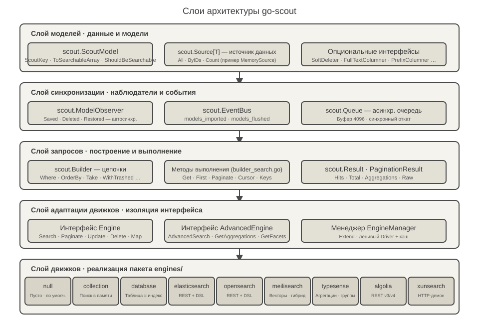
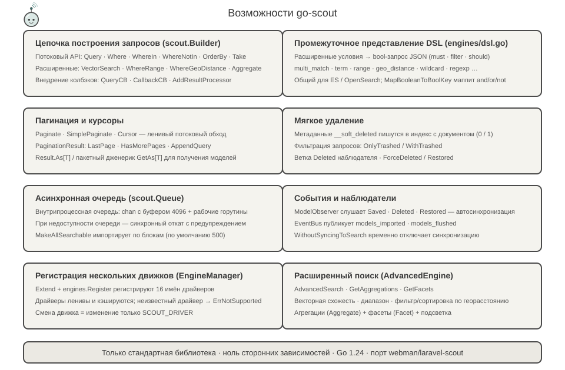
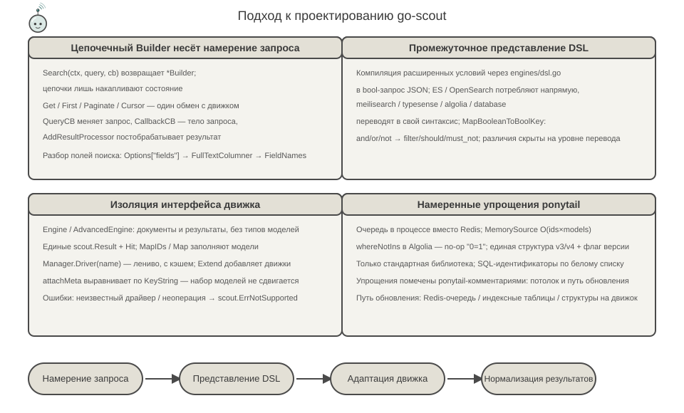
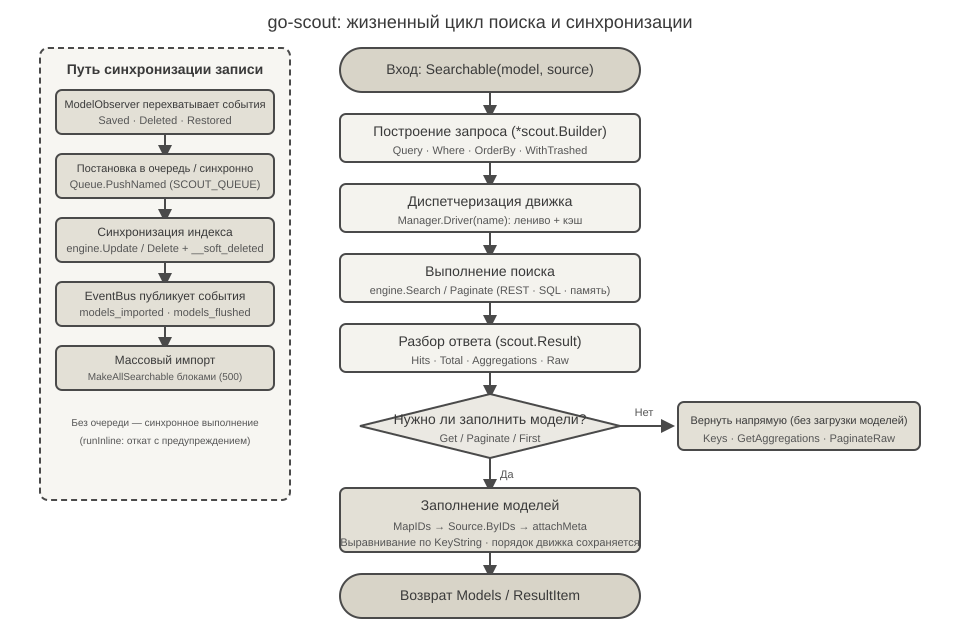

<p align="center">
  
</p>

<p align="center">
  <a href="https://pkg.go.dev/github.com/erikwang2013/go-scout"></a>
</p>

# go-scout

> Библиотека синхронизации поиска на Go — порт Laravel Scout для Go (на основе PHP-плагина [webman-scout](https://github.com/shopwwi/webman-scout)).
> Go 1.24 · чистая реализация только на стандартной библиотеке, ноль сторонних зависимостей · версия v1.4.0

**Languages / 语言**: [中文](../../../README.md) · [English](../en/README.md) · [한국어](../ko/README.md) · [Русский](./README.md) · [Deutsch](../de/README.md) · [Français](../fr/README.md) · [Español](../es/README.md) · [Português](../pt/README.md) · [हिन्दी](../hi/README.md) · [العربية](../ar/README.md) · [বাংলা](../bn/README.md) · [Bahasa Indonesia](../id/README.md) · [日本語](../ja/README.md)

## О проекте

go-scout решает задачу «синхронизации между моделью и поисковой системой»: модели, реализующие интерфейс `scout.ScoutModel`, при сохранении, удалении и восстановлении автоматически записываются в поисковую систему или удаляются из неё, а поиск по ним ведётся через единый цепочечный API запросов, скрывающий различия API между поисковыми системами (Elasticsearch, OpenSearch, Meilisearch, Typesense, Algolia, XunSearch…).

Он повторяет структуру классов и поведение исходной PHP-библиотеки:

| PHP (webman/laravel-scout) | Go (go-scout) |
|---|---|
| `Scout` | `scout.Scout` (scout.go) |
| `Builder` | `scout.Builder` (builder.go / builder_search.go) |
| `EngineManager` | `scout.Manager` / `scout.EngineManager` (manager.go) |
| `ModelObserver` | `scout.ModelObserver` (observer.go) |
| `Searchable` trait | `scout.Searchable` (searchable.go) |
| `Engine` / `AdvancedEngine` и классы движков | `scout.Engine` / `scout.AdvancedEngine` и 9 движков пакета `engines` |

Встроенные движки (пакет `engines`):

- **null** — пустая реализация, драйвер по умолчанию (используется, когда индексирование отключено)
- **collection** — поиск в памяти, не требует никаких внешних сервисов
- **database** — таблица как индекс: LIKE/ILIKE и полнотекстовый поиск прямо по таблицам БД (mysql / pgsql / sqlite)
- **elasticsearch** / **opensearch** — REST-запросы, общее промежуточное представление DSL в `engines/dsl.go`
- **meilisearch** — REST-запросы, поддержка векторного и гибридного поиска, фильтрации, сортировки, фасетов
- **typesense** — REST-запросы, поддержка агрегаций, группировки, поиска по векторным соседям
- **algolia** — REST-запросы, две версии: v3 / v4
- **xunsearch** — протокол HTTP-демона (индексная и поисковая часть)

Вместе с псевдонимами `advanced_*` `engines.Register` регистрирует 16 имён драйверов (см. [engines/register.go](../../../engines/register.go)).

## Талисман проекта · Scouty

<p align="center">
  
</p>

**Scouty (小侦)** — разведчик go-scout: маленький зонд в очках-лупе и скаутском галстуке. Он нарисован по тому, что библиотека делает на самом деле: каждая деталь соответствует слою кода:

- **Очки-лупа** — слой запросов `scout.Builder`: `Where`, `OrderBy`, векторные и геоусловия компилируются в эту линзу.
- **Антенна и дуги сигнала** — `EngineManager`: один запрос, 16 имён драйверов; `Driver(name)` создаётся лениво и кешируется.
- **Скаутский галстук** — `ModelObserver`: `Saved` / `Deleted` / `Restored` синхронизируются сами, а узел — это событие `EventBus`.
- **Карточки документов в руке** — документ после `ToSearchableArray()`; цветной квадратик — первичный ключ (`KeyString`).

Scouty живёт и в коде: `scout.MascotName` / `scout.MascotSVG` / `scout.MascotASCII` в [mascot.go](../../../mascot.go); `go run ./cmd/scout mascot` в терминале (`-svg` — вектор); логотип — [docs/logo.svg](../../../docs/logo.svg). `mascot_test.go` следит за тем, чтобы встроенный SVG совпадал с `docs/mascot.svg`, и разбирает все SVG в `docs/` (включая 12 языковых наборов).

## Архитектура



Снизу вверх пять слоёв, ответственность с каждым слоем сужается:

1. **Слой моделей** — бизнес-модели реализуют `scout.ScoutModel` (`ScoutKey`, `ToSearchableArray`, `ShouldBeSearchable`, `TableName` и т.д., см. [model.go](../../../model.go)); данные поступают через интерфейс `scout.Source[T]` (`All` / `ByIDs` / `Count`), встроен `scout.NewMemorySource`. Опциональные интерфейсы вроде `SoftDeleter`, `FullTextColumner`, `PrefixColumner` реализуются по мере необходимости.
2. **Слой синхронизации** — `scout.ModelObserver` перехватывает события сохранения/удаления/восстановления моделей; `scout.EventBus` публикует события `scout.models_imported`, `scout.models_flushed`; `scout.Queue` предоставляет внутрипроцессную асинхронную очередь (буфер 4096), а при её недоступности — синхронный откат.
3. **Слой запросов** — `scout.Builder` накапливает состояние запроса цепочками (`Where`, `OrderBy`, `Take`, `WithTrashed`…); методы выполнения из `builder_search.go` (`Get` / `First` / `Paginate` / `Cursor` / `Keys`) запускают один обмен с движком, результат нормализуется в `scout.Result` / `PaginationResult`.
4. **Слой адаптации движков** — интерфейс `Engine` (`Search`, `Paginate`, `Update`, `Delete`, `Map`, `Flush`, `CreateIndex`, `DeleteIndex`…) и расширенный интерфейс `AdvancedEngine` (`AdvancedSearch`, `GetAggregations`, `GetFacets`) изолируют различия движков за интерфейсом; `scout.Manager` регистрирует их через `Extend`, а `Driver(name)` лениво создаёт и кэширует драйверы.
5. **Слой движков** — 9 реализаций в пакете `engines`, каждая зависит только от конфигурации (`*scout.Config`) и HTTP-клиента, друг о друге они не знают.

## Возможности



- **Цепочка построения запросов** — потоковый API `scout.Builder`: `Query` / `Where` / `WhereIn` / `WhereNotIn` / `OrderBy` / `OrderByDesc` / `Latest` / `Oldest` / `Take` / `Skip`; расширенные условия `VectorSearch` / `WhereRange` / `WhereGeoDistance` / `FulltextSearch` / `OrderByVectorSimilarity` / `OrderByGeoDistance`; внедрение колбэков `QueryCB` / `CallbackCB` / `AddResultProcessor`. Порядок разбора полей поиска: `Options["fields"]` → `FullTextColumner` → `FieldNames`.
- **Промежуточное представление DSL** — [engines/dsl.go](../../../engines/dsl.go) компилирует расширенные условия в единый bool-запрос JSON (`multi_match`, `term`, `range`, `geo_distance`, `wildcard`, `regexp` и др.), который напрямую потребляют Elasticsearch / OpenSearch; `MapBooleanToBoolKey` отображает and/or/not в `filter` / `should` / `must_not`.
- **Пагинация и курсоры** — `Paginate` / `PaginateRaw` / `SimplePaginate` / `Cursor` (ленивый обход через буферизованный канал); `PaginationResult` предоставляет `LastPage` / `HasMorePages` / `AppendQuery`; `Result.As[T]` и пакетная обобщённая функция `scout.GetAs[T]` получают модели без приведения типов.
- **Мягкое удаление** — в документы индекса пишется метаданные `__soft_deleted` (0/1); фильтрация запросов `OnlyTrashed` / `WithTrashed`; движок database использует колонку `deleted_at`.
- **Асинхронная очередь** — внутрипроцессная очередь (`chan` с буфером 4096 + рабочие горутины), включается через `SCOUT_QUEUE=1`; при недоступности очереди — синхронный откат с предупреждением; `MakeAllSearchable` импортирует блоками (по умолчанию 500 записей на блок).
- **События и наблюдатели** — `ModelObserver` слушает `Saved` / `Deleted` / `Restored` и синхронизирует автоматически; `EventBus` публикует `scout.models_imported`, `scout.models_flushed`; `WithoutSyncingToSearch` временно отключает синхронизацию.
- **Регистрация нескольких движков** — `Manager.Extend` + `engines.Register` регистрируют 16 имён драйверов; драйверы создаются лениво и кэшируются; неизвестный драйвер возвращает `scout.ErrNotSupported`; смена движка — только изменение конфигурации `SCOUT_DRIVER`.

## Подход к проектированию



- **Цепочечный Builder несёт намерение запроса** — `Search(ctx, query, cb)` возвращает `*scout.Builder`; цепочки лишь накапливают состояние, а обмен с движком запускают `Get` / `First` / `Paginate` / `Cursor`; изменение запроса, перехват тела запроса и постобработка результатов — всё через колбэки, движку об этом знать не нужно.
- **Промежуточное представление DSL** — расширенные условия компилируются в единый bool-запрос JSON; ES / OpenSearch потребляют его напрямую, а Meilisearch / Typesense / Algolia / database переводят в собственный синтаксис — различия движков скрыты на уровне перевода.
- **Изоляция интерфейса движка** — `Engine` / `AdvancedEngine` говорят только о документах и результатах, не зная о типах моделей; `MapIDs` / `Map` обратно заполняют модели по ID, `attachMeta` выравнивает по `KeyString` — отфильтрованный набор моделей не сдвигается.
- **Намеренные упрощения ponytail** — в коде все компромиссы помечены комментариями `ponytail:`: внутрипроцессная очередь вместо Redis, линейный перебор `MemorySource` O(ids×models), no-op `whereNotIns` в Algolia через `"0=1"`, единая структура v3/v4 с флагом версии, случайная сортировка через заглушку `_score asc` и т.д. Только стандартная библиотека, ноль сторонних SDK.

## Жизненный цикл



**Путь поиска**: `Searchable(model, source).Search(ctx, query, cb)` строит `*scout.Builder` → `Manager.Driver(name)` назначает движок (ленивое создание с кэшем) → `engine.Search` / `Paginate` (REST / SQL / память) → разбор в `scout.Result` (Hits · Total · Aggregations · Raw) → при необходимости обратного заполнения моделей (`Get` / `Paginate` / `First`): `MapIDs` → `Source.ByIDs` → `attachMeta` (выравнивание по `KeyString`, порядок движка сохраняется) → возврат `ResultItem` / `PaginationResult`; `Keys` / `GetAggregations` / `PaginateRaw` возвращаются напрямую, без загрузки моделей.

**Путь записи**: `ModelObserver` перехватывает события модели → `Queue.PushNamed("scout_make" / "scout_remove" / "scout_make_range")` выполняется асинхронно (без очереди — синхронный откат) → `engine.Update` / `Delete` (при мягком удалении добавляется метаданные `__soft_deleted`) → `EventBus` публикует `scout.models_imported` / `scout.models_flushed`.

## Структура проекта

```
go-scout/
├── go.mod                      # Модуль: github.com/erikwang2013/go-scout · go 1.24.1 · без зависимостей
├── .gitignore                  # Исключения для IDE / кэша / файлов с ключами
├── LICENSE                     # Лицензия BSD 3-Clause
├── scout.go                    # Фасад Scout: сборка Config / Manager / Events / Queue / Observer и фабрики
├── config.go                   # Дерево конфигурации: DefaultConfig + переопределение переменными среды + dot-path
├── engine.go                   # Интерфейсы Engine / AdvancedEngine + типы Result / Hit / PaginationResult
├── manager.go                  # EngineManager: регистрация Extend, ленивое создание Driver с кэшем, движок null по умолчанию
├── builder.go                  # Структура Builder + цепочечные условия (Where / OrderBy / Take / расширенные условия)
├── builder_search.go           # Выполнение запросов: Raw / Get / First / Paginate / Cursor / GetAs[T]
├── searchable.go               # Searchable: привязка модели и источника данных, полный импорт/экспорт, метаданные мягкого удаления
├── observer.go                 # ModelObserver: автоматическая синхронизация Saved / Deleted / Restored
├── events.go                   # EventBus: потокобезопасные подписка и публикация + события импорта/очистки
├── queue.go                    # Queue: внутрипроцессная асинхронная очередь (chan 4096) + синхронный откат
├── model.go                    # Интерфейс ScoutModel + опциональные расширения + помощники KeyName/KeyString
├── source.go                   # Интерфейс Source[T] + MemorySource (линейный перебор)
├── exceptions.go               # Система ошибок ErrNotSupported / ErrScout
├── identity.go                 # Передача идентичности: `scout.WithUser` / `scout.WithClientIP` (для Algolia identify)
├── mascot.go                   # Талисман Scouty: MascotName / MascotSVG / MascotASCII
├── mascot_test.go              # Встроенный SVG против docs/mascot.svg + разбор всех SVG в docs/
├── cmd/scout/main.go           # Демонстрационный CLI: import / flush / index / queue-import и др., всего 8 подкоманд
├── engines/
│   ├── engine.go               # HTTP-клиент (auth, пропуск TLS) + общие помощники DoJSON/DoBytes
│   ├── register.go             # SetDatabase + Register регистрируют 16 имён драйверов + Drivers()
│   ├── dsl.go                  # Промежуточное представление DSL: bool-запросы / сортировка / агрегации / фасеты / подсветка
│   ├── null.go                 # NullEngine: пустая реализация
│   ├── collection.go           # CollectionEngine: поиск в памяти (регистронезависимое подстрочное совпадение)
│   ├── database.go             # DatabaseEngine: таблица как индекс SQL (LIKE/ILIKE + tsvector в pgsql)
│   ├── elasticsearch.go        # ElasticsearchEngine + общие с OpenSearch помощники es*
│   ├── opensearch.go           # OpenSearchEngine (базовый драйвер — он же расширенный движок)
│   ├── meilisearch.go          # MeilisearchEngine: фильтрация / сортировка / векторный гибрид / фасеты
│   ├── meilisearch_advanced.go # Расширенный движок Meilisearch: векторный / гибридный поиск
│   ├── typesense.go            # TypesenseEngine: filter_by / агрегации / группировка / поиск по соседям
│   ├── typesense_advanced.go   # Расширенный движок Typesense: параметры поиска / агрегации / векторы
│   ├── algolia.go              # AlgoliaEngine: единая структура v3/v4 + флаг версии
│   ├── xunsearch.go            # XunSearchEngine: демон индексации + демон поиска
│   └── xunsearch_advanced.go   # Расширенный движок XunSearch: расширенные условия / фасеты
├── docs/
│   ├── arch.svg                # Схема слоёв архитектуры
│   ├── features.svg            # Схема возможностей
│   ├── design.svg              # Схема подхода к проектированию
│   ├── logo.svg                # Главный баннер: Scouty в полный рост + надпись go-scout
│   ├── mascot.svg              # Талисман Scouty (тот же рисунок встроен в mascot.go)
│   ├── alipay.png              # QR-код Alipay (на него ссылается раздел пожертвований)
│   ├── weixinpay.png           # QR-код WeChat Pay (на него ссылается раздел пожертвований)
│   ├── coin/                   # QR-коды пожертвований по сетям (10 jpg)
│   └── lifecycle.svg           # Схема жизненного цикла поиска
└── engines/
    ├── algolia_test.go         # Тесты литералов фильтров Algolia (algoliaLit / algoliaFilters)
    ├── elasticsearch_test.go   # Тесты запросов и разбора Elasticsearch (заглушки httptest)
    ├── opensearch_test.go      # Тесты запросов и разбора OpenSearch (заглушки httptest)
    ├── xunsearch_test.go       # Тесты протокола демона XunSearch (заглушки httptest)
    ├── collection_test.go      # Тесты поведения движка в памяти (фильтрация / сортировка / пагинация / обратное заполнение)
    ├── database_test.go        # Генерация SQL и проверки (точное совпадение assertSQL)
    ├── meilisearch_test.go     # Тесты запросов/разбора Meilisearch (заглушки httptest)
    ├── typesense_test.go       # Тесты запросов/разбора Typesense (включая автосоздание коллекции при 404)
    └── null_test.go            # Тесты пустого поведения NullEngine
```

## Быстрый старт / руководство по использованию

### 1. Подключение

```bash
go get github.com/erikwang2013/go-scout
```

Без сторонних зависимостей — подключил и работаешь.

### 2. Настройка драйвера

`scout.DefaultConfig()` читает переменные среды. Общие параметры:

| Переменная среды | Значение по умолчанию | Описание |
|---|---|---|
| `SCOUT_DRIVER` | `database` | Имя драйвера движка; пустая строка или `"false"` → откат на `null` |
| `SCOUT_PREFIX` | пусто | Префикс индекса |
| `SCOUT_QUEUE` | выкл | `1` включает асинхронную очередь |
| `SCOUT_SOFT_DELETE` | выкл | Метаданные мягкого удаления записываются в индекс вместе с документом |
| `SCOUT_IDENTIFY` | выкл | включает передачу того, «кто ищет», в Algolia: `X-Algolia-UserToken` (ключ из `scout.WithUser`) и `X-Forwarded-For` (из `scout.WithClientIP`, только публичные IP) |
| `SCOUT_CHUNK_SEARCHABLE` / `SCOUT_CHUNK_UNSEARCHABLE` | `500` | Размер блока при массовом импорте/удалении |
| `SCOUT_BULK_SIZE` | `100` | Размер массовой записи (opensearch) |

Специфичные для движков (путь в дереве конфигурации `engine.key` совпадает с именем env, например `opensearch.host` ← `OPENSEARCH_HTTP_HOST`):

| Движок | Переменные среды (значения по умолчанию) |
|---|---|
| meilisearch | `MEILISEARCH_HOST` (`http://127.0.0.1:7700`), `MEILISEARCH_KEY` |
| typesense | `TYPESENSE_HOST` (`127.0.0.1`), `TYPESENSE_PORT` (`8108`), `TYPESENSE_PROTOCOL` (`http`), `TYPESENSE_API_KEY` (`xyz`), `TYPESENSE_IMPORT_ACTION` (`upsert`), `TYPESENSE_MAX_TOTAL_RESULTS` (`1000`), `TYPESENSE_CONNECTION_TIMEOUT` (`2`) |
| elasticsearch | `ELASTICSEARCH_HOST` (`http://127.0.0.1:9200`, берётся первый элемент списка hosts) + `elasticsearch.auth` (user/password) |
| opensearch | `OPENSEARCH_HTTP_HOST` (`https://127.0.0.1:6205`), `OPENSEARCH_USERNAME` / `OPENSEARCH_PASSWORD` (`admin`/`admin`), `OPENSEARCH_SSL_VERIFICATION` (по умолчанию проверка TLS отключена), `OPENSEARCH_TIMEOUT` (`30` секунд), `OPENSEARCH_CONNECTION_TIMEOUT` (`10`) |
| xunsearch | `XUNSEARCH_INDEX_HOST` (`http://127.0.0.1`) + `XUNSEARCH_INDEX_PORT` (`8383`), `XUNSEARCH_SEARCH_HOST` (`http://127.0.0.1`) + `XUNSEARCH_SEARCH_PORT` (`8384`), `XUNSEARCH_DEFAULT_INDEX` (`default`), `XUNSEARCH_CHARSET` (`utf-8`), `XUNSEARCH_CONFIG_PATH` (пусто = хосты выше; если задан, `<путь>/<индекс>.ini` даёт имя проекта, демоны и кодировку), `XUNSEARCH_BATCH_SIZE` (`100`) |
| algolia | `ALGOLIA_APP_ID`, `ALGOLIA_SECRET` (без них конструктор движка паникует), `ALGOLIA_HOST` (необязательно; по умолчанию `https://<appID>.algolia.net`, можно указать прокси или совместимый эндпоинт) |

Драйверу `database` также нужно передать подключение к БД и диалект:

```go
engines.SetDatabase(db, "mysql") // dialect: mysql / pgsql / postgres / sqlite
```

### 3. Минимальный пример использования

```go
package main

import (
	"context"
	"fmt"

	"github.com/erikwang2013/go-scout"
	"github.com/erikwang2013/go-scout/engines"
)

// Post 实现 scout.ScoutModel 即可参与搜索
type Post struct {
	ID    int
	Title string
	Body  string
}

func (p Post) ScoutKey() any            { return p.ID }
func (p Post) TableName() string        { return "posts" }
func (p Post) ShouldBeSearchable() bool { return p.Title != "" }
func (p Post) ToSearchableArray() map[string]any {
	return map[string]any{"title": p.Title, "body": p.Body}
}

func main() {
	ctx := context.Background()

	// 初始化：默认配置 + 注册全部引擎（SCOUT_DRIVER 决定用哪个）
	s := scout.NewWithConfig(scout.DefaultConfig())
	engines.Register(s.Manager)

	// 绑定模型与数据源，全量导入（chunk 传 0 表示用默认块大小 500）
	sr := s.Searchable(&Post{}, scout.NewMemorySource(
		Post{ID: 1, Title: "Go module layout", Body: "packages and imports"},
		Post{ID: 2, Title: "Indexing strategies", Body: "bulk writes"},
	))
	_ = sr.MakeAllSearchable(ctx, 0)

	// 链式查询：Search → Where → OrderByDesc → Take → Get
	items, err := sr.Search(ctx, "golang", nil). // 第三参为查询回调，可传 nil
		Where("title", "indexing").
		OrderByDesc("created_at").
		Take(10).
		Get(ctx)
	if err != nil {
		panic(err)
	}
	for _, it := range items {
		post := it.Model.(Post) // ResultItem.Model 已回填为原始模型
		fmt.Println(post.ID, it.Score)
	}

	// 泛型取数：GetAs[T] 免类型断言
	posts, _ := scout.GetAs[Post](ctx, sr.Search(ctx, "indexing", nil).Take(5))
	_ = posts
}
```

Ключевые методы выполнения запросов: `Get(ctx) ([]ResultItem, error)`, `First(ctx)`, `Paginate(ctx, perPage, page, pageName)` (по умолчанию 15 записей на страницу, имя параметра страницы — `page`), `Cursor(ctx)` (ленивый поток), `Keys(ctx)` (только первичные ключи). Результат пагинации `PaginationResult` также предоставляет `LastPage()` / `HasMorePages()` / `AppendQuery()` для построения ссылок перелистывания.

### 4. Демонстрационный CLI

`cmd/scout` — самодостаточный демонстрационный CLI: при старте устанавливает `SCOUT_DRIVER` в `collection` и через `NewMemorySource` предзаполняет 7 записей `post` (черновики с пустым заголовком пропускаются, так как `ShouldBeSearchable` возвращает false).

```bash
go run ./cmd/scout                # 打印全部子命令用法
go run ./cmd/scout index posts --key id        # 创建索引
go run ./cmd/scout import --chunk 3 --fresh    # 全量导入（每块 3 条，先清空）
go run ./cmd/scout flush          # 清空索引
go run ./cmd/scout queue-import --chunk 3 --min 1 --max 100 --workers 4  # 按键范围入队导入
go run ./cmd/scout sync-index-settings --driver meilisearch  # 同步索引设置（需引擎实现 UpdateIndexSettings）
go run ./cmd/scout delete-index posts           # 删除单个索引
go run ./cmd/scout delete-all-indexes           # 删除全部索引
go run ./cmd/scout mascot                         # показать талисман (-svg — вектор)
```

## Лицензия и примечания

Этот проект — порт PHP-плагина webman-scout на Go: структура классов, имена драйверов и семантика поведения сохранены; все сознательные упрощения отмечены в исходном коде комментариями `ponytail:` (внутрипроцессная очередь, линейный перебор источника данных в памяти, no-op Algolia через `"0=1"` и т.д.).

## Пожертвования (Donate)

Спасибо за поддержку! Ваши пожертвования помогут проекту оставаться в развитии и поддерживаться. Поддержите проект:

<p align="center">
<table>
<tr>
<td align="center">
<b>微信（WeChat Pay）</b><br/>

</td>
<td align="center">
<b>支付宝（Alipay）</b><br/>

</td>
</tr>
</table>
</p>

### Пожертвования в криптовалюте (Crypto Donate)

Поддерживаются следующие сети. При переводе сверяйте адрес кошелька с соответствующей сетью:

| Сеть | Адрес кошелька | QR-код |
|---|---|---|
| BNB Smart Chain (BEP20) | `0x355d429f97511897ccb4e271ec888205f9ab6629` |  |
| Tron (TRC20) | `TEdDHWLajt1XvqtPDWmQctdrJaC3pzZZzz` |  |
| Ethereum (ERC20) | `0x355d429f97511897ccb4e271ec888205f9ab6629` |  |
| Aptos | `0x836e3780edfc3f7b2372b39e2a1a3a5d7adfaccd96c726f21cfde1b50dd68030` |  |
| Plasma | `0x355d429f97511897ccb4e271ec888205f9ab6629` |  |
| Polygon POS | `0x355d429f97511897ccb4e271ec888205f9ab6629` |  |
| Solana | `2hfhboHdmdrYsY25XfQSsEWxq5ip4EQsR7f4AzSRMUyr` |  |
| The Open Network (TON) | `UQB9kFQohzmXUir9QSSZq01iwl9aQZIDdBpNmDklljRtCoGK` |  |
| Arbitrum One | `0x355d429f97511897ccb4e271ec888205f9ab6629` |  |
| AVAX C-Chain | `0x355d429f97511897ccb4e271ec888205f9ab6629` |  |

### Международные переводы (банковский перевод)

**Информация о получателе**

- Имя получателя: WANG KEXUN
- Номер счёта получателя: 881015918251

**Банк получателя**

- SWIFT-код банка ZA Bank: `AABLHKHHXXX`
- Название банка: ZA Bank Limited
- Код банка: 387
- Адрес банка: `Core F, Cyberport 3, 100 Cyberport Road, Hong Kong`

**Банк-корреспондент для трансграничных переводов (при необходимости)**

> Это информация о банке-корреспонденте (промежуточном банке) для трансграничных переводов, а не о банке получателя. Уточните в своём банке, требуется ли предоставлять данные банка-корреспондента.

- При переводах в гонконгских долларах, юанях и долларах США корреспондентом выступает Citibank:
  - Название банка: Citibank N.A. Hong Kong
  - SWIFT-код: `CITIHKHXXXX`
  - Код банка: 006
  - Название отделения: Hong Kong Branch
  - Код отделения: 391
  - Адрес банка: `Citibank Tower, Citibank Plaza, 3 Garden Road, Central, Hong Kong`
- При переводах в других валютах корреспондентом выступает BNY Mellon:
  - Название банка: THE BANK OF NEW YORK MELLON
  - SWIFT-код: `IRVTUS3NXXX`
  - Адрес банка: `THE BANK OF NEW YORK MELLON, 240 GREENWICH STREET, NEW YORK, United States`
